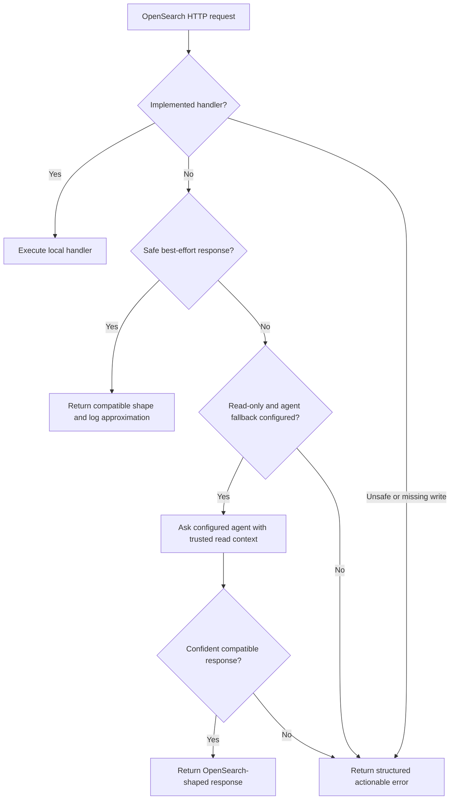

# mainstack-search Requirements

## Summary

`mainstack-search` will be a local-only, Rust-based, recent-OpenSearch-compatible
development server with a broad REST API shell, real behavior for core local
workflows, best-effort responses where exact behavior is not practical, and an
optional read-only runtime agent fallback for unsupported read requests.

---

## Problem Frame

OpenSearch is a useful local dependency for modern application development, but
the JVM-based server is often too heavy for laptops, test suites, lightweight CI,
and agent-driven development bundles. The cost is not only memory. Developers
also pay for startup time, container orchestration, plugin/security bootstrap
behavior, disk footprint, and version-specific operational quirks that are
irrelevant when the data volume is small and local.

The target development environment is expected to use OpenSearch as one of the
standard projection and search engines. The related local Cassandra work proves
the value of a small compatibility server backed by readable local files. For
OpenSearch, the API surface is much larger, so a narrow "certified subset" would
leave many clients and tools stranded even when the requested operation could be
answered well enough for development.

The product therefore needs to bias toward broad recent OpenSearch API
compatibility. Exact distributed search semantics, throughput, and Lucene
internals are less important than making normal clients and agent-written
applications keep moving locally, while preserving a clear path to full
OpenSearch in production or in a heavier local stack.

---

## Reviewed Context

- The prior draft correctly established the local-only identity, readable
  JSON/JSONL storage preference, real-client compatibility testing, and clear
  unsupported-feature errors.
- The prior draft was too narrow in treating the MVP as a small API subset. The
  revised goal is broad route coverage for recent OpenSearch APIs, with behavior
  classified by compatibility tier.
- The local Mainstack architecture is an important downstream validation target, but
  it should not define the product boundary. `mainstack-search` should support
  much more than Mainstack currently exercises.
- The current OpenSearch release page lists OpenSearch 3.6.0 as released on
  2026-04-07. Recent 3.x behavior should be the primary compatibility anchor,
  with the advertised local version configurable.
- Mainstack currently uses OpenSearch 3.6 as a projection engine and relies on
  OpenSearch index templates, exact-match keyword fields, document PUTs, and
  query-router search requests. That is evidence that templates and recent
  search behavior matter early, even though Mainstack is not the full scope.

---

## Actors

- A1. Application developer: runs the local server in a dev stack, test suite,
  or coding-agent workspace.
- A2. OpenSearch client or tool: official clients, direct HTTP callers,
  generated code, migration tools, and local scripts that expect OpenSearch-like
  responses.
- A3. Agent caller: a coding agent, query agent, or generated application agent
  that sends OpenSearch requests and benefits from structured recovery hints.
- A4. Runtime fallback agent: an optional configured OpenAI-compatible agent
  endpoint that can synthesize read-only responses from local context.
- A5. Maintainer: owns the compatibility matrix, route tiers, tests, and
  guardrails that keep broad support from becoming misleading.
- A6. Development-bundle integrator: packages `mainstack-search` with local
  Cassandra-like services and needs an easy migration path to real OpenSearch.

---

## Key Flows

- F1. Implemented OpenSearch request
  - **Trigger:** A client sends a request covered by a real handler.
  - **Actors:** A1, A2, A3
  - **Steps:** The server parses the HTTP request, routes it to an implemented
    handler, reads or mutates local state, and returns an OpenSearch-shaped
    response.
  - **Outcome:** The local workflow behaves enough like recent OpenSearch that
    the application can later point at a real OpenSearch cluster without code
    changes inside the supported behavior.
  - **Covered by:** R1, R2, R3, R7, R13, R15, R16, R17, R18, R28, R30

- F2. Best-effort compatibility response
  - **Trigger:** A client sends a recognized API request whose exact
    OpenSearch semantics are not implemented but can be approximated safely.
  - **Actors:** A2, A3, A5
  - **Steps:** The route shell recognizes the request, returns a compatible
    response shape or harmless metadata/no-op result, and logs that the response
    was approximate.
  - **Outcome:** Broad client and tool workflows continue locally without
    contaminating normal response bodies with local-only warnings.
  - **Covered by:** R4, R5, R6, R8, R9, R10, R11, R31

- F3. Read-only runtime agent fallback
  - **Trigger:** A recognized or partially supported read request cannot be
    satisfied by a deterministic handler, and an OpenAI-compatible agent
    endpoint is configured.
  - **Actors:** A2, A3, A4
  - **Steps:** The server assembles trusted read context, sends it to the
    configured agent endpoint, validates that the response is read-only and
    OpenSearch-shaped, then returns it to the caller or returns a structured
    failure.
  - **Outcome:** Local development can keep moving on read APIs that have not
    yet been implemented, especially when the caller is itself an agent that can
    adjust its query from the returned hint.
  - **Covered by:** R20, R21, R22, R23, R24, R25, R26, R27

- F4. Unsupported or unsafe request
  - **Trigger:** A client sends a production-only, unsafe, impossible, or
    unimplemented mutating request.
  - **Actors:** A2, A3, A5
  - **Steps:** The server rejects the request with an OpenSearch-shaped error
    that identifies the limitation and, when possible, suggests a compatible
    local alternative.
  - **Outcome:** Callers get a clear failure rather than silent state changes or
    misleading emulation.
  - **Covered by:** R11, R12, R22, R23, R25, R26

- F5. Migration to real OpenSearch
  - **Trigger:** A project outgrows `mainstack-search` or moves to production.
  - **Actors:** A1, A2, A6
  - **Steps:** The developer changes endpoint configuration to a real recent
    OpenSearch cluster and uses the compatibility matrix to identify any local
    approximations that must be replaced with real OpenSearch features.
  - **Outcome:** Application code using the documented supported behavior moves
    without source changes, while known local divergences are visible.
  - **Covered by:** R2, R8, R32, R34, R36

---

## Requirements

**Compatibility Posture**

- R1. The server must be a local-only, single-node OpenSearch-compatible
  development server, not a production search engine replacement.
- R2. Recent OpenSearch 3.x behavior must be the compatibility anchor. Older
  1.x and 2.x quirks should not drive design unless recent official clients
  require a compatibility response.
- R3. The first wire protocol must be HTTP/1.1 JSON/NDJSON REST, defaulting to
  `127.0.0.1:9200`. Non-REST transports are deferred.
- R4. The server must build a broad route inventory from recent OpenSearch REST
  APIs and classify every known route into a compatibility tier.
- R5. The default posture must be best-effort emulation for safe APIs rather
  than a small high-fidelity subset.
- R6. Approximate behavior must be disclosed through server logs and
  documentation, not by adding local-only warning fields to ordinary successful
  client responses.
- R7. Official OpenSearch clients and direct HTTP callers must be able to use
  normal OpenSearch request methods without custom local transport code for the
  supported behavior.

**API Surface and Behavior Tiers**

- R8. The compatibility matrix must distinguish at least these tiers:
  implemented, best-effort, agent-fallback-eligible, unsupported, and outside
  product identity.
- R9. The broad API shell should recognize recent OpenSearch route families
  across cluster, nodes, cat, indices, aliases, templates, document, bulk,
  search, tasks, ingest, snapshots, scripts, and other core REST surfaces even
  when many start as best-effort or unsupported.
- R10. Harmless metadata, status, discovery, and local no-op operations may
  return best-effort OpenSearch-shaped responses when exact distributed
  semantics do not matter for local development.
- R11. APIs that are unsafe, security-sensitive, production-only, externally
  destructive, or semantically impossible to emulate responsibly must fail
  clearly instead of returning fake success.
- R12. Mutating APIs must be handled by deterministic server code before they
  can change local state. The runtime agent fallback must never be the hidden
  implementation of a write.

**Core Local Behavior**

- R13. Core index APIs must support creating, deleting, checking, retrieving,
  mapping, and settings behavior needed by normal development workflows.
- R14. Index templates and aliases must be treated as early compatibility
  requirements, not distant nice-to-haves, because modern clients and dev
  stacks commonly rely on them before writing documents.
- R15. Core document APIs must support indexing, creating, retrieving, updating,
  deleting, generated IDs, `_source` retrieval, and basic version metadata.
- R16. Bulk ingestion must support NDJSON parsing, common `index`, `create`,
  `update`, and `delete` actions, per-item responses, and continued processing
  after item-level failures.
- R17. Writes must be read-your-own-write visible inside the local server.
  `refresh` parameters may map to immediate local visibility when documented.
- R18. Search must support common recent Query DSL behavior for local
  development: match-all, IDs, exact terms, ranges, existence, simple booleans,
  limited text matching, source filtering, sorting, pagination limits, and
  total-hit reporting.
- R19. Semantic, vector, and hybrid search must be part of the compatibility
  ambition for recent OpenSearch, even if exact vector indexing and retrieval
  behavior is staged after the broad API shell and core search path.

**Runtime Agent Fallback**

- R20. Runtime agent fallback must be disabled unless the user configures an
  OpenAI-compatible endpoint and any required authentication.
- R21. The configured endpoint may be local or cloud-hosted. Once configured, it
  is treated as trusted for the purpose of receiving relevant local read
  context.
- R22. Agent fallback must be read-only. It may synthesize responses from local
  state, but it must not mutate catalog entries, mappings, settings, templates,
  aliases, documents, files, emulator code, external services, or durable
  storage.
- R23. Agent fallback must only be eligible for read-style APIs and queries
  whose answer can be derived from available local context.
- R24. The fallback context may include the incoming request, route tier,
  OpenSearch API metadata, compatibility documentation, catalog state, mappings,
  settings, templates, aliases, and relevant raw documents.
- R25. If the fallback agent cannot confidently satisfy a request, the server
  must return a structured OpenSearch-shaped error that explains the limitation
  and gives an actionable hint for adjusting the request.
- R26. Agent-produced success responses must be validated for parseability,
  response shape, read-only behavior, configured size limits, and timeout
  limits before they are returned to the caller.
- R27. Server logs must identify agent fallback invocations, whether the
  response was successful or failed, and enough context to debug the behavior
  without hiding that a trusted external endpoint may have received local data.

**Storage, Memory, and Local Safety**

- R28. Durable mode must persist state under a configurable data directory by
  default, with an explicit ephemeral mode for disposable tests.
- R29. Storage must be readable by humans and coding agents, using JSON metadata
  and JSONL-style mutation/document records instead of OpenSearch or Lucene
  segment compatibility.
- R30. Durable writes must be recorded before acknowledgment, and restart
  recovery must rebuild local catalog, mappings, settings, templates, aliases,
  documents, tombstones, and versions from local files.
- R31. The server must bound request body size, bulk action count, result size,
  document count, index count, in-memory bytes, agent context size, agent
  response size, and concurrent connections.
- R32. Defaults must remain local and conservative: loopback binding, no auth,
  no TLS, no plugins, limited memory, limited result sizes, and explicit
  configuration before exposing data to an agent endpoint.

**Verification and Documentation**

- R33. Compatibility must be tested with real clients, starting with Python,
  JavaScript, and Java clients, plus direct HTTP smoke tests.
- R34. A shared smoke suite must run against both `mainstack-search` and a real
  recent OpenSearch 3.x container, with documented accepted divergences.
- R35. Route inventory tests must prevent known recent OpenSearch routes from
  disappearing from the compatibility matrix.
- R36. Documentation must include supported API tiers, local approximation
  behavior, agent fallback configuration, data-exposure implications,
  actionable-error examples, client configuration examples, and migration
  guidance to real OpenSearch.

---

## Acceptance Examples

- AE1. **Covers R1, R2, R3, R7.** Given the server is running on the default
  loopback address, when an official recent OpenSearch client performs its
  startup info and health checks, those calls succeed without custom client
  transport code.
- AE2. **Covers R4, R8, R9, R35.** Given a route exists in the recent
  OpenSearch REST inventory, when the compatibility matrix is generated, that
  route appears with an explicit behavior tier rather than being unknown.
- AE3. **Covers R5, R6, R10.** Given a recognized harmless metadata API is not
  fully implemented, when a client calls it, the server returns an
  OpenSearch-shaped best-effort response and logs the approximation.
- AE4. **Covers R13, R14, R15, R17.** Given an index template is registered and
  a document write creates or updates a local index, when the client reads the
  document or searches immediately after the write, local state is visible.
- AE5. **Covers R16.** Given a mixed bulk request contains valid and invalid
  item actions, when the request is processed, valid items are applied and
  invalid items are reported with per-item OpenSearch-shaped errors.
- AE6. **Covers R18.** Given several local documents with keyword, numeric,
  date-like, and text fields, when a client runs supported boolean, term, range,
  sort, and pagination searches, the response has OpenSearch-shaped hits and
  bounded result size.
- AE7. **Covers R20, R21, R23, R24.** Given agent fallback is configured and a
  read-style API lacks a deterministic handler, when the server has enough
  local context to answer, it may return an agent-produced OpenSearch-shaped
  response after validation.
- AE8. **Covers R12, R22.** Given a missing write API would change mappings,
  aliases, documents, or files, when the request is not implemented in server
  code, the runtime agent fallback is not invoked to perform the write.
- AE9. **Covers R25.** Given the fallback agent cannot confidently answer a
  read request, when the server returns the failure, the response includes a
  structured reason and a hint that an agent caller can use to retry with a
  supported query shape.
- AE10. **Covers R28, R29, R30.** Given a durable local document was written and
  the server restarts with the same data directory, when a supported get or
  search request runs, the document is recovered from readable local files.

---

## Success Criteria

- Developers can run broad OpenSearch-dependent local workflows without
  starting a JVM OpenSearch node for common development and test use.
- Recent OpenSearch clients see normal response shapes for the supported and
  best-effort behavior, while unsupported behavior fails clearly.
- The compatibility matrix makes breadth honest: users can tell which APIs are
  implemented, approximate, agent-fallback-eligible, unsupported, or outside
  the product identity.
- A configured read-only runtime agent fallback can successfully answer useful
  unsupported read requests from local context and return actionable failures
  when it cannot.
- Local data remains agent-readable on disk, and the server remains bounded for
  development-scale data sets, typically below 2 GB and with an intended ceiling
  around 10 GB.
- A project can move from `mainstack-search` to real recent OpenSearch by
  changing endpoint configuration, provided it stays within the documented
  behavior or resolves listed divergences.

---

## Scope Boundaries

### Deferred for later

- Exact parity for Lucene scoring, analyzers, tokenizers, and ranking internals.
- Full semantic, vector, and hybrid search implementation, beyond route
  recognition and staged best-effort support.
- Full plugin API implementations.
- Complete Dashboards, observability, security analytics, SQL, PPL, ML, and
  other optional ecosystem surfaces.
- Request/response compression if no target client requires it during early
  compatibility testing.
- TLS, authentication, roles, tenancy, and AWS SigV4 compatibility unless a
  target local workflow requires them.
- Runtime self-improvement that patches emulator code after an unsupported
  request.
- Agent fallback policy systems for field-level redaction or endpoint-specific
  data controls.

### Outside this product's identity

- Production OpenSearch replacement.
- Distributed cluster behavior, shard allocation fidelity, replicas, recovery,
  quorum behavior, and node coordination.
- OpenSearch or Lucene segment-file compatibility.
- Running real OpenSearch plugins.
- Forking OpenSearch to make it smaller.
- Runtime agent fallback performing writes, mutating local files, modifying
  emulator code, or silently changing local state.
- Optimizing for old OpenSearch 1.x or 2.x behavior as a primary goal.

---

## Key Decisions

- Broad recent-3.x compatibility over narrow subset: the product should expose
  as much of the recent OpenSearch REST surface as practical, even where early
  behavior is best-effort.
- Best-effort responses log divergence: successful client response bodies stay
  OpenSearch-shaped, while local approximation is visible in server logs and
  documentation.
- Runtime agent fallback is configured and read-only: an OpenAI-compatible
  endpoint may synthesize read responses from local context, but writes remain
  deterministic server responsibilities.
- Configured agent endpoints are trusted: if users configure cloud fallback,
  full relevant read context may leave the process, and that trust decision must
  be explicit in docs and logs.
- Mainstack validates direction but does not limit scope: current Mainstack OpenSearch
  usage proves templates, search, and local memory pressure matter, but the API
  target is broader than Mainstack Stage 1.
- JSON/JSONL storage remains core product identity: readable local files are a
  feature for coding agents and developers, not only an implementation shortcut.

---

## Dependencies / Assumptions

- Recent OpenSearch 3.x API metadata and behavior remain the primary reference
  for compatibility tiering.
- The runtime agent endpoint follows an OpenAI-compatible API shape and can be
  configured with endpoint, model, and optional authentication.
- Users who configure a cloud-hosted fallback endpoint accept that relevant raw
  local read context may be sent to that endpoint.
- Development-scale data is expected to be small enough for bounded in-memory
  scans and local indexes to be practical, usually below 2 GB and likely below
  10 GB.
- Exact production behavior is less important than local compatibility,
  response-shape fidelity, route breadth, clear logs, and migration guidance.

---

## Outstanding Questions

### Resolve Before Planning

- None.

### Deferred to Planning

- [Needs research] Determine the exact recent OpenSearch API inventory source
  and generation process for route tiering.
- [Needs research] Decide the default advertised OpenSearch version and how
  configurable version reporting should work.
- [Technical] Define the precise request/response contract for the configured
  OpenAI-compatible runtime fallback.
- [Technical] Define validation rules for agent-produced responses, including
  confidence, size, timeout, parseability, and read-only guarantees.
- [Technical] Decide the first route families that receive deterministic
  implementations versus best-effort shells.
- [Technical] Decide how semantic/vector/hybrid search should be staged after
  the broad compatibility shell.
- [Technical] Define local resource limits for request bodies, documents,
  indexes, result windows, and agent context.

---

## Sources and References

- OpenSearch release schedule and version history:
  <https://opensearch.org/releases/>
- OpenSearch API reference:
  <https://docs.opensearch.org/latest/api-reference/>
- OpenSearch API specification repository:
  <https://github.com/opensearch-project/opensearch-api-specification>
- OpenSearch language clients:
  <https://docs.opensearch.org/latest/clients/>
