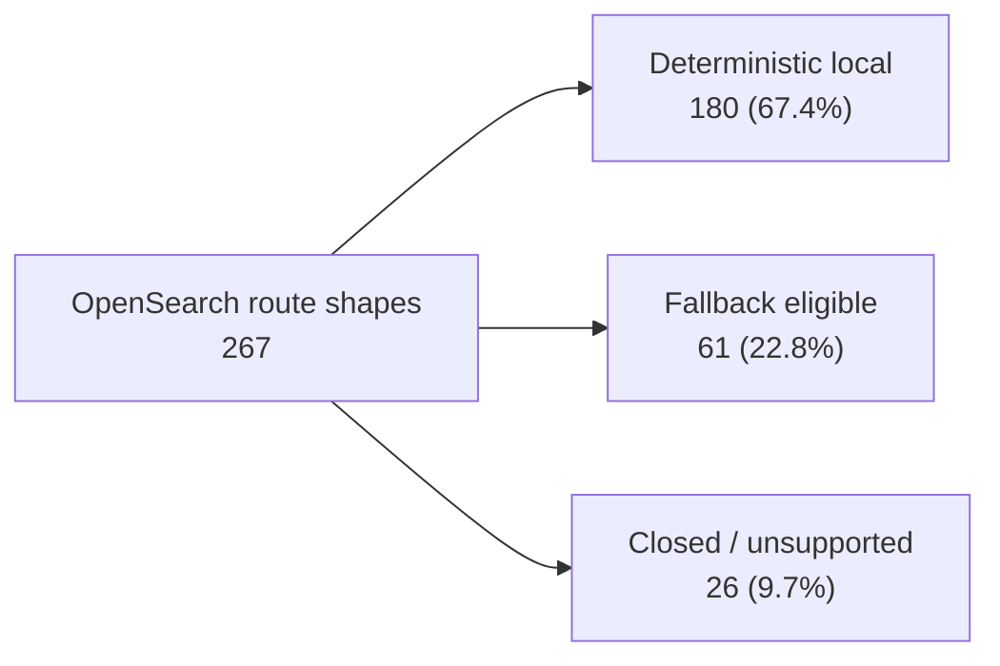
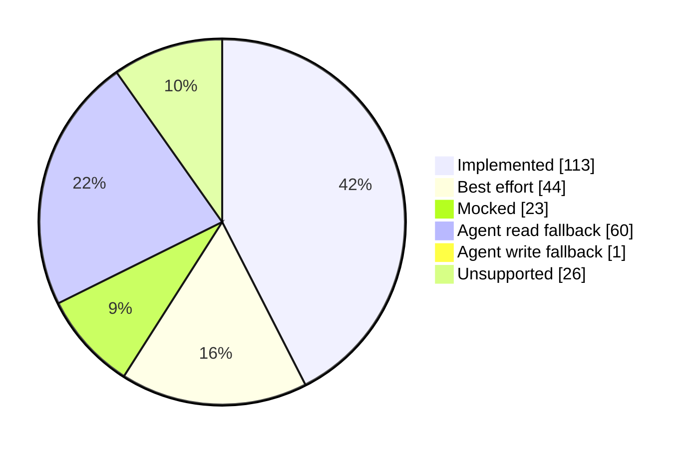
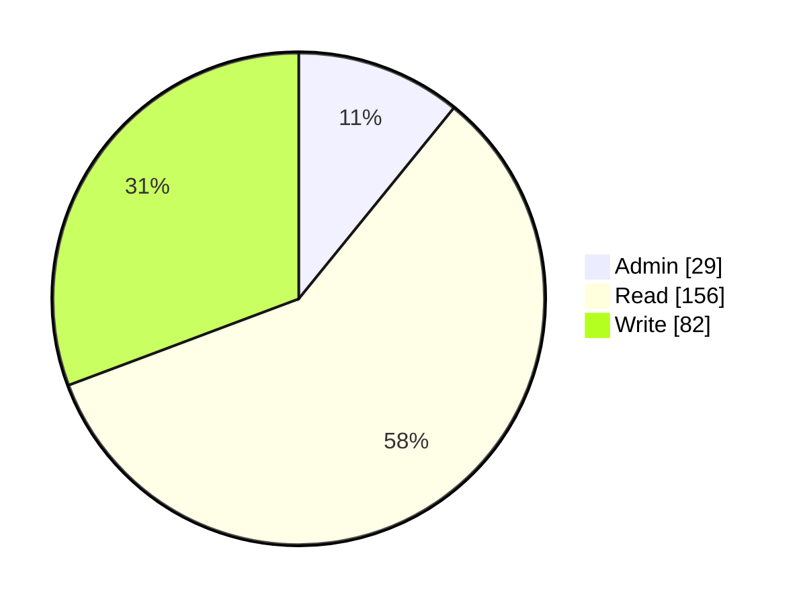
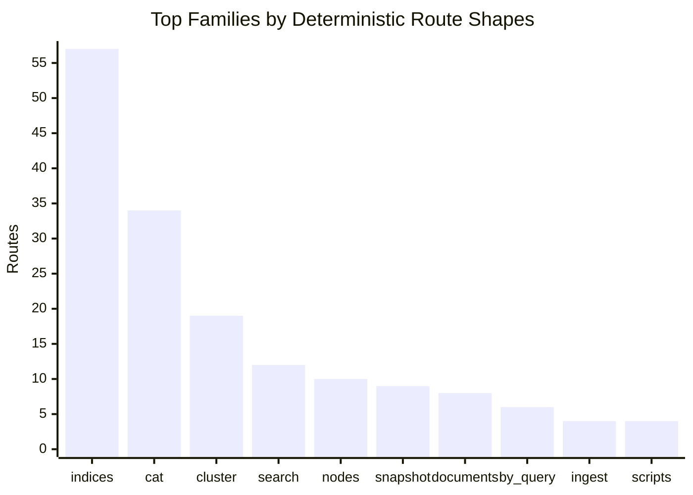

# API Coverage Visualization

Generated from `mainstack_search::api_spec::inventory()` over the pinned OpenSearch REST spec plus mainstack-search manual route overlays.

## Summary

| Metric | Count | Share |
| --- | ---: | ---: |
| Route shapes in inventory | 267 | 100.0% |
| Unique API names | 167 | - |
| Deterministic local responses | 180 | 67.4% |
| Runtime fallback eligible | 61 | 22.8% |
| Closed or outside product identity | 26 | 9.7% |

Deterministic local responses combine `implemented`, `best_effort`, and `mocked` routes. Fallback-eligible routes still require runtime agent configuration and are not deterministic local parity.

## Coverage Funnel



## Tier Mix



| Tier | Count | Share |
| --- | ---: | ---: |
| Implemented | 113 | 42.3% |
| Best effort | 44 | 16.5% |
| Mocked | 23 | 8.6% |
| Agent read fallback | 60 | 22.5% |
| Agent write fallback | 1 | 0.4% |
| Unsupported | 26 | 9.7% |

## Access Mix



| Access class | Count | Share |
| --- | ---: | ---: |
| Admin | 29 | 10.9% |
| Read | 156 | 58.4% |
| Write | 82 | 30.7% |

## Family Coverage



| Family | Total | Deterministic | Fallback eligible | Closed | Implemented | Best effort | Mocked |
| --- | ---: | ---: | ---: | ---: | ---: | ---: | ---: |
| `indices` | 85 | 57 | 16 | 12 | 48 | 0 | 9 |
| `cat` | 34 | 34 | 0 | 0 | 3 | 31 | 0 |
| `cluster` | 26 | 19 | 7 | 0 | 7 | 3 | 9 |
| `search` | 13 | 12 | 1 | 0 | 12 | 0 | 0 |
| `nodes` | 24 | 10 | 12 | 2 | 0 | 10 | 0 |
| `snapshot` | 15 | 9 | 0 | 6 | 9 | 0 | 0 |
| `documents` | 9 | 8 | 1 | 0 | 8 | 0 | 0 |
| `by_query` | 6 | 6 | 0 | 0 | 3 | 0 | 3 |
| `ingest` | 7 | 4 | 3 | 0 | 4 | 0 | 0 |
| `scripts` | 4 | 4 | 0 | 0 | 4 | 0 | 0 |
| `search_pipeline` | 4 | 4 | 0 | 0 | 4 | 0 | 0 |
| `bulk` | 2 | 2 | 0 | 0 | 2 | 0 | 0 |
| `core` | 2 | 2 | 0 | 0 | 2 | 0 | 0 |
| `field_caps` | 2 | 2 | 0 | 0 | 2 | 0 | 0 |
| `tasks` | 4 | 1 | 1 | 2 | 1 | 0 | 0 |
| `create_pit` | 1 | 1 | 0 | 0 | 1 | 0 | 0 |
| `delete_all_pits` | 1 | 1 | 0 | 0 | 1 | 0 | 0 |
| `delete_pit` | 1 | 1 | 0 | 0 | 1 | 0 | 0 |
| `get_all_pits` | 1 | 1 | 0 | 0 | 1 | 0 | 0 |
| `query` | 1 | 1 | 0 | 0 | 0 | 0 | 1 |
| `security` | 1 | 1 | 0 | 0 | 0 | 0 | 1 |
| `dangling_indices` | 3 | 0 | 1 | 2 | 0 | 0 | 0 |
| `remote_store` | 3 | 0 | 2 | 1 | 0 | 0 | 0 |
| `msearch_template` | 2 | 0 | 2 | 0 | 0 | 0 | 0 |
| `mtermvectors` | 2 | 0 | 2 | 0 | 0 | 0 | 0 |
| `rank_eval` | 2 | 0 | 2 | 0 | 0 | 0 | 0 |
| `render_search_template` | 2 | 0 | 2 | 0 | 0 | 0 | 0 |
| `search_shards` | 2 | 0 | 2 | 0 | 0 | 0 | 0 |
| `search_template` | 2 | 0 | 2 | 0 | 0 | 0 | 0 |
| `termvectors` | 2 | 0 | 2 | 0 | 0 | 0 | 0 |
| `get_script_context` | 1 | 0 | 1 | 0 | 0 | 0 | 0 |
| `get_script_languages` | 1 | 0 | 1 | 0 | 0 | 0 | 0 |
| `scripts_painless_execute` | 1 | 0 | 0 | 1 | 0 | 0 | 0 |
| `wlm_stats_list` | 1 | 0 | 1 | 0 | 0 | 0 | 0 |

## Refresh

```sh
cargo run --example api_coverage > docs/api-coverage.md
```
