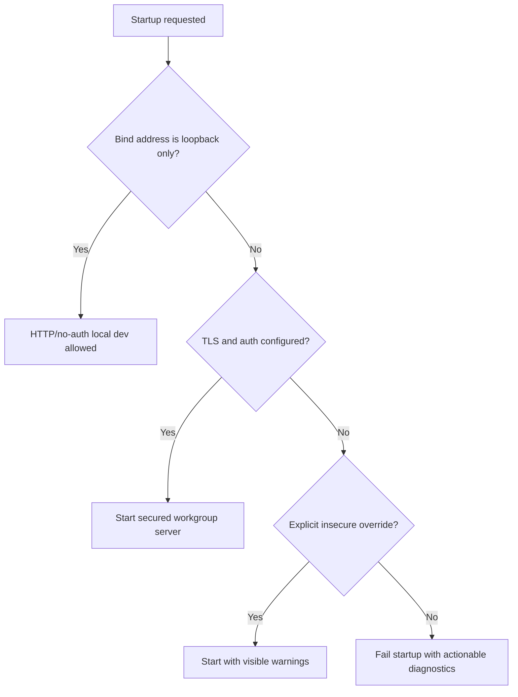

# OpenSearch Lite Kubernetes Workgroup Security Requirements

## Summary

OpenSearch Lite should add a first security tranche for Kubernetes and small
workgroup deployments where non-loopback exposure requires TLS and
authentication by default, while loopback-only local development remains simple.
The setup must be friendly to both humans and coding agents using shell,
container, and Kubernetes tooling.

---

## Problem Frame

OpenSearch Lite currently optimizes for local development by defaulting to
loopback HTTP with no authentication. That is appropriate for disposable local
use, but it creates friction when applications, official OpenSearch clients,
or workgroup deployments are already configured for secured OpenSearch
clusters.

Kubernetes and Docker deployments also change the risk profile. Binding inside
a container to a non-loopback address is normal, but doing so without TLS or
authentication can accidentally expose a development data service beyond the
intended trust boundary. At the same time, making security difficult to
configure would undermine the product's agent-assisted local-development goal:
the user's coding agent needs enough documentation and observable diagnostics
to stand up a secured instance without guessing.

---

## Actors

- A1. Application developer: runs OpenSearch Lite locally, in Docker, or in a
  Kubernetes workgroup environment.
- A2. Coding agent: configures, diagnoses, and repairs OpenSearch Lite setup
  through shell, Docker, and Kubernetes tools.
- A3. OpenSearch client or application: connects using HTTPS and authentication
  settings expected for a secured OpenSearch cluster.
- A4. Workgroup operator: owns Kubernetes Secrets, deployment configuration,
  service exposure, and safety posture.
- A5. Maintainer: keeps the feature honest about what security behavior is
  real versus compatibility-oriented.

---

## Key Flows

- F1. Secured workgroup startup
  - **Trigger:** A developer or operator deploys OpenSearch Lite with a
    non-loopback bind address.
  - **Actors:** A1, A2, A4
  - **Steps:** The deployment provides TLS material and at least one
    authentication configuration. The server validates that non-loopback
    exposure is secured before it starts. If security is missing, startup fails
    with an actionable explanation.
  - **Outcome:** A network-reachable OpenSearch Lite instance does not start in
    an accidentally unauthenticated cleartext posture.
  - **Covered by:** R1, R2, R3, R4, R11

- F2. Client compatibility connection
  - **Trigger:** An application configured for secured OpenSearch connects to
    OpenSearch Lite.
  - **Actors:** A1, A3
  - **Steps:** The client establishes TLS, presents supported credentials, and
    receives OpenSearch-shaped responses through the existing API handlers.
    Invalid credentials fail before request handling.
  - **Outcome:** Common secured-client configurations can be used without
    application code changes inside the supported compatibility surface.
  - **Covered by:** R3, R5, R6, R7, R8

- F3. Agent-assisted setup and repair
  - **Trigger:** A coding agent needs to configure or debug a secured Docker or
    Kubernetes deployment.
  - **Actors:** A2, A4
  - **Steps:** The agent reads security setup documentation, inspects mounted
    files or container state, runs deterministic validation commands, and uses
    startup diagnostics to correct missing or mismatched configuration.
  - **Outcome:** The agent can get a secured instance running without relying on
    hidden product knowledge or brittle trial-and-error.
  - **Covered by:** R11, R12, R13, R14, R15

- F4. Explicit insecure exception
  - **Trigger:** A user deliberately needs a non-loopback HTTP/no-auth instance
    for a controlled test.
  - **Actors:** A1, A4, A5
  - **Steps:** The user chooses an explicit insecure override. The server starts
    only after that deliberate opt-in and emits visible warnings.
  - **Outcome:** Unsafe exposure remains possible for exceptional local cases,
    but cannot happen accidentally.
  - **Covered by:** R1, R2, R10

---

## Requirements

**Security posture**

- R1. Non-loopback exposure must require TLS and authentication by default.
- R2. A deliberate insecure override may allow non-loopback HTTP/no-auth, but
  it must be visibly explicit and produce clear warnings.
- R3. Loopback-only local development must remain simple and may continue to
  run HTTP/no-auth by default.
- R4. Startup validation must fail closed when non-loopback exposure is
  requested without required security configuration.
- R5. TLS support must work with mounted certificate and key material suitable
  for Docker and Kubernetes Secret workflows.
- R6. The first tranche must support server-side TLS for OpenSearch REST
  clients and a path for clients to trust the server certificate.
- R7. The first tranche should include optional client certificate verification
  as a workgroup hardening mode, while not making mutual TLS mandatory for all
  secured deployments.

**Authentication and authorization**

- R8. The first authentication mechanism must cover common secured-client
  compatibility needs, especially username/password-style clients.
- R9. User secrets must be loadable from environment variables or mounted files
  so Docker and Kubernetes deployments do not require secret literals in normal
  command lines.
- R10. Secret material must not appear in startup logs, request logs, debug
  output, OpenSearch error bodies, or diagnostic summaries.
- R11. Optional simple roles should be coarse and understandable: full
  administration, read/write data access, and read-only access are sufficient
  for the first tranche.
- R12. Role behavior must be explicit when it rejects a request so client
  callers and coding agents can distinguish authentication failures from
  authorization failures.

**Agent-operable deployment**

- R13. Security documentation must include shell-friendly setup and validation
  guidance for Docker and Kubernetes, including inspection through container
  exec-style workflows.
- R14. Diagnostics must identify missing, unreadable, or mismatched TLS/auth
  inputs without exposing sensitive values.
- R15. The secured deployment path must include examples that use mounted
  Secrets rather than embedding secret values directly in user-visible command
  lines.
- R16. Documentation must clearly state which parts of OpenSearch Security are
  emulated for compatibility and which are not implemented.
- R17. Compatibility examples must cover the official-client style of connecting
  over HTTPS with authentication and certificate trust.

**Safety and compatibility**

- R18. Security checks must run before deterministic OpenSearch handlers,
  best-effort responses, or runtime agent fallback.
- R19. Runtime agent fallback must not bypass authentication or authorization.
- R20. Existing strict compatibility behavior must remain available and must
  not be weakened by the security layer.
- R21. Local development and workgroup security modes must be documented as
  distinct operating postures so users understand the tradeoff they are
  choosing.

---

## Acceptance Examples

- AE1. **Covers R1, R4.** Given a deployment binds to a non-loopback address
  without TLS or authentication, when the server starts, startup fails with an
  actionable explanation.
- AE2. **Covers R2.** Given a deployment binds to a non-loopback address with
  the explicit insecure override, when the server starts, it starts and emits a
  visible warning that the deployment is insecure.
- AE3. **Covers R3.** Given a developer runs the server on loopback for local
  development, when no TLS or authentication is configured, normal local HTTP
  workflows continue to work.
- AE4. **Covers R5, R6, R8, R17.** Given TLS material and valid credentials are
  configured from mounted files or environment, when an official OpenSearch
  client connects with HTTPS, authentication, and certificate trust, supported
  API calls succeed.
- AE5. **Covers R10, R14.** Given a credential or certificate is invalid, when
  the server reports the problem, the diagnostic output identifies the failing
  input category without printing secret material.
- AE6. **Covers R11, R12.** Given a read-only user sends a mutating request,
  when authorization is enforced, the response identifies an authorization
  failure rather than a malformed request or missing API.
- AE7. **Covers R13, R15.** Given a coding agent has shell access to a running
  container or Kubernetes pod, when security setup fails, the docs and
  diagnostics provide enough observable steps for the agent to inspect mounted
  inputs and correct configuration.
- AE8. **Covers R18, R19.** Given runtime fallback is configured and a request
  is unauthenticated or unauthorized, when the request arrives, fallback is not
  invoked.

---

## Success Criteria

- Developers can run OpenSearch Lite in a Kubernetes or Docker workgroup setup
  without exposing an unauthenticated cleartext service by accident.
- Applications that already expect HTTPS and basic secured-client credentials
  can point at OpenSearch Lite with minimal configuration changes.
- A coding agent can follow documented shell/container/Kubernetes workflows to
  configure, validate, and troubleshoot the secured deployment path.
- Maintainers can clearly explain the difference between compatibility security
  behavior and full OpenSearch Security plugin parity.
- Planning can proceed without inventing product posture for loopback local dev,
  non-loopback workgroup safety, simple users, simple roles, or agent-operable
  diagnostics.

---

## Scope Boundaries

- Full OpenSearch Security plugin implementation is not part of the first
  tranche.
- Production-grade RBAC, tenants, audit logging, SSO/SAML/OIDC, LDAP, password
  rotation workflows, document-level security, field-level security, and
  index-pattern authorization are excluded.
- AWS SigV4 is not the primary first-tranche target.
- Wasm or wasmCloud deployment is not part of this tranche.
- TLS/auth is not required for loopback-only disposable local development.
- This feature does not make OpenSearch Lite a production OpenSearch
  replacement.

---

## Key Decisions

- Non-loopback requires security by default: this prevents accidental workgroup
  exposure while preserving explicit escape hatches.
- Loopback local development remains simple: the core local-dev use case should
  not require certs or credentials for disposable runs.
- First-tranche security is compatibility-oriented: the goal is secured client
  connection and safe workgroup posture, not full security-plugin parity.
- Agent operability is a product requirement: docs and diagnostics must be
  structured so a coding agent can configure and repair the deployment through
  normal shell and container tooling.
- Mounted secrets are preferred: Docker and Kubernetes workflows should avoid
  requiring sensitive values in command histories, manifests, or logs.

---

## Dependencies / Assumptions

- Kubernetes and Docker deployments can mount certificate, key, and credential
  material as files or provide non-secret selectors through environment
  variables.
- The first secured-client target is username/password-style authentication over
  HTTPS with certificate trust.
- Coarse roles are enough for workgroup development and compatibility testing.
- Users who need production-grade OpenSearch Security behavior should use real
  OpenSearch.

---

## Outstanding Questions

### Resolve Before Planning

- None.

### Deferred to Planning

- [Affects R5, R6][Technical] Choose the TLS implementation and certificate
  reload behavior.
- [Affects R8, R9, R10][Technical] Choose the credential file format and secret
  validation rules.
- [Affects R11, R12][Technical] Define exact role-to-method/API enforcement
  boundaries.
- [Affects R13, R14, R15][Technical] Decide the exact diagnostics and
  validation commands exposed for shell and container workflows.
- [Affects R17][Needs research] Verify the secured-client examples against
  current Python, JavaScript, and Java OpenSearch clients.
