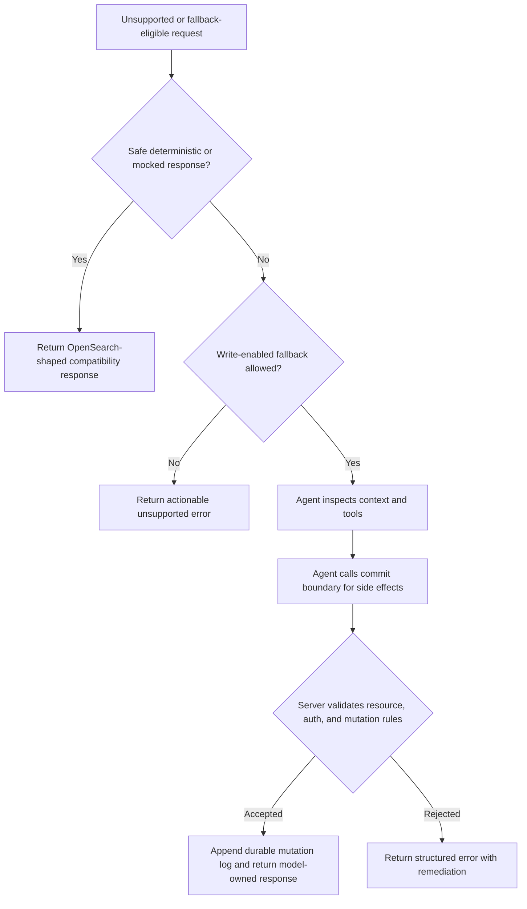

# mainstack-search Agent Fallback Write Support Requirements

## Summary

mainstack-search will expand runtime agent fallback from read-only compatibility
into a write-capable development feature with explicit commit-tool boundaries,
model benchmarking, safer benign compatibility responses, and a stronger
snapshot/log resource model. The first API priority is catalog, template,
pipeline, and script compatibility; the second priority is search-template,
explain, validation, and analysis compatibility.

---

## Problem Frame

mainstack-search exists to let developers and small workgroups build against a
recent OpenSearch-compatible API without carrying the JVM and cluster overhead
of full OpenSearch. The deterministic API surface has grown, but the vendored
OpenSearch REST inventory still includes many APIs that are either fallback
eligible or hard unsupported. If unsupported APIs consistently return client
errors, client libraries, OpenSearch Dashboards paths, and agent-driven
workflows can fail even when the requested behavior is irrelevant in a local
single-node development server.

The existing fallback is intentionally read-only and privacy-sensitive. That
has been the right safety boundary while deterministic writes were still being
hardened, but it limits the project goal of letting an agent bridge compatibility
gaps for development-scale use. The next step needs to make the model more
empowered without letting it mutate files directly or bypass server-side
resource, security, and audit controls.

The storage model also needs to evolve with write-enabled fallback. The server
keeps materialized state in memory and appends durable mutations to a readable
log. Rewriting a full snapshot after every write is too expensive for larger
local datasets, while replaying an ever-growing log on every boot would make
startup slower and more fragile. Containerized deployments add another failure
mode: if the configured local data memory budget exceeds the actual container
limit, the process can be killed before it can explain the problem.

---

## Actors

- A1. Application developer: Runs mainstack-search as a local or workgroup
  OpenSearch-compatible endpoint while building against normal OpenSearch
  clients.
- A2. Coding agent caller: Sends requests, reads fallback hints, inspects local
  state, and adjusts application queries or configuration.
- A3. Runtime fallback model: Receives bounded request context, uses exposed
  tools, and produces an OpenSearch-shaped response.
- A4. Maintainer: Expands compatibility while preserving local-only identity,
  safety boundaries, and debuggability.
- A5. Workgroup operator: Runs the server in Docker or Kubernetes and needs
  clear diagnostics when memory, security, or storage settings are invalid.
- A6. Benchmark judge model: Grades candidate fallback model responses for
  correctness, schema adherence, mutation safety, and practical usefulness.

---

## Key Flows

- F1. Write-enabled fallback request
  - **Trigger:** A request reaches an API that is not deterministically
    implemented but is allowed to use write-enabled fallback.
  - **Actors:** A1, A2, A3
  - **Steps:** The server authenticates and authorizes the caller, builds
    bounded fallback context, exposes the relevant tool surface, requires an
    explicit commit boundary for any side effects, validates proposed mutations,
    and returns the model-owned OpenSearch-shaped response only after committed
    side effects are accepted.
  - **Outcome:** Development-scale compatibility improves without direct
    model-authored file mutation or hidden side effects.
  - **Covered by:** R1, R2, R3, R4, R5, R6, R7, R8

- F2. Benign local-inapplicable API call
  - **Trigger:** A client calls an OpenSearch API whose distributed behavior is
    irrelevant or immaterial for local single-node development.
  - **Actors:** A1, A2
  - **Steps:** The route is classified as mocked or benign rather than hard
    unsupported, the server returns a positive OpenSearch-shaped response that
    should not break clients, and compatibility signals explain that the local
    answer is a development approximation.
  - **Outcome:** Clients can proceed when the API's production behavior is not
    material to local development.
  - **Covered by:** R9, R10, R11, R12, R13

- F3. Candidate model benchmark
  - **Trigger:** A maintainer evaluates which OpenRouter-hosted model should
    back fallback for a target API group.
  - **Actors:** A3, A4, A6
  - **Steps:** The benchmark discovers model candidates from current model
    metadata, runs deterministic request fixtures, records latency and cost,
    grades outputs with a frontier judge, and ranks models by accuracy, speed,
    and cost in that order.
  - **Outcome:** Model selection is evidence-driven and can be rerun as hosted
    model quality and pricing change.
  - **Covered by:** R14, R15, R16, R17, R18

- F4. Snapshot and mutation-log maintenance
  - **Trigger:** The server commits durable writes over time.
  - **Actors:** A4, A5
  - **Steps:** Every write is appended durably, snapshots are flushed only after
    enough writes or elapsed dirty time, snapshot metadata records useful
    collection-level facts, and successful snapshot flushes allow conservative
    mutation-log compaction.
  - **Outcome:** Boot remains fast, durable files stay recoverable, and agents
    retain readable local state without full snapshot churn after every write.
  - **Covered by:** R19, R20, R21, R22, R23, R24

- F5. Container memory mismatch diagnosis
  - **Trigger:** The server starts or validates configuration inside a
    constrained container.
  - **Actors:** A2, A5
  - **Steps:** The server detects the available container memory limit when
    present, compares it against the configured local data budget and snapshot
    metadata, fails before OOM-prone loading when the configuration is unsafe,
    and logs remediation directions.
  - **Outcome:** Operators and coding agents can identify and repair memory
    mismatches without a restart loop that only shows container OOM kills.
  - **Covered by:** R25, R26, R27, R28, R29

---

## Requirements

**Write-enabled fallback behavior**

- R1. Runtime fallback must support an explicitly configured write-capable mode
  for development and workgroup environments. It must remain disabled unless
  configured.
- R2. Write-enabled fallback must remain behind normal authentication,
  authorization, route classification, body-size limits, context limits, and
  response limits.
- R3. The fallback model may produce the OpenSearch-shaped response body for
  eligible APIs, including success responses, partial success responses, and
  structured errors.
- R4. Durable side effects must pass through an explicit server-visible commit
  boundary before the model can return a successful write response.
- R5. The server must validate fallback-initiated commits against the same
  resource limits, mutation rules, and persistence guarantees used by
  deterministic write handlers.
- R6. The model must not be allowed to mutate durable files directly, bypass the
  storage layer, or apply side effects only by claiming them in a response body.
- R7. Fallback context must continue to treat indexed document text as
  untrusted data and must not broaden data exposure beyond the route's
  configured trust boundary without explicit configuration and tests.
- R8. Fallback failures must return OpenSearch-shaped responses with hints that
  help human or agent callers simplify the request, use a deterministic API,
  adjust configuration, or move to full OpenSearch when the local development
  server is the wrong fit.

**API family priorities and tool surface**

- R9. The first write-enabled fallback API priority must be catalog, template,
  pipeline, and script compatibility, including local registry-style behavior
  where definitions can be stored, retrieved, deleted, simulated, or used by
  later requests.
- R10. The second fallback API priority must be search-template, explain,
  query-validation, text-analysis, and term-vector style compatibility.
- R11. The initial tool surface must support catalog inspection, bounded
  document scanning, query evaluation, aggregation execution, template
  rendering, registry reads, explicit mutation commits, runtime task recording,
  and OpenSearch-shaped error construction.
- R12. Specialized tools for templates, pipelines, scripts, data streams,
  point-in-time cursors, snapshots, and task controls should be added only when
  the target API family needs them and benchmark fixtures demonstrate the need.
- R13. DuckDB, Polars, or other embedded analytical engines should not be part
  of the first fallback tranche unless benchmarks show the in-memory tools are
  insufficient for correctness, speed, or memory behavior.

**Benign compatibility responses**

- R14. The route inventory must distinguish APIs that cannot safely be answered
  from APIs that are merely not material in local single-node development.
- R15. Harmless or local-inapplicable APIs should return mocked or benign
  positive responses where that is less likely to break clients than a hard
  unsupported error.
- R16. Benign compatibility responses must be visibly marked for agents and
  operators without breaking strict clients that expect normal OpenSearch
  response shapes.
- R17. Cluster routing, cache, flush, force-merge, open/close, rethrottle, and
  similar local-inapplicable controls are candidates for mocked or no-op
  success responses.
- R18. Security/control namespaces, destructive filesystem-like behavior,
  snapshot restore/delete, dangling-index operations, and wrong-method routes
  must remain fail-closed until deliberately designed.

**Model discovery and benchmarking**

- R19. Initial model evaluation must use OpenRouter-hosted models and load
  credentials from local environment or secret files rather than committed
  configuration.
- R20. Candidate discovery should use current model metadata and current model
  quality/cost statistics so the candidate set can evolve without code changes.
- R21. Benchmark ranking must favor accuracy first, speed second, and cost
  third.
- R22. Write benchmarks must grade mutation correctness, schema adherence,
  response accuracy, absence of unauthorized side effects, and recoverability
  after restart.
- R23. Read and analytical benchmarks must grade answer correctness, response
  shape compatibility, bounded context use, latency, and cost.
- R24. A frontier model should be used as the judge for subjective or
  compatibility-shaped grading, but deterministic assertions must be preferred
  wherever expected behavior can be specified exactly.

**Snapshot, mutation log, and boot behavior**

- R25. Durable writes must continue appending committed mutations to a readable
  mutation log on every write.
- R26. Full snapshot flushing must not happen after every write. It should
  happen after a configured write-count threshold or after a configured elapsed
  dirty interval, and the elapsed interval must require at least one committed
  change since the last successful snapshot.
- R27. Normal boot must load the latest valid snapshot when available and replay
  only mutations that occurred after that snapshot.
- R28. Successful snapshot flushes must allow conservative, atomic, recoverable
  mutation-log compaction or rotation so normal boot does not replay obsolete
  history.
- R29. Snapshot metadata must include useful lightweight facts such as estimated
  stored bytes, index counts, document counts, collection-level timestamps or
  generations, and other facts that can support boot checks or fast metadata
  responses.
- R30. Snapshot metadata must be readable before loading the full snapshot and
  must not be treated as authoritative if the snapshot/log relationship cannot
  be validated.
- R31. Intelligent handling of non-idempotent replay cases must be explicit
  recovery or repair tooling, not silent normal boot behavior.

**Memory and container diagnostics**

- R32. The stored-data memory cap must continue to reject new writes before
  committing candidate state that exceeds the configured budget.
- R33. Fallback commit tools must use the same stored-data memory admission
  control as deterministic writes.
- R34. Startup and validation should detect container memory limits when they
  are visible to the process and compare them with the configured local data
  budget plus reserved overhead.
- R35. If configured memory is incompatible with detected container limits or
  snapshot metadata suggests the data directory cannot safely load, the server
  must fail fast before OOM-prone work.
- R36. Fail-fast memory diagnostics must write explicit logs with remediation
  directions, including increasing local or container memory, reducing local
  data, lowering mainstack-search limits, using a smaller data directory, or
  moving to full/cloud/server-hosted OpenSearch when the local machine cannot
  provide enough memory.
- R37. Agent-operable diagnostics must expose the configured data budget,
  detected container memory limit, reserved overhead, effective safe budget,
  snapshot metadata summary, and pass/fail result without printing secrets or
  arbitrary document bodies.

---

## Acceptance Examples

- AE1. **Covers R1, R2, R4, R5, R6.** Given write-enabled fallback is
  configured and an eligible registry-style API is called, when the model
  proposes side effects, the request succeeds only if the model uses the
  explicit commit boundary and the server validates the proposed mutations.
- AE2. **Covers R2, R18.** Given a caller invokes a security/control namespace
  or wrong-method mutating route, when fallback is configured, the request still
  fails closed before the fallback model can answer.
- AE3. **Covers R14, R15, R16, R17.** Given a client calls a local-inapplicable
  cluster-control API, when the operation is safe to ignore locally, the server
  returns a positive compatibility response with machine-visible OpenSearch
  Lite signals rather than a client-breaking unsupported error.
- AE4. **Covers R19, R20, R21, R22, R23, R24.** Given benchmark credentials are
  available in local secret configuration, when the benchmark runs, it discovers
  current OpenRouter candidate models, grades fixtures with deterministic and
  judge-based checks, and ranks candidates by accuracy, speed, and cost.
- AE5. **Covers R25, R26, R27, R28, R29, R30.** Given durable mode has accepted
  writes since the last snapshot, when either the write-count threshold is
  reached or the dirty interval elapses, the server writes a recoverable
  snapshot with metadata and compacts only mutation history made obsolete by
  that durable snapshot.
- AE6. **Covers R26.** Given no writes have occurred since the last successful
  snapshot, when the elapsed snapshot interval passes, the server does not
  rewrite the snapshot solely because time elapsed.
- AE7. **Covers R31.** Given repair tooling is asked to inspect a damaged or
  ambiguous mutation log, when it encounters non-idempotent operations, it
  reports the checks and choices it made rather than silently folding them into
  normal boot.
- AE8. **Covers R32, R33.** Given a fallback-initiated write would push stored
  data above the configured memory budget, when the model calls the commit
  boundary, the server rejects the commit and leaves durable state unchanged.
- AE9. **Covers R34, R35, R36, R37.** Given the server starts in a container
  whose memory limit is too small for the configured data budget or existing
  snapshot metadata, when startup validation runs, it fails before loading large
  state and logs remediation options including moving to full or hosted
  OpenSearch.

---

## Success Criteria

- The fallback system can safely handle a meaningful share of currently
  fallback-eligible or unsupported catalog/template/pipeline/script APIs without
  client-breaking errors.
- The second API tranche has a clear benchmark path for search-template,
  explain, validation, analysis, and term-vector behavior.
- Write-enabled fallback side effects are visible, auditable, restart-safe, and
  subject to the same resource limits as deterministic writes.
- Benign local-inapplicable APIs improve client compatibility without hiding
  material unsupported behavior.
- Snapshot/log behavior keeps boot fast for normal development datasets and
  avoids rewriting full snapshots after every write.
- Containerized deployments fail with actionable diagnostics rather than opaque
  OOM restart loops when memory configuration is impossible.
- Downstream planning can proceed without inventing fallback safety boundaries,
  API priority order, model benchmark priorities, snapshot policy, or memory
  remediation behavior.

---

## Scope Boundaries

- Full production OpenSearch behavior for clustering, shard allocation,
  snapshots, restore workflows, security plugin management, distributed fault
  tolerance, and Lucene internals is outside this tranche.
- General Painless execution is outside this tranche. Script behavior may be
  registry-backed, narrowly simulated, or explicitly rejected when unsupported.
- Direct model mutation of durable files is outside this tranche.
- Silent repair of ambiguous or non-idempotent replay history during normal boot
  is outside this tranche.
- Treating snapshot metadata as authoritative when snapshot/log validation
  fails is outside this tranche.
- Committing API keys, benchmark credentials, model tokens, or secret material
  to Git is outside this tranche.
- A hard total process RSS cap is outside this tranche; the server should
  coordinate with container limits and enforce app-level admission controls, but
  Docker or Kubernetes remains responsible for hard memory enforcement.

---

## Key Decisions

- Write-enabled fallback uses an explicit commit-tool boundary because it gives
  the model room to answer unsupported APIs while keeping durable mutations
  auditable and server-validated.
- The model may own response shape because the purpose is development
  compatibility breadth, but side effects must be committed through server
  tools because persistence and limits are product safety boundaries.
- Catalog, template, pipeline, and script APIs come first because they expand
  broad API surface with bounded local registry semantics.
- Search-template, explain, validation, and analysis APIs come second because
  they require more nuanced correctness and benefit from the first tranche's
  tooling and benchmark harness.
- Unsupported is not a single product behavior. The project should distinguish
  impossible or unsafe requests from mocked, benign, local-inapplicable, and
  agent-assisted compatibility paths.
- Snapshot metadata is valuable both as a boot safety check and as a future
  shortcut for lightweight collection-level metadata responses.
- Normal boot should prefer a validated snapshot plus post-snapshot replay;
  intelligent idempotence handling belongs in explicit recovery tooling so
  corruption or semantic drift is visible.
- Container memory coordination should focus on detected limits rather than
  Kubernetes requests, because limits are what cause OOM kills at runtime.

---

## Dependencies / Assumptions

- The vendored OpenSearch REST API inventory remains the source of truth for API
  names and route classification.
- OpenRouter-hosted models are the initial live fallback candidate set.
- Artificial Analysis-style model quality and cost data is available during
  benchmark runs through local credentials.
- Benchmark credentials and API keys are available from ignored local env or
  secret files, not committed configuration.
- Existing authentication, authorization, route classification, body-size,
  context-size, and stored-data memory-limit behavior remain enforceable before
  fallback response handling.
- Container memory limits are detectable in common Docker and Kubernetes
  environments through process-visible runtime metadata.

---

## Outstanding Questions

### Deferred to Planning

- [Affects R1, R2][Technical] What exact configuration names and defaults
  should control read-only fallback, write-enabled fallback, and per-API-family
  allowlisting?
- [Affects R11, R12][Technical] Which first-tranche tools should be exposed as
  model-callable tools versus implemented as deterministic pre/post-processing
  around a raw model response?
- [Affects R14, R15, R16][Technical] What route-tier names should represent
  mocked, benign no-op, agent-assisted write, and fail-closed behavior in
  generated inventory and response headers?
- [Affects R19, R20, R21][Needs research] Which OpenRouter candidates should be
  included in the first live benchmark run based on current model availability,
  quality, structured-output support, tool support, latency, and cost?
- [Affects R25, R26, R28][Technical] What default snapshot write-count
  threshold and dirty-time interval should ship, and should both be
  configurable?
- [Affects R34, R35, R36][Technical] What safety margin should the server
  reserve below detected container memory limits before accepting a configured
  stored-data budget?
