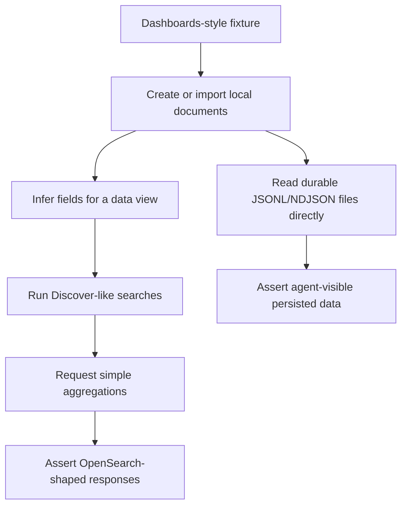

# mainstack-search Dashboards Discover And Visualization API Expansion

## Summary

mainstack-search will expand its deterministic API surface enough to support
basic OpenSearch Dashboards-style data exploration: data import, data view
creation, Discover searches, and simple aggregation-backed visualizations. The
first proof will be Rust/API fixtures traceable to the OpenSearch Dashboards
3.7.0 source baseline captured in `docs/opensearch-dashboards-gap-analysis.md`,
plus an explicit check that coding agents can read persisted JSONL/NDJSON data
directly from disk.

This tranche proves fixture-level Dashboards API compatibility. It should reduce
the unknowns for a later live Dashboards smoke, but it must not claim full live
OpenSearch Dashboards support until that separate smoke passes.

---

## Problem Frame

mainstack-search already covers core local index, document, bulk, scalar search,
and secured workgroup workflows. The next compatibility pressure comes from the
Dashboards source-backed gap analysis: OpenSearch Dashboards exercises
OpenSearch as an application substrate rather than as isolated client calls, and
the local clone identifies concrete boot, data-view, Discover, and visualization
APIs that are still missing or too generic.

Dashboards depends on a chain of behavior: it must inspect cluster metadata,
create or use indices, infer fields for a data view, run Discover-style searches,
and request aggregation shapes used by simple visualizations. If mainstack-search
only implements individual APIs without validating that chain, planning can
over-prioritize isolated route count and under-prioritize the workflows that
real local developers will actually use.

The project also has a development-specific promise that full OpenSearch does
not have: local data files should remain readable by agents and tooling. That
property needs to be verified as part of the same workflow, not treated as a
documentation claim.

---

## Actors

- A1. Application developer: Uses mainstack-search as the local OpenSearch
  endpoint while building or testing a Dashboards-like exploration workflow.
- A2. Coding agent: Runs compatibility tests, reads local durable files, and
  uses diagnostics to explain gaps or failures.
- A3. OpenSearch Dashboards-style client: Issues the OpenSearch API calls needed
  for data views, Discover, and simple visualizations.
- A4. Maintainer: Expands API coverage while preserving local-only simplicity,
  security posture, and readable persistence.

---

## Key Flows

- F1. API-fixture workflow proof
  - **Trigger:** A maintainer starts the Dashboards-driven compatibility test
    suite.
  - **Actors:** A2, A4
  - **Steps:** The fixture creates representative indices, imports documents,
    performs Dashboards-shaped metadata calls from the first-tranche matrix,
    runs Discover-style searches, runs simple visual aggregations, verifies
    response shape, and records the Dashboards source path or captured request
    that justified each call.
  - **Outcome:** The supported workflow is proven without requiring a live
    Dashboards process.
  - **Covered by:** R1, R2, R3, R16, R18

- F2. Data view creation
  - **Trigger:** A Dashboards-style client needs to build a field list for an
    index or pattern.
  - **Actors:** A1, A3
  - **Steps:** The client checks index existence, requests field capabilities
    through both read method shapes, receives field names/types/flags, and can
    proceed with a data view. The fixture also covers empty, missing, malformed,
    and conflicting field-capability inputs.
  - **Outcome:** A basic data view can be modeled from local index metadata and
    observed documents.
  - **Covered by:** R4, R5, R6, R17, R19

- F3. Discover search
  - **Trigger:** A user opens a Discover-like view for a data view.
  - **Actors:** A1, A3
  - **Steps:** The client sends filtered, sorted, paginated search requests,
    receives hits, source filtering, total-hit metadata, and predictable empty
    results for no-match queries. Invalid, unsupported, and over-limit query
    bodies return structured OpenSearch-shaped errors before expensive
    evaluation.
  - **Outcome:** A developer can inspect local documents through a
    Dashboards-style search path.
  - **Covered by:** R7, R8, R9, R19

- F4. Simple visualization
  - **Trigger:** A user creates or opens a simple chart or metric panel.
  - **Actors:** A1, A3
  - **Steps:** The client sends aggregation-backed search requests over a small
    local dataset for metric summaries, terms buckets, date histograms, numeric
    histograms/ranges, filters, missing buckets, and top-hit tables, then
    receives bucket or metric aggregation responses.
  - **Outcome:** Common local charts and metric summaries render from
    OpenSearch-shaped aggregation results.
  - **Covered by:** R10, R11, R12, R19

- F5. Agent-readable durable data
  - **Trigger:** A coding agent needs to diagnose or verify local data without
    trusting the HTTP API.
  - **Actors:** A2
  - **Steps:** The fixture writes non-sensitive synthetic data in durable mode,
    locates the readable persisted data files, parses line-oriented mutation
    records and materialized state directly from disk, and confirms indexed
    documents are inspectable without exposing private data.
  - **Outcome:** The local development promise of agent-readable persistence is
    tested end to end.
  - **Covered by:** R13, R14, R15

---

## Requirements

**Dashboards-driven proof**

- R1. The tranche must use OpenSearch Dashboards behavior as the prioritization
  guide for API expansion, with `docs/opensearch-dashboards-gap-analysis.md` as
  the starting reference and the OpenSearch Dashboards 3.7.0 source baseline
  recorded there as the target for this fixture slice.
- R2. The first acceptance gate must be deterministic Rust/API fixtures that
  mimic Dashboards calls for data import, data view creation, Discover searches,
  and simple visualizations. Each fixture call must cite a Dashboards source
  path, captured request, or row in the local gap analysis so hand-authored
  fixtures cannot drift into invented compatibility.
- R3. The fixture proof must not require launching a live OpenSearch Dashboards
  process, and passing it must be described as fixture-level compatibility until
  a later live Dashboards smoke is introduced.

**Data view prerequisites**

- R4. mainstack-search must expose index-existence behavior under the appropriate
  OpenSearch API identity so clients and route inventory checks can distinguish
  index lookup from index existence.
- R5. mainstack-search must provide deterministic field-capability responses for
  stored local data, including field names, inferred or mapped field types, and
  basic searchable/aggregatable flags. Both `GET` and `POST` forms of
  `/_field_caps` and `/{index}/_field_caps` must classify as read APIs and must
  not rely on runtime agent fallback.
- R6. Metadata APIs used during Dashboards startup and data-view setup must
  return response shapes that Dashboards-style clients can consume, even when
  the local answer is intentionally minimal. The implemented set for this
  tranche is the first-tranche API and access matrix below.

**Discover search behavior**

- R7. Search and count behavior must cover the query patterns used by
  Dashboards-style saved-object and Discover flows, including boolean
  composition, term matching, terms matching, existence checks, ranges, simple
  query strings, and no-match cases.
- R8. Search responses must preserve source filtering, pagination, sorting, and
  total-hit metadata needed by Discover-like result tables.
- R9. Unsupported query features must fail with structured OpenSearch-shaped
  errors and caller-oriented hints rather than silently returning misleading
  results. Query parsing must also enforce bounded request size, query depth,
  clause count, terms-list size, pagination window, aggregation depth, and bucket
  count before expensive evaluation.

**Visualization aggregations**

- R10. Aggregation support must cover the first-tranche Dashboards-relevant
  subset before broader aggregation parity: bucket aggregations `terms`,
  `date_histogram`, `histogram`, `range`, `filters`, and `missing`; metric
  aggregations `value_count`, `min`, `max`, `avg`, `sum`, `cardinality`,
  `stats`, and `top_hits`.
- R11. Aggregation behavior must be good enough for development-scale data and
  simple visualizations, but it does not need distributed Lucene/OpenSearch
  parity.
- R12. Aggregation responses must be OpenSearch-shaped enough for client code to
  consume nested bucket and metric results without special mainstack-search
  handling.

**Persistence and agent readability**

- R13. Durable-mode compatibility fixtures must verify that persisted
  JSONL/NDJSON data can be read directly from disk by a coding agent without
  using the HTTP API. The fixture must use a temporary fixture data directory
  containing only non-sensitive synthetic records.
- R14. The direct disk-read verification must confirm that representative
  indexed document content, identifiers, and mutation intent are understandable
  from the persisted records. For this tranche, mutation intent means the
  operation kind and target expressed in the append-only mutation log; materialized
  document state is cross-checked against the readable snapshot when present.
- R15. The direct disk-read verification must avoid exposing secrets and must
  respect existing security guidance about not logging credentials, tokens,
  Authorization headers, private keys, or secret file contents. It must also
  avoid printing or sending arbitrary indexed document bodies to agent context
  unless they came from the synthetic fixture dataset.

**Scope control and compatibility hygiene**

- R16. Runtime agent fallback must not be used as the primary proof for
  Dashboards-driven APIs in this tranche; supported workflow calls should be
  deterministic.
- R17. Route classification, access classes, and unsupported-route behavior must
  remain security boundaries as new read, write, and control-like APIs are
  added. Every API in the first-tranche matrix must have an explicit
  `AccessClass`, and wrong-method variants must fail closed before handler or
  fallback dispatch.
- R18. Test fixtures should use selected OpenSearch Dashboards data or behavior
  only where it materially improves coverage, not as a wholesale import of the
  full Dashboards test suite.
- R19. The fixture suite must cover success, empty, invalid-input, unsupported,
  partial/conflicting-data, and security-denied states for the selected
  data-view, Discover, and visualization workflows.

---

## First-Tranche Scope Decisions

### Source Baseline And Claims

- Target Dashboards signal: `docs/opensearch-dashboards-gap-analysis.md`,
  based on OpenSearch Dashboards package version `3.7.0` at commit
  `a30877d7b9c70c896247ca2e8f9e974cb672b1ed`.
- Every fixture group must include a short traceability note that names the
  Dashboards source path, captured request, or gap-analysis row it represents.
- The tranche may say "Dashboards-shaped fixture compatibility" when it passes.
  It may not say "OpenSearch Dashboards is supported" until a live smoke runs.

### API And Access Matrix

| API identity | Methods / routes | Access | First-tranche behavior |
| --- | --- | --- | --- |
| `indices.exists` | `HEAD /{index}` | `Read` | Distinct route identity from `indices.get`; empty `200` or `404` response; no fallback. |
| `field_caps` | `GET`/`POST /_field_caps`, `GET`/`POST /{index}/_field_caps` | `Read` | Deterministic `fields` response from mappings plus observed values; supports `fields=*`; no fallback. |
| `cat.plugins` | `GET /_cat/plugins` | `Read` | Return `[]` for JSON output and compatible empty text output. |
| `cat.templates` | `GET /_cat/templates` | `Read` | Return `[]` unless legacy templates are implemented. |
| `cluster.stats` | `GET /_cluster/stats` | `Read` | Return stable single-node metadata, `cluster_uuid`, node count, index count, document count, and store counters. |
| `indices.delete_template` | `DELETE /_template/{name}` | `Write` | Return acknowledged not-found-compatible behavior when no legacy template exists; no fallback. |
| `indices.update_aliases` | `POST /_aliases`, `POST /_alias` | `Write` | Extend alias actions to cover `remove_index` atomically enough for local use. |
| `search`, `count` | `GET`/`POST /_search`, `GET`/`POST /{index}/_search`, `GET`/`POST /_count`, `GET`/`POST /{index}/_count` | `Read` | Use the shared local query evaluator and enforce request guardrails before evaluation. |
| `msearch` | `GET`/`POST /_msearch`, `GET`/`POST /{index}/_msearch` | `Read` | Execute selected searches with the same evaluator, response shape, and per-item errors. |

### Field-Capability Rules

- Explicit mappings are authoritative. When mappings exist, empty indices still
  return mapped fields.
- Unmapped observed values may infer booleans, integral numbers, floating-point
  numbers, strings as `keyword`, objects, and arrays from their scalar members.
  Date fields in the first fixture dataset should use explicit mappings.
- Empty unmapped indices return an empty `fields` object.
- Missing index or pattern requests return an OpenSearch-shaped not-found or
  no-indices error unless the request explicitly opts into ignoring missing
  indices.
- Mixed observed scalar types must either return OpenSearch-shaped conflict
  metadata or a structured unsupported error with a caller hint; they must not
  silently pick one type.
- Malformed field-capability inputs return structured errors without fallback.

### Query Evaluation And Guardrails

- The first shared in-memory evaluator must cover `bool.must`, `bool.filter`,
  `bool.should`, `minimum_should_match`, `must_not`, `term`, `terms`, `exists`,
  `match_all`, `simple_query_string`, `match_phrase_prefix`, `range`, `_source`
  filtering, `sort`, `from`, `size`, and `track_total_hits`.
- `nested` only needs enough support for Dashboards saved-object references in
  this tranche. Unknown nested shapes fail with structured hints.
- Search, count, msearch, and future query-mutating APIs should share the same
  evaluator semantics rather than grow separate partial parsers.
- Default guardrails for this tranche: request body no larger than 10 MiB, query
  depth no greater than 32, total boolean/query clauses no greater than 1024,
  `terms` values no greater than 4096 per clause, aggregation nesting no greater
  than 8, returned buckets no greater than 10000, and `from + size` no greater
  than the local result window of 10000.
- Guardrail failures return OpenSearch-shaped validation errors with hints that
  tell an agent caller how to narrow the request.

### Visualization Slice

- Metric summary panels: `value_count`, `min`, `max`, `avg`, `sum`,
  `cardinality`, and `stats` over numeric, keyword, and mapped date fields where
  applicable.
- Terms charts and data tables: `terms` buckets with nested metric aggregations,
  deterministic ordering, `doc_count`, and empty bucket behavior.
- Time charts: `date_histogram` over explicitly mapped date fields with nested
  metric aggregations.
- Numeric charts: `histogram` and `range` over numeric fields.
- Filtered charts: `filters` and `missing` buckets.
- Document sample tables: `top_hits` with source filtering, sorting, and size
  limits.
- Pipeline aggregations, scripted aggregations, distributed accuracy metadata,
  and Lucene scoring parity remain out of scope for this tranche unless a
  selected fixture proves they are required.

### Durable Disk-Read Contract

- The append-only mutation log is the authoritative source for mutation intent.
  The coding-agent fixture should parse transaction `begin`/`commit` records and
  mutation `kind` values such as `index_document`, `create_document`,
  `update_document`, and `delete_document`.
- The readable snapshot is a materialized-state cross-check, not the sole source
  of mutation intent.
- The fixture may print identifiers, operation kinds, index names, and selected
  synthetic fixture fields. It must not print credentials, token-like values,
  private key material, arbitrary user data, or non-fixture document bodies.

### Workflow State Matrix

| Workflow | Required states |
| --- | --- |
| Data view creation | Existing index, missing index, empty mapped index, empty unmapped index, malformed field-capability request, mixed observed types, read-only access, denied write/control access. |
| Discover search | Match, no match, missing sort/filter field, invalid query clause, unsupported query clause, over-limit request, source filtering, pagination boundary. |
| Visualization | Non-empty buckets, empty buckets, missing aggregation field, unsupported aggregation, over bucket limit, nested bucket plus metric, read-only access. |
| Durable disk read | Synthetic data visible, mutation intent visible, snapshot cross-check present or absent, malformed/torn final log record handled by existing recovery behavior, sensitive data not emitted. |

---

## Acceptance Examples

- AE1. **Covers R2, R3, R4, R5, R6, R17.** Given fixture calls traceable to the
  Dashboards baseline, when the API-fixture test performs a data-view setup
  sequence, it observes `indices.exists`, `field_caps`, and the selected
  metadata responses without launching Dashboards. Both `GET` and `POST`
  `field_caps` classify as read access, and wrong-method variants fail closed.
- AE2. **Covers R5, R19.** Given mapped, unmapped, empty, missing, malformed, and
  mixed-type field-capability cases, when the fixture requests fields for an
  index or pattern, it receives deterministic fields, empty fields, conflict
  metadata, or structured errors according to the field-capability rules.
- AE3. **Covers R7, R8, R9.** Given indexed documents with strings, numbers,
  dates, missing fields, and arrays, when the fixture sends Discover-like search
  requests, matching hits, source filtering, sort order, pagination, and
  total-hit metadata are deterministic. Unsupported or over-limit query clauses
  return structured errors before expensive evaluation.
- AE4. **Covers R10, R11, R12.** Given the same local dataset, when the fixture
  sends first-tranche visualization aggregation requests, metric summaries,
  terms buckets, date histograms, numeric histograms/ranges, filters, missing
  buckets, and top-hit tables have OpenSearch-shaped names, buckets, doc counts,
  and values that match the local data.
- AE5. **Covers R13, R14, R15.** Given a durable-mode fixture run, when a coding
  agent reads the persisted line-oriented data files and snapshot directly from
  disk, it can parse mutation intent and representative synthetic document
  content without using the HTTP API or printing secret material.
- AE6. **Covers R16, R17, R18, R19.** Given strict compatibility mode or disabled
  runtime fallback, when the Dashboards-driven fixture suite runs,
  deterministic supported calls still pass, unsupported calls fail closed, and
  security-denied states do not reach handler or fallback dispatch.

---

## Success Criteria

- A maintainer can run a deterministic Dashboards-style API fixture suite and
  see which Discover/visualization workflow slice is supported.
- A future live OpenSearch Dashboards smoke has fewer unknowns because boot,
  data-view, Discover, and simple aggregation calls have already been isolated
  and tested against source-traceable fixtures.
- A coding agent can inspect durable local files and explain persisted fixture
  data without going through the HTTP API.
- The requirements handoff gives `ce-plan` enough scope, boundaries, and success
  criteria to plan implementation without inventing product behavior.

---

## Scope Boundaries

- Do not run or require the full OpenSearch Dashboards Cypress suite in this
  tranche.
- Do not require a live OpenSearch Dashboards process as the first acceptance
  gate.
- Do not describe this tranche as full OpenSearch Dashboards support; it proves
  a selected, source-traceable API fixture slice.
- Do not implement plugin-specific APIs such as PPL or data source management
  unless the selected API fixtures prove they are required for the targeted
  workflow.
- Do not include snapshot APIs used by Dashboards archiver tooling unless they
  become necessary for the targeted workflow.
- Do not pursue full OpenSearch aggregation, Lucene scoring, distributed query,
  or production-scale optimization parity.
- Do not introduce Polars or another DataFrame engine as a requirement for this
  tranche.
- Do not weaken existing authentication, authorization, fallback, or
  unsupported-route safety boundaries while expanding API coverage.

---

## Key Decisions

- API-fixture proof comes before live Dashboards smoke: deterministic fixtures
  provide faster feedback and isolate OpenSearch API gaps before introducing
  Dashboards server/runtime setup variables.
- Source traceability is required for fixture credibility: fixtures must be
  grounded in the pinned Dashboards baseline or local gap-analysis rows, not
  invented from memory.
- Native in-memory evaluation remains the required execution path: the project
  target is small local datasets with readable JSON/JSONL durability, and
  introducing a DataFrame engine is not required to prove the next workflow.
- Discover and visualization support includes prerequisite boot/data-view calls:
  the headline workflow cannot work unless metadata and field-discovery calls
  are reliable first.
- Agent-readable persistence is a first-class compatibility property: local
  development usefulness includes being able to inspect durable data outside
  the API.
- The mutation log carries operation intent; snapshots are useful for
  materialized-state inspection but are not the sole semantic contract.

---

## Dependencies / Assumptions

- `docs/opensearch-dashboards-gap-analysis.md` remains the main local research
  artifact for Dashboards API signals.
- The selected fixture datasets should remain small enough for the existing
  local resource-limit model.
- Existing official-client smoke tests continue to cover driver-level
  compatibility while the Dashboards fixture suite covers application-level API
  behavior.
- Security and fallback behavior from the Kubernetes/workgroup security tranche
  remains in force for any new APIs.
- The first-tranche guardrail values are defaults for this requirements slice;
  implementation planning may decide whether they should become configurable.

---

## Outstanding Questions

### Deferred to Planning

- [Affects R7, R9, R10][Technical] Which internal module boundaries should own
  the shared query evaluator so future `delete_by_query`, `update_by_query`, and
  aggregation work reuse the same semantics?
- [Affects R9][Technical] Which guardrail values should be fixed defaults versus
  user-configurable development settings?
- [Affects R3][Validation] Which live Dashboards smoke should follow this
  fixture tranche before the project claims live Dashboards support?
