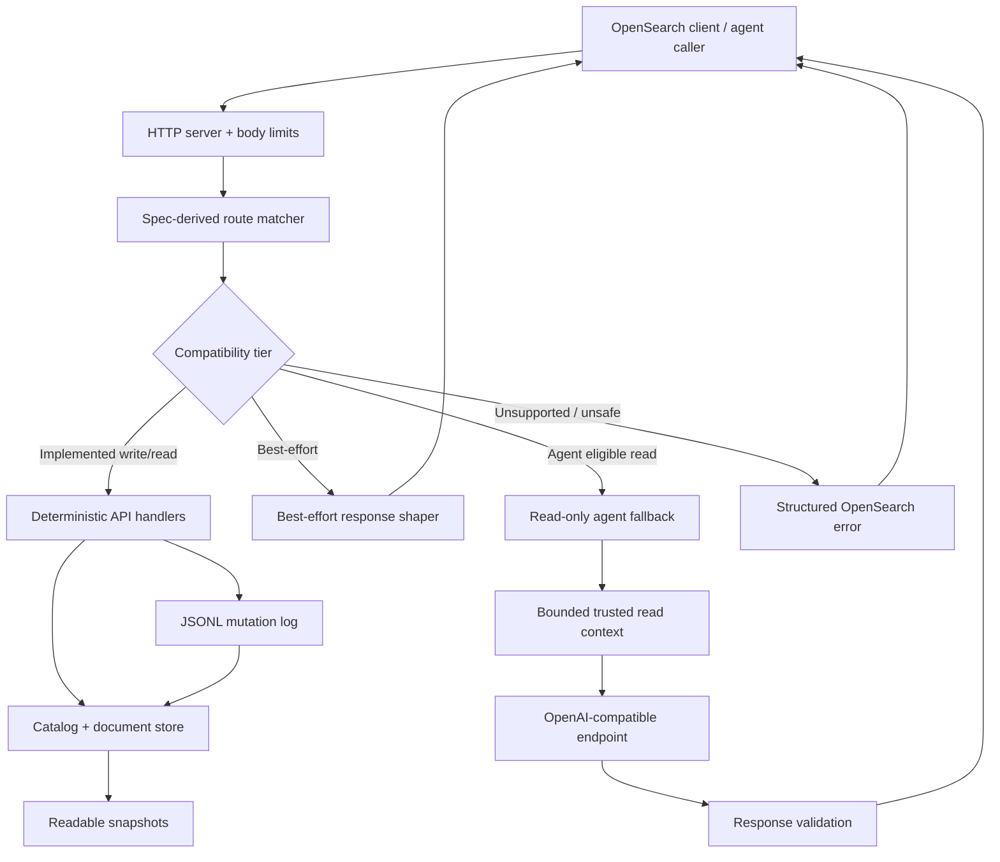

# feat: Build OpenSearch Lite

## Summary

Build `opensearch-lite` as a greenfield Rust service with a broad recent
OpenSearch REST compatibility shell, deterministic local implementations for
core index/document/bulk/search workflows, JSON/JSONL-readable persistence, and
a configured read-only OpenAI-compatible runtime agent fallback for unsupported
read requests.

---

## Problem Frame

The requirements in `PLAN.md` define a broad local OpenSearch emulator rather
than a narrow Axon-only subset. The implementation has to make route breadth
visible early without letting shallow compatibility hide state mutation,
resource, or data-exposure risks.

---

## Planning Requirements Summary

- S1. Preserve the local-only, single-node identity and recent OpenSearch 3.x
  compatibility posture from `PLAN.md`.
- S2. Recognize a broad recent OpenSearch REST route inventory and classify each
  route by behavior tier.
- S3. Implement deterministic local behavior for core index, template, alias,
  document, bulk, and search flows before those APIs can mutate local state.
- S4. Return OpenSearch-shaped best-effort responses for safe status, metadata,
  and no-op APIs while logging approximation.
- S5. Persist local state in readable JSON/JSONL files with append-before-ack
  mutation durability and restart replay.
- S6. Provide a configured read-only runtime agent fallback for eligible
  unsupported read requests, with full read context treated as trusted once
  configured.
- S7. Validate agent-produced responses before returning them and produce
  structured, agent-actionable errors when fallback cannot answer.
- S8. Bound HTTP bodies, bulk batches, result windows, document/index counts,
  memory, agent context size, agent response size, connections, and timeouts.
- S9. Verify compatibility through generated route-inventory tests, deterministic
  API tests, real-client smokes, and a parity harness against real recent
  OpenSearch.
- S10. Document API tiers, local approximation behavior, agent fallback
  configuration and data exposure, client examples, and migration guidance.

**Origin actors:** A1 application developer, A2 OpenSearch client/tool, A3
agent caller, A4 runtime fallback agent, A5 maintainer, A6 development-bundle
integrator.

**Origin flows:** F1 implemented request, F2 best-effort response, F3 read-only
runtime agent fallback, F4 unsupported or unsafe request, F5 migration to real
OpenSearch.

**Origin acceptance examples:** AE1 client startup, AE2 route inventory, AE3
best-effort metadata response, AE4 template/write/read visibility, AE5 bulk
item behavior, AE6 search, AE7 agent fallback read response, AE8 missing write
API rejection, AE9 actionable fallback failure, AE10 durable recovery.

Implementation unit traceability uses the source `PLAN.md` requirement IDs
(`R1`-`R36`) and acceptance examples (`AE1`-`AE10`), not the summary labels
above.

---

## Scope Boundaries

### Deferred for later

- Exact parity for Lucene scoring, analyzers, tokenizers, and ranking internals.
- Full semantic, vector, and hybrid search implementation, beyond route
  recognition and staged best-effort support.
- Full plugin API implementations.
- Complete Dashboards, observability, security analytics, SQL, PPL, ML, and
  other optional ecosystem surfaces.
- Request/response compression if no target client requires it during early
  compatibility testing.
- TLS, authentication, roles, tenancy, and AWS SigV4 compatibility unless a
  target local workflow requires them.
- Runtime self-improvement that patches emulator code after an unsupported
  request.
- Agent fallback policy systems for field-level redaction or endpoint-specific
  data controls.

### Outside this product's identity

- Production OpenSearch replacement.
- Distributed cluster behavior, shard allocation fidelity, replicas, recovery,
  quorum behavior, and node coordination.
- OpenSearch or Lucene segment-file compatibility.
- Running real OpenSearch plugins.
- Forking OpenSearch to make it smaller.
- Runtime agent fallback performing writes, mutating local files, modifying
  emulator code, or silently changing local state.
- Optimizing for old OpenSearch 1.x or 2.x behavior as a primary goal.

### Deferred to Follow-Up Work

- Native vector index implementation: plan after core route shell, CRUD, bulk,
  and scalar search behavior are stable.
- Provider-specific agent fallback features beyond OpenAI-compatible chat-style
  calls: add after the generic fallback contract is test-covered.
- Full OpenSearch plugin endpoint behavior: retain route tiers and explicit
  unsupported/best-effort classification until demand justifies deeper support.

---

## Context & Research

### Relevant Code and Patterns

- The sibling `cqlite-server` project is the closest local pattern: it uses an
  explicit Rust binary crate, conservative CLI defaults, loopback binding guard,
  low-resource limits, durable local files, ignored real-client smoke tests, and
  protocol-shaped errors.
- The sibling `cqlite-server` config module shows the config posture to mirror:
  parse byte units, reject impossible limits, and require explicit opt-in before
  exposing an unauthenticated local server outside loopback.
- The sibling `cqlite-server` mutation log, storage, and row-store modules show
  the local durability pattern: append a JSONL mutation record, fsync the commit
  source, use snapshots as recovery accelerators, and replay into in-memory
  state at startup.
- The sibling `cqlite-server` real-client smoke test shows the test style:
  start the binary on `127.0.0.1:0`, discover the bound port from stderr, run the
  client workflow, and assert a clear success marker.
- The local OpenSearch clone's REST API spec currently contains 165 API
  definitions plus `_common.json`, with 265 path variants and 323 method/path
  combinations. The largest families are `indices`, `cat`, and `cluster`, which
  should drive the first route-tier inventory.
- Axon Stage 1 currently relies on OpenSearch 3.6, index templates,
  document PUTs, and `_search` with exact filters and sorting. This validates
  early template/alias/search support, but does not bound product scope.

### Institutional Learnings

- `cqlite-server` mutation-log recovery learning: the append-only log must be
  the durable commit source. After a successful append, snapshots should be
  best-effort recovery caches; otherwise clients can see failure for mutations
  that replay later applies.
- `cqlite-server` protocol hardening learning: every resource limit needs config
  validation, runtime enforcement, and a focused test proving enforcement.
- Axon OpenSearch operator learning: recent OpenSearch 3.x brings useful
  semantic/vector/agentic features, but JVM/operator startup remains a
  meaningful local-dev cost. This strengthens the case for a light local
  emulator and for recent 3.x compatibility.
- Axon JVM memory learning: avoid inheriting production engine memory
  assumptions into local-dev dependencies; explicit memory and body limits are
  product requirements, not late hardening work.

### External References

- OpenSearch releases page: OpenSearch 3.6.0 is the current concrete recent 3.x
  target as of 2026-04-29, with the local advertised version configurable.
- OpenSearch REST API specification: use the spec as the route inventory and
  compatibility matrix seed because it is intended to formalize the HTTP API for
  clients and integrations. Implementation must pin this input to the release
  tag or commit matching the advertised compatibility target rather than reading
  upstream `main`, a sibling checkout, or the network during normal builds.
- OpenSearch 3.6 announcement: validates that recent OpenSearch includes
  agentic search, alias support in agentic search, fallback query behavior,
  reranking, and vector-search improvements.
- OpenSearch client docs: Python, JavaScript, and Java clients cover both raw
  REST and generated client abstractions, making them the first smoke targets.
- OpenAI API reference: OpenAI-compatible fallback needs endpoint URL, optional
  bearer authentication, request IDs/logging, and pinned model/config choices
  because model behavior can vary across snapshots.

---

## Key Technical Decisions

- Use a generated compatibility inventory from a pinned OpenSearch REST spec as
  the source of route truth. This gives immediate breadth, keeps route
  generation reproducible, and prevents the project from drifting toward an
  undocumented hand-written subset.
- Keep the HTTP route shell data-driven. A generated route table should
  normalize method/path/query metadata and dispatch to deterministic handlers,
  best-effort handlers, agent-fallback eligibility, or structured unsupported
  errors.
- Keep best-effort compatibility invisible to normal OpenSearch response bodies
  but visible to automation through headers, structured audit logs, and a strict
  compatibility mode that can fail on approximation during CI or migration
  checks.
- Make the mutation log the durable commit source. Snapshots and compacted
  document files improve startup and agent-readability, but acknowledged writes
  must replay from append-only records.
- Durable mode is the default. Ephemeral mode is an explicit opt-in for
  disposable test/dev runs and must exercise the same in-memory semantics
  without promising restart recovery.
- Implement write APIs only through deterministic Rust handlers. Runtime agent
  fallback is read-only and must never be used as a hidden mutating handler.
- Use OpenAI-compatible chat-style transport as the first agent fallback shape.
  It maximizes compatibility with local and cloud providers; the internal
  `AgentClient` boundary exists for that transport and test doubles. Responses
  style or provider-specific transports stay follow-up work until a second
  transport is actually in scope.
- Treat configured fallback endpoints as trusted, but make the trust explicit in
  config validation, startup logs, per-request logs, and documentation.
- Stage semantic/vector support as route-aware and fallback-aware first, then
  add deterministic vector search later when core scalar search and storage are
  stable.

---

## First-Release Workflow Anchors

Broad route recognition is the product direction, but the first release should
use concrete workflows to prioritize deterministic handlers, best-effort
responses, and fallback-eligible reads:

- Official client startup and discovery for Python, JavaScript, and Java.
- Template, alias, index, document CRUD, bulk fixture loading, and scalar search
  through normal OpenSearch client calls.
- Local migration rehearsal where strict compatibility mode identifies
  best-effort or fallback-dependent requests before switching to real
  OpenSearch.
- Agent-caller read workflows where unsupported search or metadata requests can
  use configured read-only fallback and receive actionable failure hints.

These anchors guide first-release ordering without reducing the longer-term API
coverage goal to an Axon-only or workflow-only subset.

---

## Open Questions

### Resolved During Planning

- API inventory source: use the recent OpenSearch REST API specification as the
  primary route inventory, backed by official OpenSearch docs and parity tests.
- Advertised OpenSearch version: default to the latest tested recent 3.x version
  at implementation time, initially `3.6.0`, and make it configurable for
  client compatibility tests.
- Runtime agent fallback transport: start with a minimal OpenAI-compatible
  chat-style endpoint abstraction with endpoint URL, model, optional API key,
  request timeout, and size limits.
- First deterministic API families: root/info, health, core cat output,
  indices/templates/aliases, document CRUD, bulk, and scalar search.
- First best-effort route families: node/cluster stats, tasks, ingest metadata,
  snapshot metadata, scripts metadata, and plugin-like surfaces that can safely
  report empty or local-only state.

### Deferred to Implementation

- Exact Rust HTTP crate versions and final dependency versions: choose current
  stable crates during scaffold, but preserve the data-driven router boundary.
- Exact default resource-limit values: set conservative defaults during
  scaffold and tune after early resource/search benchmarks plus the first
  real-client smokes.
- Exact OpenSearch error type names for every unsupported feature: compare
  against a real OpenSearch container while implementing each route family.
- Exact generated file shape for the route inventory: choose whichever shape is
  simplest to review and keeps route-tier tests stable.
- Exact semantic/vector staging details: decide after scalar search and route
  classification exist.

---

## Output Structure

```text
opensearch-lite/
  Cargo.toml
  build.rs
  src/
    main.rs
    lib.rs
    config.rs
    server.rs
    api_spec/
    http/
    responses/
    catalog/
    storage/
    search/
    agent/
  vendor/
    opensearch-rest-api-spec/
  tests/
    api_inventory.rs
    http_surface.rs
    catalog_surface.rs
    document_surface.rs
    bulk_surface.rs
    search_surface.rs
    agent_fallback.rs
    python_client_smoke.rs
    javascript_client_smoke.rs
    java_client_smoke.rs
  benches/
    search_scan.rs
  scripts/
    update-opensearch-rest-spec.sh
    run-python-client-smoke.sh
    run-javascript-client-smoke.sh
    run-java-client-smoke.sh
    run-opensearch-parity-smoke.sh
  docker/
    docker-compose.yml
    java-smoke/
  docs/
    compatibility.md
    agent-fallback.md
    supported-apis.md
    driver-examples.md
    migration.md
```

This tree is a planning target. The implementing agent may adjust module names
when implementation reveals a simpler layout, but it should preserve the
component boundaries and test surfaces.

---

## High-Level Technical Design

> *This illustrates the intended approach and is directional guidance for
> review, not implementation specification. The implementing agent should treat
> it as context, not code to reproduce.*



---

## Phased Delivery

### Phase 1: Compatibility Shell

- Scaffold the Rust service, config, HTTP server, response shapers, route
  inventory generator, and compatibility matrix.
- Prove root/info/health and unknown-route behavior before persistent storage.

### Phase 2: Deterministic Core

- Add catalog, templates, aliases, document store, mutation log, CRUD, bulk, and
  scalar search.
- Run deterministic API tests and the Python/JavaScript subset of the client
  smoke harness as soon as U6 lands.

### Phase 3: Agentic Breadth

- Add read-only agent fallback, response validation, structured actionable
  errors, and fallback documentation.
- Expand route tiers and best-effort responses across broader API families.

### Phase 4: Parity and Packaging

- Add Java smoke, real OpenSearch parity harness, Docker/Compose support,
  migration guidance, and packaging release gates.

---

## Implementation Units

- U1. **Scaffold Service, Config, and HTTP Boundary**

**Goal:** Create the Rust crate, binary entrypoint, local-only configuration,
HTTP listener, request body admission, connection limits, and basic logging.

**Requirements:** R1, R3, R8, AE1

**Dependencies:** None

**Files:**
- Create: `Cargo.toml`
- Create: `build.rs`
- Create: `src/main.rs`
- Create: `src/lib.rs`
- Create: `src/config.rs`
- Create: `src/server.rs`
- Create: `src/http/mod.rs`
- Create: `src/http/request.rs`
- Create: `src/http/router.rs`
- Create: `src/http/body.rs`
- Create: `tests/http_surface.rs`

**Approach:**
- Mirror `cqlite-server`'s conservative config posture: loopback by default,
  explicit non-loopback opt-in, byte-unit parsing, positive resource limits, and
  startup validation before binding.
- Keep HTTP parsing and admission separate from API behavior so later route
  handlers inherit body, timeout, connection, and content-type safeguards.
- Log startup configuration clearly without including secrets. Agent fallback
  endpoint logging is introduced in U7 when fallback config exists.

**Execution note:** Implement configuration and admission behavior test-first;
these are security and resource-control contracts.

**Patterns to follow:**
- The sibling `cqlite-server` config module for argument parsing and local-only
  bind guard.
- The sibling `cqlite-server` server module for listener startup, connection
  admission, and bounded runtime errors.

**Test scenarios:**
- Happy path: default config binds loopback and serves `GET /` with an
  OpenSearch-shaped response placeholder.
- Edge case: `--listen 0.0.0.0:9200` fails unless explicit non-loopback opt-in
  is present.
- Error path: unknown CLI flags and zero/invalid resource limits fail before
  the server starts.
- Error path: oversized request bodies fail before JSON parsing or route
  dispatch.
- Integration: server started on `127.0.0.1:0` reports the bound address in a
  form smoke tests can consume.

**Verification:**
- A local HTTP client can reach root/info, and all configured resource limits
  are enforced at the layer that consumes the resource.

---

- U2. **Generate Route Inventory and Compatibility Matrix**

**Goal:** Turn the OpenSearch REST API specification into a checked, testable
  route inventory with explicit compatibility tiers.

**Requirements:** R2, R4, R8, R9, R35, AE2

**Dependencies:** U1

**Files:**
- Create: `vendor/opensearch-rest-api-spec/`
- Create: `src/api_spec/mod.rs`
- Create: `src/api_spec/generated.rs`
- Create: `src/api_spec/tier.rs`
- Create: `src/http/route_matcher.rs`
- Create: `tests/api_inventory.rs`
- Create: `docs/compatibility.md`
- Create: `docs/supported-apis.md`
- Create: `scripts/update-opensearch-rest-spec.sh`
- Modify: `build.rs`

**Approach:**
- Vendor or generate from a checked-in OpenSearch REST API spec input pinned to
  the release tag or commit matching the default advertised OpenSearch version.
  Normal builds and CI must not fetch the network or depend on a sibling
  checkout.
- Use the pinned spec as the source of route names, path patterns, methods,
  parameters, body presence, and stability metadata.
- Generate or load a compact route table that supports matching concrete
  requests to API names and path parameters.
- Store a first-pass tier assignment beside generated metadata so route
  coverage and product behavior are reviewed together.
- Generate `docs/supported-apis.md` from the same tier inventory and fail docs
  generation when any route lacks a tier or documentation row.
- Record the pinned spec tag/SHA and parity image tag in generated docs and test
  snapshots, with an explicit update script for future OpenSearch versions.
- Start deterministic tiering with core implemented APIs, safe best-effort
  metadata APIs, read-only fallback-eligible APIs, explicit unsupported APIs,
  and outside-identity APIs.

**Technical design:** Directional route-dispatch shape:

```text
Request(method, path) -> RouteMatch(api_name, params, tier)
  tier=implemented -> deterministic handler
  tier=best_effort -> response shaper
  tier=agent_read -> fallback eligibility check
  tier=unsupported/outside_identity -> structured error
```

**Patterns to follow:**
- The local OpenSearch clone's REST API spec for route metadata shape.
- The local OpenSearch clone's API spec schema for the generator input shape.

**Test scenarios:**
- Covers AE2. Happy path: every current API spec file except `_common.json`
  contributes one API name to the matrix.
- Happy path: known routes such as root info, cluster health, create index,
  document index, bulk, search, and index template match expected API names.
- Edge case: overlapping paths route by specificity rather than declaration
  order when a concrete path and parameterized path both could match.
- Error path: a malformed or unsupported spec entry fails inventory generation
  with a useful error rather than silently dropping a route.
- Regression: route count and method/path count are asserted or snapshotted so
  pinned spec updates force a matrix review.
- Regression: docs generation fails if a recognized route has no tier or no
  supported-API documentation row.

**Verification:**
- The compatibility matrix can be generated from the spec and every recognized
  route has exactly one behavior tier, with no build-time dependency on a
  sibling repository or network fetch.

---

- U3. **Response, Error, and Approximation Shaping**

**Goal:** Provide shared OpenSearch-shaped success, best-effort, and error
  response helpers before feature handlers proliferate.

**Requirements:** R4, R5, R6, R10, R11, R25, AE1, AE3, AE9

**Dependencies:** U1, U2

**Files:**
- Create: `src/responses/mod.rs`
- Create: `src/responses/info.rs`
- Create: `src/responses/errors.rs`
- Create: `src/responses/best_effort.rs`
- Create: `src/responses/logging.rs`
- Modify: `src/http/router.rs`
- Test: `tests/http_surface.rs`

**Approach:**
- Centralize root/info, product/version, health-ish, unsupported, malformed,
  size-limit, and fallback-failure response shapes.
- Keep approximation visible in logs and docs, not successful response bodies.
- Emit a machine-readable compatibility signal outside the JSON body for
  best-effort and fallback responses, such as a stable response header plus a
  structured audit log entry containing the route ID and tier.
- Add strict compatibility mode for CI and migration checks. In strict mode,
  best-effort and agent-fallback responses fail unless the route is explicitly
  allowlisted for that run.
- Include machine-readable error fields and actionable hints for agent callers,
  while preserving OpenSearch-like structure.
- Make status-code choices close to recent OpenSearch during each route-family
  implementation, but keep the helper API stable.

**Patterns to follow:**
- The sibling `cqlite-server` protocol error and message helpers for shaped
  protocol errors and bounded error text.
- OpenSearch root/info and error responses captured from a real 3.x container
  during parity harness work.

**Test scenarios:**
- Covers AE1. Happy path: root/info response includes product/version fields
  accepted by recent clients.
- Covers AE3. Happy path: a best-effort route returns a normal success body and
  writes an approximation log entry plus the out-of-body compatibility signal.
- Covers AE9. Error path: fallback failure returns a structured limitation and
  a retry hint without leaking arbitrary prompt text.
- Error path: strict compatibility mode rejects unallowlisted best-effort and
  fallback responses without adding local-only fields to success bodies.
- Edge case: HEAD requests return status and headers without response bodies.
- Error path: unknown routes and unsupported unsafe routes use distinct
  response helpers.

**Verification:**
- All non-feature route outcomes go through shared response/error helpers rather
  than ad hoc JSON in handlers.

---

- U4. **Catalog, Templates, Aliases, and Durable Storage**

**Goal:** Implement the local state model and JSON/JSONL persistence that all
  deterministic handlers use.

**Requirements:** R3, R5, R8, R13, R14, R17, R28, R29, R30, R31, AE4, AE10

**Dependencies:** U1, U3

**Files:**
- Create: `src/catalog/mod.rs`
- Create: `src/catalog/index.rs`
- Create: `src/catalog/mapping.rs`
- Create: `src/catalog/settings.rs`
- Create: `src/catalog/template.rs`
- Create: `src/catalog/alias.rs`
- Create: `src/storage/mod.rs`
- Create: `src/storage/mutation_log.rs`
- Create: `src/storage/snapshot.rs`
- Create: `src/storage/document_store.rs`
- Create: `tests/catalog_surface.rs`

**Approach:**
- Treat the mutation log as the durable commit source for catalog changes,
  template/alias updates, document writes, updates, deletes, and tombstones.
- Use readable snapshots for current catalog and document state, but never let
  snapshot failure contradict a successful committed mutation.
- Route all mutations through one transaction path: allocate version/sequence
  metadata under the write guard, append and fsync the mutation record before
  publishing in-memory state, and expose committed state to reads only after the
  transaction completes.
- For bulk, return per-item errors when an item cannot be durably appended and
  continue later items only when their own mutation records commit.
- Support templates early enough that a document write can create an index with
  template-derived mapping/settings behavior.
- Model aliases as local routing metadata for reads and writes, with clear
  handling for unsupported alias filters/routing options.
- Preserve unknown harmless mapping/settings fields for metadata round trips
  where they do not imply unsupported execution semantics.
- Create durable data directories and files with owner-only permissions where
  the platform supports it, keep raw `_source` out of logs and errors, and
  document that readable JSON/JSONL files may contain indexed data.
- Define compaction and purge behavior: retained snapshots and compacted
  segments should omit raw sources for deleted documents, while active append
  segments may retain raw source until compaction. Provide explicit data-dir
  wipe and ephemeral-mode paths for disposable runs.
- Default to durable mode. Ephemeral mode must be an explicit opt-in for tests
  or disposable local runs.

**Execution note:** Add restart-recovery coverage before layering API handlers
on top of the store.

**Patterns to follow:**
- The sibling `cqlite-server` mutation log implementation for append, fsync
  grouping, segment rotation, checkpointing, and replay tolerance for torn final
  records.
- The sibling `cqlite-server` storage implementation for atomic snapshot writes
  and directory sync discipline.

**Test scenarios:**
- Covers AE4. Happy path: registering a template then writing a document creates
  local index metadata that reflects the template.
- Covers AE10. Integration: after durable restart, catalog, templates, aliases,
  documents, tombstones, and versions are reconstructed.
- Error path: simulated snapshot write failure after mutation append logs a
  warning but preserves committed replay behavior.
- Error path: concurrent writes and mixed bulk requests preserve one replay
  order, stable version metadata, and read-your-own-write visibility only after
  the commit path completes.
- Edge case: torn final JSONL mutation record is truncated or ignored only when
  it is incomplete; earlier malformed committed records fail recovery.
- Error path: resource limits reject too many indexes, too many documents, or
  excessive estimated in-memory state.
- Data-protection path: durable files use restrictive permissions where
  supported, raw `_source` is absent from logs/errors, compaction removes
  deleted sources from retained snapshots/segments, and data-dir wipe removes
  durable state.

**Verification:**
- Durable mode can replay all committed local state from readable files, and
  explicit ephemeral mode exercises the same in-memory semantics without file
  writes or restart-recovery guarantees.

---

- U5. **Deterministic Index, Template, Alias, Document, and Bulk APIs**

**Goal:** Add real handlers for the mutating and read APIs that normal local
  development workflows depend on most.

**Requirements:** R3, R7, R12, R13, R14, R15, R16, R17, AE4, AE5, AE8

**Dependencies:** U2, U3, U4

**Files:**
- Create: `src/api/mod.rs`
- Create: `src/api/cluster.rs`
- Create: `src/api/cat.rs`
- Create: `src/api/indices.rs`
- Create: `src/api/templates.rs`
- Create: `src/api/aliases.rs`
- Create: `src/api/documents.rs`
- Create: `src/api/bulk.rs`
- Modify: `src/http/router.rs`
- Test: `tests/catalog_surface.rs`
- Test: `tests/document_surface.rs`
- Test: `tests/bulk_surface.rs`

**Approach:**
- Implement root/info, health, and key cat endpoints as deterministic local
  status over the catalog and document store.
- Implement index create/delete/get/head, mapping/settings get/put, index
  templates, and aliases before document write flows are considered complete.
- Implement document index/create/get/head/update/delete with generated IDs,
  source retrieval, basic version/sequence metadata, conflict behavior, and
  clear unsupported paths for scripts and pipelines.
- Implement bulk as NDJSON action parsing with per-item result/error shaping
  and continued processing after item failures.
- Reject missing write APIs and unsafe mutations rather than routing them to
  agent fallback.

**Patterns to follow:**
- The sibling `cqlite-server` deterministic surface tests for API-level
  behavior coverage.
- OpenSearch REST spec files for route aliases, parameter names, and supported
  methods.

**Test scenarios:**
- Covers AE4. Integration: template registration, lazy index creation through
  document write, immediate get, and immediate search-visible state.
- Covers AE5. Integration: mixed bulk request applies valid index/update/delete
  items and reports invalid items without aborting later valid items.
- Covers AE8. Error path: unimplemented mutating APIs return structured
  unsupported errors and do not invoke fallback.
- Happy path: aliases route get/search/write operations where local semantics
  are safe and supported.
- Edge case: path-level index defaults in `/{index}/_bulk` apply only when
  item metadata omits `_index`.
- Error path: malformed JSON, malformed NDJSON, unsupported update scripts, and
  request-size violations return shaped errors.

**Verification:**
- The first deterministic local app workflow can create metadata, write
  documents, bulk load fixtures, read documents, delete documents, and inspect
  status through OpenSearch-shaped APIs.

---

- U6. **Scalar Search Evaluator and Result Shaping**

**Goal:** Implement bounded local `_search` behavior for common Query DSL and
  response features.

**Requirements:** R3, R18, R19, R31, AE6

**Dependencies:** U4, U5

**Files:**
- Create: `src/search/mod.rs`
- Create: `src/search/dsl.rs`
- Create: `src/search/evaluator.rs`
- Create: `src/search/source_filter.rs`
- Create: `src/search/sort.rs`
- Create: `src/search/scoring.rs`
- Create: `src/api/search.rs`
- Create: `benches/search_scan.rs`
- Test: `tests/search_surface.rs`

**Approach:**
- Start with bounded in-memory scans over local documents because the expected
  development data set is small.
- Before committing to the evaluator limits, run an early benchmark/spike with
  representative document counts, source byte sizes, index counts, memory
  ceilings, and latency gates. Use it to decide when the server rejects,
  falls back, or introduces inverted/vector indexes.
- Support match-all, IDs, term/terms, range, exists, simple bool, limited text
  match, source filtering, simple scalar sort, `from`, `size`, and total-hit
  reporting.
- Keep scoring deterministic and documented rather than pretending Lucene
  parity. Prefer `_score` values that are stable enough for tests and clearly
  local.
- Reject or classify aggregations, nested queries, scripts, highlighting,
  scroll/PIT, and vector/neural queries according to route tier and fallback
  eligibility.
- Record the design point where optional inverted indexes or vector indexes
  can be introduced without changing API handler contracts.

**Test scenarios:**
- Covers AE6. Happy path: bool filter combining exact term and range returns
  the expected hit set with OpenSearch-shaped hits.
- Happy path: source include/exclude filters trim `_source` without mutating
  stored documents.
- Edge case: `from`/`size` and max-result limits bound output and memory use.
- Edge case: numeric/date-like ranges compare according to mapping when
  available and fail or fallback predictably when mapping is missing.
- Error path: unsupported query types produce structured unsupported or
  fallback-eligible outcomes rather than empty misleading results.
- Benchmark path: representative scan workloads record latency and memory
  against the release gates before U6 is considered complete.

**Verification:**
- Supported search requests produce deterministic hit sets and response shapes
  through the same local state used by document APIs.

---

- U7. **Read-Only Runtime Agent Fallback**

**Goal:** Add configured runtime fallback for unsupported read requests, with
  trusted read context, response validation, and actionable failures.

**Requirements:** R6, R7, R8, R20, R21, R22, R23, R24, R25, R26, R27, AE7, AE8,
AE9

**Dependencies:** U2, U3, U4, U6

**Files:**
- Create: `src/agent/mod.rs`
- Create: `src/agent/config.rs`
- Create: `src/agent/context.rs`
- Create: `src/agent/client.rs`
- Create: `src/agent/prompt.rs`
- Create: `src/agent/validation.rs`
- Create: `src/agent/errors.rs`
- Modify: `src/config.rs`
- Modify: `src/http/router.rs`
- Test: `tests/agent_fallback.rs`
- Create: `docs/agent-fallback.md`

**Approach:**
- Add config for endpoint URL, model, optional bearer token source, request
  timeout, context byte limit, response byte limit, and enablement. No
  configured endpoint means disabled.
- Load bearer tokens from environment variables or secret files rather than
  committed config values. Redact token material from startup logs, per-request
  logs, debug output, and errors; document rotation as replacing the secret and
  restarting or reloading the service.
- Require `https://` for non-loopback agent endpoints. Permit plain HTTP for
  loopback/local endpoints, and require an explicit insecure override plus
  startup and per-request warnings for any other plain-HTTP endpoint.
- Build fallback eligibility from route tier, HTTP method, request body, and
  handler result. Mutating routes are never eligible.
- Assemble bounded trusted context from the request, route metadata, tier,
  compatibility docs, catalog, templates, aliases, mappings, settings, and
  relevant raw documents.
- Serialize raw documents only as quoted data with stable delimiters, mark
  document contents as untrusted, and keep request metadata separate from raw
  data so indexed prompt-injection text cannot override fallback policy.
- Ask the configured OpenAI-compatible endpoint for a response wrapper that
  separates provider metadata from the client-visible OpenSearch response.
- Validate parseability, response shape, no write intent, status mapping, size,
  timeout, and confidence before returning success.
- On failure, return an OpenSearch-shaped error with structured reason and a
  safe retry hint for agent callers.

**Technical design:** Directional validation gate:

```text
FallbackCandidate -> ContextBundle -> AgentResponse
  reject if method mutates
  reject if context/response exceeds limits
  reject if response wrapper is not parseable JSON
  reject if response declares mutation or unsafe action
  reject if confidence below threshold
  else return shaped response and log fallback provenance
```

**Agent response contract:** The chat response must contain a JSON wrapper with
at least `{status, headers, body, confidence, failure_reason, read_only}`.
`body` is the OpenSearch-shaped JSON response returned to the caller when
validation succeeds. The validator must define outcomes for missing choices,
empty content, provider HTTP errors, malformed wrapper JSON, malformed body
JSON, low confidence, and `read_only: false`.

**Patterns to follow:**
- OpenAI API reference for bearer authentication, request IDs, and stable API
  behavior expectations.
- Agent-native parity principle: the fallback can achieve read outcomes from
  available local primitives, but it cannot gain hidden write authority.

**Test scenarios:**
- Covers AE7. Happy path: configured mock agent receives bounded context for a
  read request and returns a valid OpenSearch-shaped response.
- Covers AE8. Error path: missing write API is not eligible for fallback even
  when fallback is configured.
- Covers AE9. Error path: low-confidence, malformed, oversized, timed-out, or
  unsafe agent responses return actionable structured errors.
- Security path: config/debug/log output never includes bearer token material.
- Security path: non-loopback HTTP endpoints fail without an explicit insecure
  override, while loopback/local HTTP endpoints remain valid for local models.
- Security path: indexed documents containing prompt-injection strings cannot
  alter fallback policy, bypass read-only validation, or change response schema.
- Edge case: fallback disabled by missing endpoint returns the same unsupported
  error path without attempting network access.
- Scenario suite: fallback tests include at least one material unsupported
  search/read workflow and one metadata/status read, not only a trivial route.
- Integration: fallback invocation logs route, tier, configured endpoint host,
  context sizing, result status, and whether raw data may have been sent.

**Verification:**
- Fallback is useful for read breadth, visibly configured, bounded, and unable
  to mutate local state.

---

- U8. **Compatibility Harness, Real Clients, and Parity Testing**

**Goal:** Prove that the server works through official clients and that
  divergences from real OpenSearch are deliberate.

**Requirements:** R7, R9, R33, R34, R35, AE1, AE2, AE4, AE5, AE6

**Dependencies:** U1, U2, U5, U6 for Python/JavaScript client smokes; U7 for
fallback-specific parity cases.

**Files:**
- Create: `tests/python_client_smoke.rs`
- Create: `tests/javascript_client_smoke.rs`
- Create: `tests/java_client_smoke.rs`
- Create: `scripts/run-python-client-smoke.sh`
- Create: `scripts/run-javascript-client-smoke.sh`
- Create: `scripts/run-java-client-smoke.sh`
- Create: `scripts/run-opensearch-parity-smoke.sh`
- Create: `docker/docker-compose.yml`
- Create: `docker/java-smoke/Dockerfile`
- Create: `docker/java-smoke/pom.xml`
- Create: `docker/java-smoke/entrypoint.sh`

**Approach:**
- Use ignored integration tests for real clients, following the
  `cqlite-server` smoke pattern.
- Implement and run the Python/JavaScript smoke subset as soon as U6 lands, so
  deterministic core compatibility is validated before agent fallback work.
- Run the same high-level workflow against `opensearch-lite` and a real recent
  OpenSearch container: info, health, template/alias/index setup, document
  CRUD, bulk, supported search, unsupported/fallback cases, cleanup.
- Capture request traces from clients during early implementation and convert
  hidden startup probes into deterministic route tests.
- Pin parity containers to the same recent 3.x target as the vendored REST spec
  input and record accepted divergences in docs.
- Run parity in strict compatibility mode so best-effort and fallback responses
  fail unless the route is explicitly allowlisted for the migration check.

**Patterns to follow:**
- The sibling `cqlite-server` real-client smoke test.
- The sibling `cqlite-server` smoke-test runner script.
- The sibling `cqlite-server` Docker Compose setup.

**Test scenarios:**
- Covers AE1. Python, JavaScript, and Java clients connect and complete
  startup info/health checks.
- Covers AE4/AE5/AE6. Each client performs template/index setup, document
  write/read, bulk write/update/delete, and supported search.
- Integration: parity script runs the same smoke flow against real OpenSearch
  and records documented divergences.
- Integration: generated docs and parity output record the OpenSearch spec
  tag/SHA and image tag used for the run.
- Error path: unsupported mutating API and fallback-ineligible search feature
  produce shaped errors through each client or direct HTTP harness.

**Verification:**
- Real clients can exercise the supported local workflow without custom
  transport code, and parity divergences are documented rather than accidental.

---

- U9. **Documentation, Packaging, and Migration Guidance**

**Goal:** Make the broad compatibility posture usable and honest for developers,
  maintainers, and agent callers.

**Requirements:** R10, R31, R32, R36

**Origin flow:** F5 migration to real OpenSearch

**Dependencies:** U2, U5, U7, U8

**Files:**
- Create: `docs/driver-examples.md`
- Create: `docs/migration.md`
- Modify: `docs/supported-apis.md`
- Modify: `docs/compatibility.md`
- Modify: `docs/agent-fallback.md`
- Create: `docker/opensearch-lite.Dockerfile`
- Modify: `docker/docker-compose.yml`
- Modify: `README.md`

**Approach:**
- Refresh generated supported API docs from the route-tier inventory and keep
  migration-oriented explanation in U9; initial generation and drift checks
  belong to U2.
- Document agent fallback as an explicit trust decision: configured endpoint,
  optional auth, full read context exposure, local/cloud considerations,
  token loading/redaction, transport security, prompt-injection controls,
  logging, limits, and failure hints.
- Provide client examples for no-auth HTTP local usage and note where real
  OpenSearch auth/TLS config differs.
- Provide migration guidance from local best-effort behavior to real recent
  OpenSearch, including how to interpret approximation signals, strict
  compatibility failures, and compatibility tiers.
- Package a local binary and container/Compose example only after deterministic
  core, fallback behavior, and lightweight-operation release gates are
  test-covered.
- For Docker Compose, run the server inside the container with
  `--listen 0.0.0.0:9200 --allow-nonlocal-listen` and publish the host port on
  `127.0.0.1`, documenting this as the container-specific explicit exposure
  path.

**Test scenarios:**
- Happy path: generated compatibility docs include all route tiers from the
  inventory.
- Error path: docs generation fails if a route tier lacks a documentation row.
- Integration: Compose example starts `opensearch-lite`, runs a smoke script,
  and exits cleanly.
- Integration: Compose port publishing is reachable from the host while still
  requiring explicit non-loopback opt-in inside the container.
- Documentation review: agent fallback docs explicitly state that configured
  cloud endpoints may receive raw local read data.

**Verification:**
- A new developer can start the server, configure a client, understand API
  tiers, enable or avoid agent fallback, and know when to move to real
  OpenSearch.

---

## System-Wide Impact

- **Interaction graph:** Every request crosses HTTP admission, spec-derived
  route matching, tier dispatch, response shaping, and logging. Deterministic
  handlers additionally cross catalog/storage/search. Agent fallback crosses
  context assembly, external endpoint transport, validation, and shaped
  response/error handling.
- **Error propagation:** Unsupported, unsafe, malformed, resource-limited, and
  agent-failed requests must all become OpenSearch-shaped responses with stable
  status behavior and bounded error text.
- **Approximation propagation:** Best-effort and fallback responses keep normal
  body shape, but emit out-of-body compatibility signals and respect strict
  compatibility mode for CI and migration checks.
- **State lifecycle risks:** Mutation append is the commit boundary. Snapshot
  writes, compaction, and docs generation must not change the client-visible
  outcome of committed writes.
- **API surface parity:** Any new route family must update the route tier
  inventory, docs, response behavior, and tests together.
- **Integration coverage:** Unit tests prove route matching and local
  semantics; real-client smokes prove transport/client expectations; parity
  smokes prove accepted divergences against real OpenSearch.
- **Unchanged invariants:** The server remains local-only by default,
  unauthenticated unless later scoped, and not a production OpenSearch
  replacement. Agent fallback remains read-only.

---

## Alternative Approaches Considered

- Hand-write only the API routes needed by first client smokes: rejected because
  it recreates the narrow-subset problem and fails the broad API support goal.
- Generate full deterministic handlers from the REST API spec: rejected because
  the spec describes route/parameter shape, not complete OpenSearch semantics
  or response behavior.
- Let the runtime agent handle missing writes: rejected because it would create
  hidden state mutation, poor replayability, and a serious trust boundary
  problem.
- Implement vector search before broad scalar search: rejected because the
  route shell, storage, and response contracts need to be stable first.

---

## Risk Analysis & Mitigation

| Risk | Likelihood | Impact | Mitigation |
|------|------------|--------|------------|
| Broad route shell creates false confidence | High | High | Tier every route, emit out-of-body approximation signals, provide strict compatibility mode, and generate docs from tiers |
| Mutation log and snapshots diverge | Medium | High | Make append-only log the commit source; snapshots are recovery caches |
| Runtime fallback leaks local data unexpectedly | Medium | High | Fallback is disabled until configured; disclose raw context exposure, redact secrets, require secure transport for non-loopback endpoints, and isolate untrusted document text |
| Agent response is malformed or unsafe | High | Medium | Validate wrapper parseability, body shape, size, confidence, and read-only behavior before returning |
| Search evaluator grows without bounds | High | Medium | Start with scalar subset, run an early benchmark gate, enforce strict result limits, and define fallback/unsupported behavior |
| Recent OpenSearch API changes shift route inventory | Medium | Medium | Generate inventory from a pinned spec tag/SHA and snapshot route counts/tier coverage in tests |
| Real clients require hidden startup endpoints | Medium | Medium | Capture client traces in smoke tests and add route-tier entries deliberately |
| Semantic/vector expectations arrive early | Medium | Medium | Recognize routes and document staging; implement deterministic vector support after core shell |

---

## Documentation / Operational Notes

- Documentation must be updated as part of route-tier work, not after all API
  handlers are implemented.
- Approximation and fallback logs should be concise but specific enough for both
  humans and agent callers to adjust requests.
- Strict compatibility mode should be part of migration and CI guidance so
  teams can detect dependence on best-effort or fallback behavior.
- The first release should advertise itself as local-only and unauthenticated;
  any non-loopback binding or agent endpoint should be visibly explicit.
- Compatibility docs should include a "move to real OpenSearch" section so
  users know which local approximations must be revisited.

---

## Success Metrics

- The compatibility matrix covers every route in the current generated recent
  OpenSearch route inventory from the pinned spec tag/SHA.
- Core local workflows pass through Python, JavaScript, and Java clients.
- The same smoke flow passes against a real recent OpenSearch container with
  documented accepted divergences.
- Strict compatibility mode fails unallowlisted best-effort and fallback
  responses in CI/migration checks.
- Agent fallback successfully answers a canonical scenario suite with at least
  one material unsupported search/read workflow and one metadata/status read,
  while rejecting missing writes, malformed responses, low-confidence responses,
  prompt-injection attempts, and oversized context.
- Durable restart recovers committed catalog, template, alias, document, and
  tombstone state from readable local files.
- The first packaged release meets lightweight-operation gates on the target
  developer machine class: cold start to readiness no more than 2 seconds, idle
  RSS no more than 150 MiB, RSS no more than 512 MiB after a representative
  100k-document or 256 MiB raw-source load, compacted disk footprint no more
  than 2.5x raw source, and p95 supported scalar search latency no more than
  250 ms on that representative load. The same report must include a real
  OpenSearch 3.x baseline for comparison.

---

## Sources & References

- **Origin document:** `PLAN.md`
- Local durability pattern: sibling `cqlite-server` mutation log implementation.
- Local config and resource pattern: sibling `cqlite-server` config
  implementation.
- Local real-client smoke pattern: sibling `cqlite-server` smoke test.
- OpenSearch release schedule and version history:
  <https://opensearch.org/releases/>
- OpenSearch 3.6 announcement:
  <https://opensearch.org/blog/introducing-opensearch-3-6/>
- OpenSearch REST API specification for the initial 3.6.0 target:
  <https://github.com/opensearch-project/OpenSearch/tree/3.6.0/rest-api-spec>
- OpenSearch API reference:
  <https://docs.opensearch.org/latest/api-reference/>
- OpenSearch clients:
  <https://docs.opensearch.org/latest/clients/>
- OpenAI API reference:
  <https://developers.openai.com/api/reference/overview>
