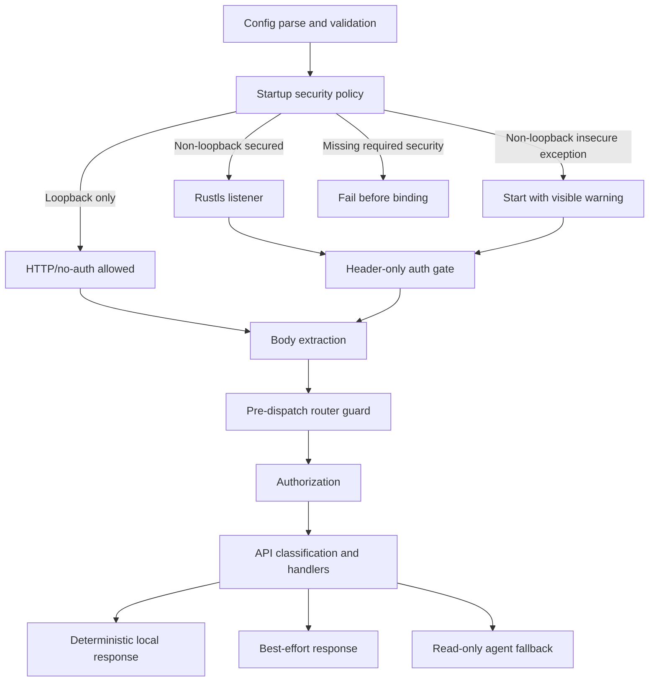
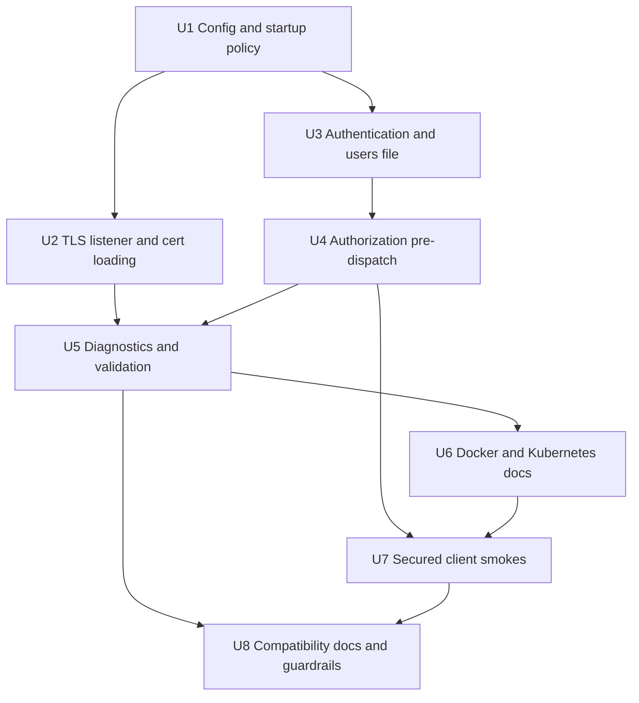
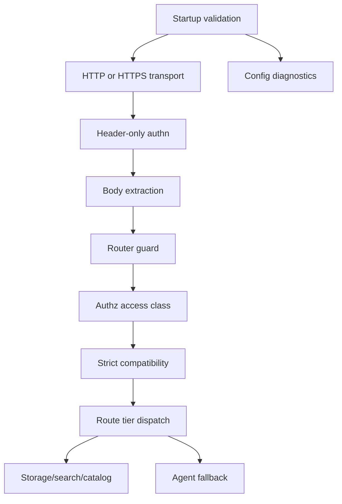

# feat: Add Kubernetes Workgroup Security

## Summary

Add a pre-dispatch security layer for workgroup and Kubernetes deployments by
extending configuration, listener setup, request guarding, diagnostics, and
client examples. Loopback development remains HTTP/no-auth by default, while
non-loopback exposure requires TLS and authentication unless an explicit
insecure exception is configured.

---

## Problem Frame

mainstack-search currently defaults to safe loopback binding, but container and
Kubernetes deployments normally bind inside the container to a non-loopback
address. The next implementation tranche needs to make that deployment shape
secure by default without losing the simple local developer flow or client
compatibility goals established in the origin document.

---

## Requirements

### Startup and Transport

- R1. Non-loopback exposure requires TLS and authentication by default.
- R2. Deliberate insecure non-loopback exposure remains possible only through
  explicit configuration and visible warnings.
- R3. Loopback-only local development can continue to run HTTP/no-auth by
  default.
- R4. Startup fails closed when non-loopback exposure is requested without the
  required security posture, including TLS-without-auth and auth-without-TLS.
- R5. TLS certificate and key material can be loaded from mounted files suitable
  for Docker and Kubernetes Secret workflows.
- R6. The REST endpoint supports server-side TLS and gives clients a clear CA
  trust path.
- R7. Client certificate verification is available as an optional hardening
  mode, but mutual TLS is not required for every secured deployment and does not
  replace username/password authentication in this tranche.

### Authentication and Authorization

- R8. Username/password authentication works with common secured OpenSearch
  client configuration.
- R9. Secret values can be loaded from environment variables or mounted files,
  without requiring secret literals in normal command lines.
- R10. Secret material is redacted from startup logs, request logs, debug
  output, errors, diagnostics, and tests.
- R11. Coarse roles are available for admin, read/write, and read-only users.
- R12. Authorization failures return explicit OpenSearch-shaped responses that
  callers and coding agents can distinguish from authentication failures.
- R22. Secured mode includes an online guessing control for failed Basic auth
  attempts, or explicitly documents the network-isolation assumptions if the
  implementation chooses not to throttle in the first tranche.

### Agent-Operable Deployment

- R13. Docker and Kubernetes setup guidance is shell-friendly and supports
  coding-agent workflows such as inspecting mounted files and validating config
  from inside a container.
- R14. Diagnostics identify missing, unreadable, malformed, or mismatched TLS
  and auth inputs without exposing secrets.
- R15. Secured deployment examples use mounted Secrets rather than embedding
  secret values directly in command-line arguments.
- R16. Documentation clearly distinguishes emulated OpenSearch Security
  behavior from unsupported Security plugin parity.
- R17. Official-client style examples cover HTTPS, authentication, and
  certificate trust.

### Compatibility and Fallback

- R18. Security checks run before deterministic handlers, best-effort
  responses, runtime agent fallback, and large body buffering for secured
  requests.
- R19. Runtime agent fallback cannot bypass authentication or authorization and
  is denied for security/control namespaces that this local server does not
  implement.
- R20. Strict compatibility mode remains available and is not weakened by the
  security layer.
- R21. Local development and workgroup security modes are documented as
  distinct operating postures.

**Origin actors:** A1 application developer, A2 coding agent, A3 OpenSearch
client/application, A4 workgroup operator, A5 maintainer.

**Origin flows:** F1 secured workgroup startup, F2 client compatibility
connection, F3 agent-assisted setup and repair, F4 explicit insecure exception.

**Origin acceptance examples:** AE1 non-loopback insecure startup failure, AE2
explicit insecure override warning, AE3 loopback no-auth local development, AE4
official client HTTPS/auth/cert trust, AE5 redacted invalid credential/cert
diagnostics, AE6 read-only mutation denial, AE7 coding-agent diagnostics, AE8
fallback not invoked for unauthenticated or unauthorized requests.

---

## Scope Boundaries

- No full OpenSearch Security plugin parity in this tranche: tenants,
  document-level security, field-level security, index-pattern permissions,
  audit log management, SAML, OIDC, LDAP, and password rotation workflows remain
  out of scope.
- No AWS SigV4 support in this tranche.
- No Wasm or wasmCloud responsibility split in this tranche.
- No production-grade certificate hot reload. Mounted Secret updates are handled
  by process restart for now.
- No trusted front-proxy or service-mesh bypass mode. First-tranche workgroup
  deployments require in-process TLS and authentication even when an ingress,
  sidecar, or service mesh also terminates TLS.
- No broad expansion of OpenSearch API support unrelated to security.
- No promise that the roles are equivalent to OpenSearch Security roles. They
  are coarse local compatibility roles for development and small workgroups.
- No requirement for TLS/auth when the server is bound only to loopback for
  disposable local development.

### Deferred to Follow-Up Work

- Fine-grained authorization: plan after the coarse role model has real-client
  and agent-fallback coverage.
- Certificate hot reload: revisit after the startup-loaded Rustls path is
  stable.
- Security management APIs, including auth-info style HTTP diagnostics: defer
  until there is a concrete client compatibility need.
- Raw password env/file verifier backends: defer until the PHC-hash users file
  is implemented and documented.

---

## Context & Research

### Relevant Code and Patterns

- `src/config.rs` owns all CLI parsing, validation, defaults, and usage text.
  It already enforces loopback-by-default binding and validates agent fallback
  endpoint security.
- `src/server.rs` builds `AppState`, constructs the Axum router, binds the TCP
  listener, and prints startup posture.
- `src/http/router.rs` is the existing pre-dispatch boundary for body limits,
  host checks, cross-site write protection, and write content-type checks.
  Security should extend this boundary before `api::handle_request`.
- `src/api/mod.rs` classifies routes, applies strict compatibility, routes
  best-effort responses, and invokes runtime agent fallback. Authorization must
  happen before this layer can call fallback.
- `src/http/request.rs` normalizes headers into lowercase strings, but auth must
  inspect raw `HeaderMap` before that normalization so duplicate or invalid
  `Authorization` headers can fail closed.
- `src/responses/mod.rs` provides OpenSearch-shaped error responses with
  machine-readable hints.
- `tests/http_surface.rs`, `tests/agent_fallback.rs`, and the real-client smoke
  tests provide the right pattern for request-boundary and compatibility
  coverage.
- `docker/docker-compose.yml` currently binds the server to `0.0.0.0` inside
  the container and will need either secured configuration or an explicit
  insecure development exception.

### Institutional Learnings

- `docs/solutions/security-issues/mainstack-search-p1-code-review-hardening-2026-04-29.md`
  says route classification and agent fallback are security boundaries. Known
  mutating routes must fail closed before fallback, and fallback context must be
  tightly scoped.
- The same learning calls out method-aware route inventory checks. The role
  model must not classify authorization purely by HTTP method because several
  OpenSearch read APIs use `POST`.
- Existing memory and bulk hardening tests show that security regressions should
  be covered by request-surface tests and not left as documentation-only claims.

### External References

- OpenSearch Python client docs show HTTPS, `http_auth`, `verify_certs`, CA
  bundle configuration, and optional client certificates as normal secured
  client inputs.
- OpenSearch JavaScript client docs show HTTPS node URLs with embedded basic
  credentials or auth configuration, CA trust through the `ssl.ca` option, and
  optional client certificate/key inputs.
- OpenSearch Java client docs show `BasicCredentialsProvider`, HTTPS hosts, and
  truststore/SSL context configuration.
- OpenSearch TLS docs distinguish REST-layer TLS, PEM cert/key inputs, optional
  client certificate authentication modes, and hot reload. OpenSearch supports
  hot reload, but this plan intentionally defers it.
- Crate research found `axum-server` 0.8 with Rustls support, `tokio-rustls`
  0.26, `rustls-pemfile` 2.2, `argon2` 0.5, `base64` 0.22, `secrecy` 0.10, and
  `rcgen` 0.14 as practical dependencies for this feature family.

---

## Key Technical Decisions

- Security is enforced before API dispatch: authentication and authorization
  live in a pre-dispatch security layer, not inside individual API handlers.
  For secured mode, authentication must inspect headers before full request-body
  buffering so unauthenticated clients cannot consume the configured body limit
  across many concurrent requests. This satisfies R18/R19 and keeps runtime
  agent fallback behind the same guard as deterministic handlers.
- Split non-loopback binding from insecure exposure: keep a flag that allows
  binding to non-loopback addresses, and add a separate explicit insecure
  exception for HTTP/no-auth non-loopback operation. This preserves container
  ergonomics while making insecure exposure visibly intentional.
- Use Rustls for server TLS: integrate the REST listener with a Rustls-backed
  server path, preferably through `axum-server`'s Rustls support to avoid
  hand-rolling Hyper connection serving. If that crate blocks on integration,
  the implementation can fall back to direct `tokio-rustls` plus Hyper utilities
  without changing the rest of the plan.
- Load TLS material at startup only: server cert/key files and the server CA
  bundle that clients trust are validated before the server starts. If client
  certificate verification is enabled, the server uses a distinct client-cert
  CA bundle to validate client certificates. Hot reload is deferred because
  Kubernetes Secret rollouts can restart the container, and startup validation
  is the first safety requirement.
- Treat mTLS as transport hardening, not user authentication: a valid client
  certificate may be required to complete TLS, but it does not create a user
  principal or satisfy Basic auth unless a later plan adds certificate
  subject-to-role mapping.
- Use a mounted users file with PHC password hashes first: a small local users
  config should support usernames, coarse roles, and password hashes. Raw
  password env/file verifier backends are deferred; docs and client smokes can
  still load the client-side password from mounted files or environment
  variables without placing secret literals in command lines.
- Prefer Basic auth first: it aligns with current official OpenSearch client
  examples and keeps the compatibility path simple.
- Add a per-request security context: successful authentication produces a
  context that records disabled-auth loopback mode, principal, roles, and
  client-cert verification state. Authorization and diagnostics consume this
  context instead of reparsing headers.
- Role checks consume route inventory without duplicating it: authorization maps
  `api_name + method` to a separate access class. Read-only users can call safe
  `GET`/`HEAD` APIs and OpenSearch read APIs that use `POST`, such as search,
  count, mget, and msearch. Mutating and control APIs require read/write or
  admin authority as appropriate.
- Deny fallback for security and control namespaces: unknown `GET` fallback
  remains useful for read-oriented APIs, but `_plugins/_security`,
  `_opendistro/_security`, `_security`, snapshots, tasks, and similar control
  namespaces must fail closed instead of reaching runtime fallback.
- Make diagnostics agent-operable: validation output should name the missing or
  malformed input class and the relevant config key, while redacting all secret
  material. This is a product requirement for coding-agent repair loops.
- Require in-process security for first-tranche workgroup deployments: ingress,
  front proxy, and service mesh deployments may add controls, but they do not
  replace mainstack-search TLS/auth in this plan.

---

## Open Questions

### Resolved During Planning

- TLS implementation and reload behavior: use Rustls-backed server TLS with
  startup-loaded cert/key/CA material; defer hot reload.
- Credential format: use a mounted local users file with roles and PHC password
  hashes first. Client examples may load raw passwords from env/mounted files,
  but server-side raw password verifier backends are deferred.
- Role boundaries: implement coarse admin, read/write, and read-only roles,
  enforced through a route access-class matrix derived from `api_name + method`.
- Diagnostics interface: add a config validation path and redacted startup/error
  diagnostics documented for shell/container workflows. Defer auth-info style
  HTTP diagnostics unless implementation uncovers a concrete client need.
- Official-client examples: update Python, JavaScript, and Java examples and
  smokes around HTTPS, Basic auth, and CA trust because current OpenSearch docs
  still use that shape.
- Kubernetes probe posture: prefer TCP probes plus exec/config validation that
  reads mounted files. Avoid HTTP probes that embed credentials in manifests.

### Deferred to Implementation

- Exact CLI flag spelling: the plan expects distinct TLS, users-file,
  client-cert, and insecure non-loopback controls, but the implementing agent
  may adjust names to match local parser conventions as long as docs and tests
  cover the final contract.
- Exact users file schema: the plan defines required capabilities, not field
  names. The schema should be simple JSON and documented in `docs/security.md`.
- Auth-info style HTTP diagnostics: deferred unless a concrete client
  compatibility need appears during implementation.
- Exact TLS test fixture generation: use `rcgen` or a fixture helper depending
  on what keeps tests deterministic and readable.

---

## Output Structure

This tree shows the expected new or materially expanded areas. It is a scope
declaration, not a constraint; implementation may adjust names if the local code
shape calls for it.

```text
src/security/
  mod.rs
  config.rs
  context.rs
  tls.rs
  users.rs
  authn.rs
  authz.rs
  diagnostics.rs

tests/
  security_surface.rs
  tls_surface.rs

docs/
  security.md
  kubernetes-security.md

docker/
  docker-compose.secure.yml
```

---

## High-Level Technical Design

> *This illustrates the intended approach and is directional guidance for
> review, not implementation specification. The implementing agent should treat
> it as context, not code to reproduce.*



---

## Implementation Units



- U1. **Security Config and Startup Policy**

**Goal:** Add explicit security configuration and startup validation so the
server fails closed for unsecured non-loopback exposure while preserving the
loopback local-development default.

**Requirements:** R1, R2, R3, R4, R9, R10, R20, R21; F1, F4; AE1, AE2, AE3.

**Dependencies:** None.

**Files:**
- Modify: `src/config.rs`
- Modify: `src/main.rs`
- Create: `src/security/mod.rs`
- Create: `src/security/config.rs`
- Test: `src/config.rs`
- Test: `tests/security_surface.rs`

**Approach:**
- Introduce a `SecurityConfig` owned by `Config` with TLS, users file,
  client-cert mode, and insecure non-loopback controls.
- Validate the startup posture before binding any socket. Non-loopback plus
  missing TLS, missing auth, TLS-without-auth, or auth-without-TLS should be a
  configuration error unless the explicit insecure exception is set.
- Keep loopback-only defaults unchanged for `cargo run -- --ephemeral` and
  current local tests.
- Make startup messages describe posture without printing secret values or full
  secret file contents.
- Keep strict compatibility independent from security posture. Strict mode
  should still reject best-effort/fallback routes after security has allowed the
  request.

**Execution note:** Start with failing config validation tests for the three
security modes before modifying server startup.

**Patterns to follow:**
- `src/config.rs` byte parsing, positive-limit validation, and agent endpoint
  validation patterns.
- Existing loopback/non-loopback validation wording, but revise it so it no
  longer describes non-loopback as simply unauthenticated local-only exposure.

**Test scenarios:**
- Covers AE1. Error path: `--listen` on a non-loopback address with
  non-loopback binding allowed but no TLS/auth returns a configuration error
  before server startup.
- Covers AE1. Error path: non-loopback with TLS configured but no users/auth
  config returns a configuration error before server startup.
- Covers AE1. Error path: non-loopback with users/auth config but no TLS
  returns a configuration error before server startup.
- Covers AE2. Happy path: non-loopback binding with the explicit insecure
  exception is accepted and records a warning posture without enabling auth by
  accident.
- Covers AE3. Happy path: default loopback config with no TLS/auth remains
  valid.
- Error path: TLS cert configured without matching key fails validation with a
  redacted, actionable message.
- Error path: users file configured without any usable user fails validation
  with no secret values in the error.
- Integration: strict compatibility settings remain parsed and validated
  independently of security settings.
- Integration: Docker/Kubernetes validation examples exercise the same startup
  policy as normal CLI startup.

**Verification:**
- Config tests cover each startup mode and redacted failure path.
- Startup posture can be determined from `Config` without starting the server.

---

- U2. **TLS Listener and Certificate Loading**

**Goal:** Serve the OpenSearch REST API over HTTPS when TLS is configured,
including certificate/key loading, CA trust configuration for clients, and
optional client certificate verification.

**Requirements:** R1, R5, R6, R7, R10, R14, R17; F1, F2; AE4, AE5.

**Dependencies:** U1.

**Files:**
- Modify: `Cargo.toml`
- Modify: `Cargo.lock`
- Modify: `src/server.rs`
- Create: `src/security/tls.rs`
- Test: `tests/tls_surface.rs`
- Test: `tests/security_surface.rs`

**Approach:**
- Add Rustls-based dependencies for server-side TLS and PEM parsing.
- Load certificate chains and private keys from mounted files at startup.
- Validate missing files, unreadable files, empty chains, key/cert mismatches,
  and unsupported key formats with redacted diagnostics.
- Keep server trust material terminology distinct: the server cert chain and
  server CA bundle are what clients trust; the client-cert CA bundle is what the
  server uses only when mTLS hardening is enabled.
- Add a server branch that serves the same Axum router over TLS when TLS is
  enabled.
- Support optional client-cert CA configuration and a require-client-cert mode
  as a hardening option. Do not require mTLS for normal secured Basic-auth
  clients, and do not treat a valid client certificate as a user identity in
  this tranche.
- Keep TLS details out of handler code. Handlers should see the same `Request`
  abstraction after transport setup succeeds.

**Execution note:** Add TLS fixture generation or deterministic PEM fixtures
before changing listener startup so transport tests can fail usefully.

**Patterns to follow:**
- `src/server.rs` should remain the listener/app boundary.
- `src/responses/mod.rs` error style for OpenSearch-shaped HTTP errors, while
  startup TLS validation remains normal config/startup diagnostics.

**Test scenarios:**
- Covers AE4. Happy path: HTTPS listener accepts a trusted client request and
  returns root info through the existing router.
- Covers AE5. Error path: missing cert file fails startup validation without
  printing secret material.
- Error path: cert/key mismatch fails startup validation before bind.
- Error path: invalid PEM fails startup validation with the config key and path
  category, not file contents.
- Happy path: optional client certificate mode disabled still accepts a normal
  trusted TLS client at the transport layer.
- Happy path: require-client-cert mode accepts a client with a cert signed by
  the configured CA.
- Error path: require-client-cert mode rejects a client with no valid cert at
  the TLS boundary.

**Verification:**
- The same router works over HTTP loopback and HTTPS secured modes.
- TLS startup failures are deterministic and redacted.

---

- U3. **Authentication and Users File**

**Goal:** Authenticate common OpenSearch clients with username/password
credentials while loading secret material from safe development and Kubernetes
sources.

**Requirements:** R8, R9, R10, R13, R14, R15, R17, R18, R22; F2, F3; AE4,
AE5, AE7.

**Dependencies:** U1.

**Files:**
- Modify: `Cargo.toml`
- Modify: `Cargo.lock`
- Modify: `src/server.rs`
- Create: `src/security/context.rs`
- Create: `src/security/users.rs`
- Create: `src/security/authn.rs`
- Modify: `src/security/config.rs`
- Modify: `src/http/request.rs`
- Test: `tests/security_surface.rs`

**Approach:**
- Define a small JSON users file format for development/workgroup use. The
  first tranche should support username, coarse roles, and PHC password hashes
  in the mounted users file.
- Add a header-only authentication gate in the Axum/Tower layer, before
  extracting the full body into `Bytes`, so unauthenticated secured-mode
  requests cannot consume the full body limit across many concurrent
  connections.
- Parse HTTP Basic credentials from the raw `HeaderMap` before
  `Request::from_parts` normalizes headers, so duplicate, empty, malformed, and
  non-UTF-8 `Authorization` headers can be rejected deterministically.
- Compare passwords through a password-hashing library without exposing either
  side in logs or errors.
- Produce a per-request `SecurityContext` or equivalent authenticated request
  wrapper that records disabled-auth loopback mode, principal, roles, and
  client-cert verification state for downstream authorization and diagnostics.
- Return authentication failures before API classification, body parsing, and
  runtime fallback can see the request.
- Add a lightweight failed-auth guessing control, such as bounded retry delay or
  rate limiting keyed by username and client address when available. If the
  implementation cannot obtain a reliable client address, use a conservative
  global failed-auth throttle and document the network-isolation assumption.
- Keep disabled-auth loopback mode explicit in state so tests and docs can
  distinguish "no auth configured because loopback" from "auth misconfigured".
- Avoid default credentials. Docs may include placeholders, but the binary
  should not silently create an admin user.

**Execution note:** Implement authentication test-first around request headers
and redaction before wiring into router state.

**Patterns to follow:**
- `src/agent/client.rs` token loading redacts by reference and distinguishes
  env/file sources.
- `src/http/request.rs` lowercases headers, so auth parsing should not rely on
  mixed-case names.

**Test scenarios:**
- Covers AE4. Happy path: a valid Basic auth header for a configured user
  reaches the existing root info handler.
- Covers AE5. Error path: invalid password returns an authentication failure
  with no submitted password, hash, env value, or file contents in the response.
- Error path: malformed Basic auth header returns a structured authentication
  error and does not reach API classification.
- Error path: unknown user returns the same class of authentication error as an
  invalid password.
- Happy path: users file loaded from a mounted path configures PHC-hashed
  credentials without placing password literals in CLI arguments.
- Happy path: PHC password hash authenticates a valid Basic auth password and
  rejects an invalid one.
- Error path: duplicate, empty, malformed, non-Basic, and non-UTF-8
  `Authorization` headers fail before normalized request construction loses
  evidence.
- Error path: a valid client certificate without Basic auth fails
  authentication and does not create a principal.
- Error path: unauthenticated secured-mode request with an oversized body
  returns an authentication failure before body-limit rejection.
- Error path: repeated invalid passwords trigger the chosen failed-auth
  guessing control without leaking whether the username exists.
- Edge case: duplicate usernames in the users file fail validation.
- Edge case: a user with no roles fails validation or receives no access,
  depending on the final schema decision, with behavior documented.

**Verification:**
- Authentication can be enabled without TLS for loopback tests but non-loopback
  startup still requires TLS plus auth unless the insecure exception is set.
- No authentication failure path invokes deterministic handlers, best-effort
  handlers, or fallback.

---

- U4. **Authorization and Fallback Guarding**

**Goal:** Enforce coarse roles before API dispatch so read-only users can use
safe OpenSearch read APIs while write/control requests fail before mutation or
agent fallback.

**Requirements:** R11, R12, R18, R19, R20; F2; AE6, AE8.

**Dependencies:** U1, U3.

**Files:**
- Modify: `build.rs`
- Create: `src/security/authz.rs`
- Modify: `src/http/router.rs`
- Modify: `src/api_spec/mod.rs`
- Modify: `src/api_spec/tier.rs`
- Modify: `src/api/mod.rs`
- Test: `tests/security_surface.rs`
- Test: `tests/agent_fallback.rs`
- Test: `tests/http_surface.rs`

**Approach:**
- Extend or supplement the generated route inventory with an access-class
  taxonomy keyed by `api_name + method`. `Tier` remains compatibility metadata;
  it must not be treated as the authorization source of truth.
- Apply authorization using the authenticated request security context and the
  existing `RouteMatch` from `api_spec::classify`, rather than creating a
  second path/method classifier that can drift from API dispatch.
- Apply authorization after authentication and existing request-safety checks,
  before `api::handle_request`.
- Permit read-only users to call read APIs even when the method is `POST`, such
  as search, count, mget, and msearch.
- Require read/write for local data mutations and admin for any future
  security-management surfaces.
- Deny unsupported mutating/control APIs before fallback. This complements the
  existing route-classification hardening rather than replacing it.
- Deny runtime fallback for security and control namespaces, including
  `_plugins/_security`, `_opendistro/_security`, `_security`, snapshots, tasks,
  and other management-like unknown `GET` routes.
- Ensure fallback context excludes authorization headers and secret-like query
  or body fields, or deny fallback when safe redaction cannot be proven.
- Return OpenSearch-shaped authz errors with a hint that tells an agent caller
  whether to use read credentials, adjust the query, or use a higher role.

**Execution note:** Add regression tests for fallback not being invoked before
or during authorization failures.

**Patterns to follow:**
- `src/api_spec/mod.rs` route-tier classification and method-aware route
  matching.
- `docs/solutions/security-issues/mainstack-search-p1-code-review-hardening-2026-04-29.md`
  guidance that unsupported write/control routes fail closed before fallback.

**Test scenarios:**
- Covers AE6. Error path: read-only user attempting document index, update,
  delete, bulk, alias mutation, index deletion, `_refresh`, mapping/settings
  mutation, or index-template mutation receives an authorization failure and
  state is unchanged.
- Covers AE8. Error path: unauthenticated request to a fallback-eligible route
  returns authn failure and does not call fallback.
- Covers AE8. Error path: read-only user attempting a fallback-ineligible
  mutating route returns authz or unsupported failure and does not call fallback.
- Covers AE8. Error path: unknown `GET` requests under security/control
  namespaces fail closed and do not invoke fallback.
- Happy path: read-only user can call `GET /`, `GET /index/_doc/id`, `POST
  /index/_search`, `POST /index/_count`, `POST /_mget`, and `POST /_msearch`.
- Happy path: read/write user can mutate local index/document state but cannot
  access future admin-only security management surfaces.
- Happy path: admin user can access all local data APIs and any future
  admin-only security surfaces.
- Integration: every generated or hand-maintained route inventory entry has an
  access class, and docs can surface that class without manual drift.
- Integration: strict compatibility still rejects unallowlisted best-effort and
  fallback routes after authn/authz succeeds.
- Edge case: unknown `GET` fallback route remains eligible only after
  authorization succeeds, avoids security/control namespaces, and still receives
  metadata-only fallback context.

**Verification:**
- No unauthorized request can mutate state.
- No unauthorized request can invoke runtime fallback.
- Authorization tests cover read APIs that use `POST`.

---

- U5. **Agent-Operable Diagnostics and Validation**

**Goal:** Provide deterministic validation and runtime diagnostics that humans
and coding agents can use from shell, Docker, or Kubernetes contexts without
exposing secret values.

**Requirements:** R10, R13, R14, R16, R18, R19, R21; F3; AE5, AE7, AE8.

**Dependencies:** U1, U2, U3, U4.

**Files:**
- Modify: `src/main.rs`
- Modify: `src/config.rs`
- Create: `src/security/diagnostics.rs`
- Modify: `src/responses/mod.rs`
- Test: `tests/security_surface.rs`

**Approach:**
- Add a validation mode that parses config, loads TLS/auth inputs, validates
  role/user consistency, and exits without serving traffic.
- Emit diagnostics as stable, redacted text or JSON so coding agents can parse
  the failing category and config key.
- Make startup warnings for explicit insecure non-loopback mode visible and
  machine-detectable without leaking secrets.
- Define Kubernetes probe guidance that does not place credentials in manifests:
  prefer TCP probes for process reachability plus exec/config validation that
  reads mounted files when deeper readiness is required.
- Keep runtime HTTP error diagnostics redacted and useful, but avoid adding
  Security-inspired HTTP diagnostic endpoints in this tranche.

**Execution note:** Characterize current startup error behavior first, then add
  redaction and validation-mode coverage.

**Patterns to follow:**
- `src/responses/mod.rs` hint style for agent-actionable errors.
- Existing `--help` and parser behavior in `src/config.rs`.

**Test scenarios:**
- Covers AE5. Error path: invalid credential source or unreadable TLS file
  reports a redacted diagnostic that names the failing input category.
- Covers AE7. Happy path: validation mode succeeds for a complete secured
  config and does not start a listener.
- Covers AE7. Error path: validation mode fails with structured output for each
  missing required secured-mode input.
- Happy path: Kubernetes-oriented validation mode can be used from an exec
  probe or manual container shell without embedding credentials in manifests.
- Edge case: explicit insecure non-loopback mode emits a warning even when auth
  settings are absent.

**Verification:**
- A coding agent can determine whether TLS files, users config, and role
  assignments are valid without trial-and-error HTTP requests.
- Diagnostic outputs are covered by tests for redaction.

---

- U6. **Docker and Kubernetes Security Posture**

**Goal:** Make container and Kubernetes deployment native for the first security
tranche by documenting mounted Secret workflows and preventing accidental
cleartext/no-auth workgroup exposure.

**Requirements:** R1, R2, R5, R9, R10, R13, R15, R21; F1, F3, F4; AE1, AE2,
AE7.

**Dependencies:** U1, U2, U3, U5.

**Files:**
- Modify: `docker/docker-compose.yml`
- Create: `docker/docker-compose.secure.yml`
- Modify: `docker/mainstack-search.Dockerfile`
- Create: `docs/security.md`
- Create: `docs/kubernetes-security.md`
- Modify: `README.md`

**Approach:**
- Update the existing compose file so any insecure non-loopback container
  binding is explicit and documented as local development only.
- Add a secured compose example that mounts certificate, key, CA, and users
  files rather than passing secrets as command-line literals.
- Add Kubernetes manifests or snippets that use Secret volume mounts for TLS
  and auth material and show the expected readiness/validation posture.
- State that ingress, front-proxy, and service-mesh deployments still run
  mainstack-search with in-process TLS/auth in this tranche. They may add
  NetworkPolicy, Service, or Ingress controls, but they must not rely on the
  explicit insecure exception for workgroup deployments.
- Document readiness/liveness posture that avoids credentials in manifests,
  such as TCP probes plus optional exec validation that reads mounted files.
- Document container inspection and validation workflows in prose suitable for
  a coding agent operating through shell, `docker exec`, or `kubectl exec`.
- Keep the Docker image small and avoid baking sample secrets into the image.
- Document how to trust the server CA from clients and how to rotate mounted
  material by restarting the workload.

**Patterns to follow:**
- Current `docker/docker-compose.yml` simple service shape.
- README quick-start and local-safety sections.

**Test scenarios:**
- Test expectation: none for Kubernetes manifests unless a lightweight manifest
  lint path already exists. The feature-bearing behavior is covered by config,
  TLS, and auth tests in earlier units.
- Documentation review scenario: secured examples use mounted files and do not
  embed password literals in command arrays.
- Documentation review scenario: insecure compose mode is labeled local-only and
  visibly tied to the explicit insecure exception.
- Documentation review scenario: Kubernetes examples do not use HTTP readiness
  probes with inline Basic auth credentials.
- Documentation review scenario: front-proxy/service-mesh examples preserve
  in-process TLS/auth or are explicitly marked unsupported for this tranche.

**Verification:**
- Users can distinguish loopback local dev, explicit insecure container dev,
  and secured workgroup deployment from docs alone.
- No documentation example normalizes cleartext/no-auth non-loopback workgroup
  deployment.

---

- U7. **Secured Official-Client Smokes**

**Goal:** Prove that Python, JavaScript, and Java OpenSearch clients can connect
to secured mainstack-search with HTTPS, Basic auth, and CA trust.

**Requirements:** R6, R8, R10, R14, R17, R20; F2; AE4, AE5.

**Dependencies:** U2, U3, U4, U6.

**Files:**
- Modify: `scripts/run-python-client-smoke.sh`
- Modify: `scripts/run-javascript-client-smoke.sh`
- Modify: `scripts/run-java-client-smoke.sh`
- Modify: `tests/python_client_smoke.rs`
- Modify: `tests/javascript_client_smoke.rs`
- Modify: `tests/java_client_smoke.rs`
- Test: `tests/tls_surface.rs`
- Test: `tests/security_surface.rs`
- Modify: `docker/java-smoke/src/main/java/local/mainstacksearch/Smoke.java`
- Modify: `docker/java-smoke/pom.xml`
- Modify: `docs/driver-examples.md`

**Approach:**
- Extend smoke scripts so they can run in unsecured loopback mode and secured
  HTTPS/auth mode.
- Generate or mount temporary TLS/auth fixtures for local smokes without
  placing secret values in visible command lines.
- Update Python client smoke to use HTTPS, auth, certificate verification, and
  CA trust options.
- Update JavaScript client smoke to use HTTPS, auth, and `ssl.ca`.
- Update Java smoke to use HTTPS, credentials provider, and trust material
  consistent with the current Apache HttpClient 5 transport.
- Keep ignored smoke tests ignored because they install external client
  dependencies and may require Docker, Node, Python, or Maven.
- Add a non-ignored Rust HTTPS/auth/CA integration test so CI has a secured
  transport compatibility gate even when official-client smokes are manual or
  CI-gated separately.
- Keep strict compatibility smoke behavior available, but do not require strict
  mode for every secured smoke.

**Execution note:** Update one client smoke end to end first, then reuse its
fixture pattern for the other clients.

**Patterns to follow:**
- Existing smoke scripts own dependency installation and optional externally
  supplied `OPENSEARCH_URL`.
- `docker/java-smoke/src/main/java/local/mainstacksearch/Smoke.java` already
  proves official Java client API calls against the local endpoint.

**Test scenarios:**
- Covers AE4. Happy path: Python client connects over HTTPS with valid Basic
  auth and trusted CA, then completes CRUD/search assertions.
- Covers AE4. Happy path: JavaScript client connects over HTTPS with valid auth
  and trusted CA, then completes existing index/search assertions.
- Covers AE4. Happy path: Java client connects over HTTPS with valid auth and
  trusted certificate material, then completes existing typed-client assertions.
- Covers AE5. Error path: Rust integration tests cover invalid credential
  failures and redaction; at most one official-client smoke needs a negative
  invalid-credential proof.
- Edge case: unsecured loopback smoke mode still works for local development.
- Integration: secured smoke scripts continue to work when targeting an
  externally supplied secured mainstack-search URL and credentials.

**Verification:**
- Non-ignored Rust integration tests prove HTTPS/auth/CA behavior in normal CI,
  while ignored smoke tests document their external dependency requirements and
  exercise real secured clients when explicitly run.
- `docs/driver-examples.md` includes both loopback unsecured and secured
  workgroup client snippets.

---

- U8. **Compatibility Documentation and Guardrails**

**Goal:** Keep users and agents honest about what the security tranche emulates,
what it does not emulate, and how auth interacts with strict compatibility and
agent fallback.

**Requirements:** R12, R16, R18, R19, R20, R21; F2, F3; AE6, AE8.

**Dependencies:** U5, U6, U7.

**Files:**
- Modify: `README.md`
- Modify: `docs/compatibility.md`
- Modify: `docs/supported-apis.md`
- Modify: `docs/agent-fallback.md`
- Modify: `docs/migration.md`
- Modify: `docs/driver-examples.md`
- Test: `tests/security_surface.rs`
- Test: `tests/agent_fallback.rs`

**Approach:**
- Document the three operating modes: loopback local dev, secured workgroup, and
  explicit insecure non-loopback exception.
- Update compatibility docs to state that auth/TLS is an OpenSearch-compatible
  connection posture, not full Security plugin parity.
- Update supported API docs with route access classes or minimum roles so
  developers and coding agents do not discover read-only versus read/write
  boundaries by trial and error.
- Update agent fallback docs to state that fallback is behind authn/authz and
  cannot answer unauthorized requests or security/control namespace requests.
- Update migration docs so users know that apps using standard HTTPS and Basic
  auth should move to real OpenSearch without changing application code, while
  coarse local roles should not be treated as production RBAC.
- Keep strict compatibility documentation clear: strict mode controls
  best-effort/fallback route behavior after security has admitted the request.

**Patterns to follow:**
- `docs/compatibility.md` tier language and out-of-body compatibility signal
  explanation.
- `docs/agent-fallback.md` explicit trust-boundary warnings.

**Test scenarios:**
- Covers AE8. Regression: unauthorized fallback-eligible request does not call
  fallback.
- Covers AE6. Regression: read-only role cannot mutate through a documented
  write API.
- Documentation review scenario: docs do not imply full Security plugin parity.
- Documentation review scenario: docs explain how an agent caller can adjust a
  request or credentials after an auth/authz failure.
- Documentation review scenario: `docs/supported-apis.md` exposes the route
  access-class matrix generated or checked by U4.

**Verification:**
- A reader can identify which security behavior is deterministic local
  implementation, which is compatibility approximation, and which is not
  implemented.
- Existing strict compatibility and fallback docs remain accurate after the
  security layer is added.

---

## System-Wide Impact

- **Interaction graph:** config validation gates startup; TLS gates transport;
  secured-mode authn gates body extraction; authz gates router dispatch; API
  classification, strict compatibility, best-effort responses, and fallback all
  remain downstream of security.
- **Error propagation:** startup configuration errors stay as process failures;
  HTTP auth/authz failures use OpenSearch-shaped JSON errors with redacted
  hints; TLS handshake failures occur before HTTP response generation.
- **State lifecycle risks:** unauthorized write requests must not reach storage.
  Tests should verify state remains unchanged after denied mutations.
- **API surface parity:** secured clients should use normal OpenSearch client
  HTTPS/auth/CA options. Security plugin management APIs remain unsupported in
  this tranche.
- **Integration coverage:** unit tests alone are insufficient for TLS and client
  behavior; non-ignored Rust integration tests cover secured transport in normal
  CI, while manual or CI-gated real-client smokes cover Python, JavaScript, and
  Java.
- **Unchanged invariants:** loopback local development remains simple; strict
  compatibility still controls best-effort/fallback tiers; runtime fallback
  remains read-only and scoped.



---

## Risks & Dependencies

| Risk | Likelihood | Impact | Mitigation |
|------|------------|--------|------------|
| Authz accidentally treats read-style `POST` APIs as writes | Medium | High | Route-aware authorization, explicit tests for search/count/mget/msearch with read-only users |
| Authz drifts from route classification | Medium | High | Consume `RouteMatch` and maintain a separate access-class matrix keyed by `api_name + method` |
| Fallback bypasses auth due to ordering | Low | High | Enforce auth before API dispatch and fallback; regression tests in `tests/agent_fallback.rs` |
| Unauthenticated clients force body buffering before auth | Medium | High | Add header-only auth before body extraction for secured mode |
| Basic auth is vulnerable to online guessing | Medium | Medium | Add failed-auth throttling or document network-isolation assumptions with tests |
| Secret values leak through diagnostics or test failures | Medium | High | Use source references in errors, redaction tests, and avoid debug-printing loaded secret structs |
| TLS integration adds brittle server plumbing | Medium | Medium | Prefer `axum-server` Rustls support; keep direct `tokio-rustls` fallback available without changing security design |
| Docker examples normalize insecure workgroup exposure | Medium | High | Separate dev-only insecure compose from secured compose and Kubernetes docs; visible warning tests for insecure mode |
| Front-proxy deployments bypass in-process security | Medium | High | Require in-process TLS/auth even behind ingress, sidecars, or service meshes in this tranche |
| Users mistake coarse roles for production Security plugin parity | Medium | Medium | Prominent compatibility docs and migration guidance |
| Java client trust material setup is harder than Python/JS | Medium | Medium | Update Java smoke early enough to catch dependency and truststore issues before docs are finalized |

---

## Alternative Approaches Considered

- Terminate TLS at a reverse proxy only: rejected for the first tranche because
  many clients and agents will connect directly to the bundled service in
  Docker or Kubernetes, and the server itself must fail closed for accidental
  non-loopback exposure.
- Trusted front-proxy mode: deferred because it would need a separate trust
  model, NetworkPolicy/Ingress guidance, and forwarded-identity handling. In
  this tranche, proxies may add controls but do not replace in-process TLS/auth.
- Implement full OpenSearch Security plugin APIs first: rejected as too broad
  for this tranche and contrary to the origin scope boundary. The goal is
  secured client compatibility and safe local/workgroup posture.
- Add auth-info HTTP diagnostics first: deferred because startup/config
  validation and redacted errors satisfy the first agent-operability need
  without expanding the Security API surface.
- Support raw password env/file verifiers alongside PHC hashes: deferred to
  keep the first users-file credential model small and less likely to leak
  secrets.
- Require mTLS for all secured mode: rejected because common OpenSearch client
  examples use HTTPS plus Basic auth and CA trust. mTLS remains an optional
  hardening mode.
- Enforce authorization inside each API handler: rejected because handler-local
  checks would be easy to miss and would not protect best-effort or fallback
  uniformly.
- Keep a single `--allow-nonlocal-listen` escape hatch: rejected because it
  conflates binding intent with insecure exposure and makes container examples
  too easy to copy into unsafe workgroup deployments.

---

## Success Metrics

- Non-loopback startup without TLS/auth fails before binding unless the explicit
  insecure exception is set.
- Loopback local development works without TLS/auth.
- Secured mode accepts official Python, JavaScript, and Java clients over HTTPS
  with Basic auth and CA trust when manual or CI-gated real-client smokes are
  run.
- Non-ignored Rust integration tests prove secured HTTPS/auth/CA behavior in
  normal CI.
- Invalid credentials and unauthorized roles fail before any storage mutation or
  fallback call, and unauthenticated secured-mode requests fail before large
  body buffering.
- Unknown security/control namespace requests fail closed and do not reach
  runtime fallback.
- Docker and Kubernetes docs show mounted Secret workflows and include
  agent-operable validation guidance.
- Documentation clearly states which security behaviors are local compatibility
  features and which OpenSearch Security plugin features remain unsupported.

---

## Phased Delivery

### Phase 1: Startup and Transport

- U1 and U2 establish the security config contract, startup failure behavior,
  and HTTPS serving path.

### Phase 2: Request Security Boundary

- U3 and U4 add authentication, coarse roles, and fallback-safe authorization
  before API dispatch.

### Phase 3: Operability

- U5 and U6 add validation, diagnostics, Docker, and Kubernetes guidance.

### Phase 4: Compatibility Proof

- U7 and U8 update real-client smokes and compatibility documentation.

---

## Documentation / Operational Notes

- The README should continue to lead with loopback local development, then point
  workgroup and Kubernetes readers to `docs/security.md` and
  `docs/kubernetes-security.md`.
- `docs/security.md` should explain the users file, role model, TLS material,
  validation mode, failed-auth guessing control, and redaction policy.
- `docs/kubernetes-security.md` should focus on Secret mounts, restart-based
  rotation, readiness/validation, probe strategy without inline credentials,
  front-proxy/service-mesh posture, and container inspection workflows.
- `docs/driver-examples.md` should include both unsecured loopback examples and
  secured examples for Python, JavaScript, Java, and direct HTTP.
- `docs/agent-fallback.md` should explicitly say fallback is subject to the same
  auth/authz gate as deterministic handlers and is denied for unsupported
  security/control namespaces.
- Docs should avoid real secret values. Use placeholders and mounted-file
  descriptions rather than command-line password literals.

---

## Sources & References

- Origin document:
  `docs/brainstorms/2026-04-29-mainstack-search-kubernetes-workgroup-security-requirements.md`
- Existing implementation plan:
  `docs/plans/2026-04-29-001-feat-mainstack-search-implementation-plan.md`
- Existing safety learning:
  `docs/solutions/security-issues/mainstack-search-p1-code-review-hardening-2026-04-29.md`
- Current config and startup: `src/config.rs`, `src/server.rs`, `src/main.rs`
- Current pre-dispatch guard: `src/http/router.rs`, `src/http/request.rs`
- Current API dispatch and fallback: `src/api/mod.rs`, `src/api_spec/mod.rs`
- Current tests and smokes: `tests/http_surface.rs`, `tests/agent_fallback.rs`,
  `scripts/run-python-client-smoke.sh`, `scripts/run-javascript-client-smoke.sh`,
  `scripts/run-java-client-smoke.sh`
- OpenSearch Python client docs: <https://docs.opensearch.org/latest/clients/python-low-level/>
- OpenSearch JavaScript client docs: <https://docs.opensearch.org/latest/clients/javascript/index/>
- OpenSearch Java client docs: <https://docs.opensearch.org/3.1/clients/java/>
- OpenSearch TLS configuration docs: <https://docs.opensearch.org/latest/security/configuration/tls/>
- Rust crates considered: `axum-server`, `tokio-rustls`, `rustls-pemfile`,
  `argon2`, `base64`, `secrecy`, `rcgen`
