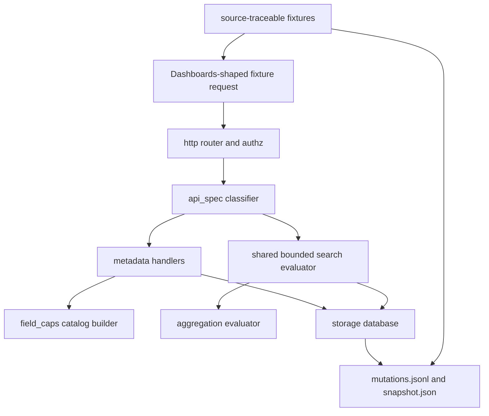
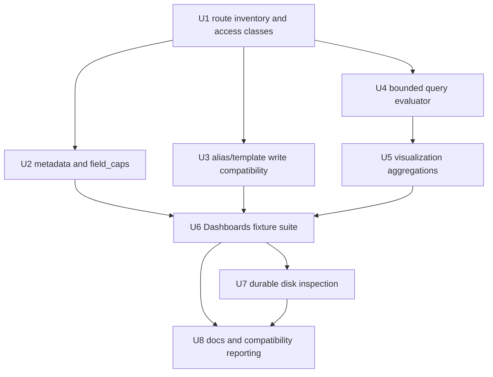

# feat: Expand Dashboards Discover And Visualization API Surface

## Summary

This plan expands mainstack-search's deterministic API surface for the
Dashboards-shaped fixture tranche: metadata and field discovery first, then a
shared bounded query evaluator, the first visualization aggregation subset,
source-traceable fixture coverage, and direct durable-file inspection.

---

## Problem Frame

mainstack-search already covers core local index, document, bulk, count,
multi-get, multi-search, and scalar search behavior. The next pressure point is
application-shaped compatibility: OpenSearch Dashboards-style clients need a
chain of startup metadata, field capabilities, Discover searches, and
aggregation responses to work without special mainstack-search handling.

The goal here is fixture-level confidence against the pinned Dashboards 3.7.0
signals, not a claim that a live OpenSearch Dashboards process is supported.

---

## Requirements

- R1. Use `docs/opensearch-dashboards-gap-analysis.md` and the pinned
  Dashboards 3.7.0 baseline as the prioritization source for this tranche.
- R2. Add deterministic Rust/API fixtures for data import, data view creation,
  Discover searches, and simple visualization requests.
- R3. Keep the acceptance claim to fixture-level Dashboards compatibility until
  a later live Dashboards smoke exists.
- R4. Classify `HEAD /{index}` as `indices.exists`, distinct from
  `indices.get`.
- R5. Implement deterministic `field_caps` for `GET` and `POST`
  `/_field_caps` and `/{index}/_field_caps` without fallback.
- R6. Implement or shape the first-tranche metadata APIs:
  `cat.plugins`, `cat.templates`, `cluster.stats`, `indices.delete_template`,
  and the alias update extension.
- R7. Cover the Discover-relevant query patterns in a shared evaluator.
- R8. Preserve Discover response needs: `_source` filtering, pagination,
  sorting, and total-hit metadata.
- R9. Enforce structured query and aggregation guardrails before expensive
  scans.
- R10. Add the first visualization aggregation subset: `terms`,
  `date_histogram`, `histogram`, `range`, `filters`, `missing`,
  `value_count`, `min`, `max`, `avg`, `sum`, `cardinality`, `stats`, and
  `top_hits`.
- R11. Keep aggregation semantics scoped to small, local, in-memory datasets.
- R12. Return OpenSearch-shaped nested bucket and metric aggregation responses.
- R13. Verify durable JSONL/NDJSON files can be read directly from disk by a
  coding agent.
- R14. Verify mutation intent from the append-only log and materialized state
  from the snapshot when present.
- R15. Keep durable inspection synthetic and secret-safe.
- R16. Do not use runtime agent fallback as proof for supported Dashboards
  workflow calls.
- R17. Preserve route classification, access class, and wrong-method behavior
  as security boundaries.
- R18. Use selected, source-traceable fixture coverage rather than importing the
  full Dashboards test suite.
- R19. Cover success, empty, invalid, unsupported, conflicting, and
  security-denied states for the selected workflows.

**Origin actors:** A1 application developer, A2 coding agent, A3
Dashboards-style client, A4 maintainer.

**Origin flows:** F1 API-fixture workflow proof, F2 data view creation, F3
Discover search, F4 simple visualization, F5 agent-readable durable data.

**Origin acceptance examples:** AE1 data-view setup, AE2 field-capability
states, AE3 Discover search states, AE4 aggregation states, AE5 durable disk
read, AE6 strict compatibility and security boundaries.

---

## Scope Boundaries

- Do not launch or require a live OpenSearch Dashboards process in this tranche.
- Do not claim full OpenSearch Dashboards support from fixture success.
- Do not import the full OpenSearch Dashboards test suite or broad Cypress
  coverage.
- Do not implement plugin-specific APIs such as PPL or data source management.
- Do not add snapshot APIs for Dashboards archiver tooling.
- Do not pursue Lucene scoring, distributed query, distributed aggregation, or
  production-scale optimization parity.
- Do not introduce Polars or another DataFrame engine for this tranche.
- Do not broaden runtime agent fallback eligibility, fallback context, or
  unsupported-route behavior.

### Deferred to Follow-Up Work

- Live OpenSearch Dashboards smoke: add after this deterministic fixture tranche
  passes and the remaining startup/runtime gaps are clearer.
- Saved-object migration tranche: scroll, clear scroll, reindex/tasks,
  delete-by-query, and update-by-query remain separate work.
- Configurable query-limit CLI flags: this plan fixes the new query-specific
  guardrail defaults in code first, then documents which ones should become
  user-configurable if real local workloads need tuning.
- Broader OpenSearch YAML fixture support: add selected cases only when they
  directly validate this tranche's API or aggregation behavior.

---

## Context & Research

### Relevant Code and Patterns

- `src/api_spec/mod.rs` is the security-critical route classifier. It already
  handles read `POST` APIs explicitly and fails closed for known write/control
  routes.
- `src/api/mod.rs` is the current dispatch and handler surface. Stub modules
  such as `src/api/cat.rs`, `src/api/cluster.rs`, `src/api/aliases.rs`,
  `src/api/templates.rs`, and `src/api/search.rs` exist for focused extraction
  when handler logic becomes large enough.
- `src/search/evaluator.rs` already performs in-memory document scans,
  filtering, scalar query matching, sorting, source filtering, and a small
  aggregation subset. `src/search/dsl.rs`, `src/search/sort.rs`, and
  `src/search/source_filter.rs` are available as module boundaries but are
  mostly placeholders.
- `src/storage/mod.rs`, `src/storage/mutation_log.rs`, and
  `src/storage/snapshot.rs` already provide readable JSONL mutation records and
  readable JSON snapshots.
- `tests/api_inventory.rs`, `tests/security_surface.rs`, `tests/catalog_surface.rs`,
  `tests/search_surface.rs`, `tests/http_surface.rs`, and
  `tests/opensearch_yaml_runner.rs` are the existing coverage patterns to
  extend.
- `tests/support/yaml_rest_runner.rs` already runs selected upstream
  OpenSearch REST YAML tests through the local router.
- `docs/supported-apis.md`, `docs/compatibility.md`, `docs/agent-fallback.md`,
  and `docs/yaml-parity.md` are the documentation surfaces that need to reflect
  this tranche's actual support boundaries.

### Institutional Learnings

- `docs/solutions/security-issues/mainstack-search-p1-code-review-hardening-2026-04-29.md`
  shows that route classification, agent fallback, bulk parsing, create
  semantics, memory admission, and durable writes are trust boundaries. This
  tranche must keep new routes explicit and avoid fallback-based proof.
- `docs/solutions/security-issues/mainstack-search-kubernetes-workgroup-security-2026-04-30.md`
  shows that authorization is route-inventory based, not method based. New read
  `POST` APIs must be marked `Read` intentionally.

### External References

- Local vendored OpenSearch REST specs under
  `vendor/opensearch-rest-api-spec/rest-api-spec/api`.
- Selected upstream REST YAML fixtures under
  `vendor/opensearch-rest-api-spec/rest-api-spec/test`.
- Sibling reference checkout `../OpenSearch` for REST YAML parity comparison.
- Sibling reference checkout `../OpenSearch-Dashboards`, recorded in
  `docs/opensearch-dashboards-gap-analysis.md`, for source paths that motivate
  the selected API calls.

---

## Key Technical Decisions

- Extend the existing route classifier before handlers: this preserves the
  security boundary that unsupported methods and known mutating APIs fail closed
  before handler or fallback dispatch.
- Keep deterministic handlers in-process and in-memory: the target data size is
  small, and API response shape matters more than Lucene/distributed internals.
- Split search internals only where the current evaluator becomes unsafe to
  maintain: introduce focused query, aggregation, and limits modules, but keep
  the public `search` entry point stable for `search`, `count`, and `msearch`.
- Implement `field_caps` as catalog-derived metadata, not as a search query:
  explicit mappings are authoritative, observed values fill unmapped fields, and
  mixed observed scalar types become conflict metadata or structured errors.
- Treat `cat.plugins`, `cat.templates`, and `cluster.stats` as deterministic
  single-node metadata rather than runtime fallback.
- Add `remove_index` through an atomic-enough local catalog mutation path,
  rather than composing separate delete-index and alias operations at the API
  layer.
- Use fixed query-specific guardrail defaults for this tranche. Existing
  `--max-body-size` and `--max-result-window` remain configurable, but
  search-shaped requests also honor the tranche's 10 MiB query-body default;
  depth, clause, terms, aggregation-depth, and bucket limits start as documented
  constants.
- Use `chrono` as the small date/time parsing dependency for `date_histogram`.
  Do not add a DataFrame engine.
- Keep durable disk-read tests inside synthetic fixture data. The test should
  parse files directly, but it should not print arbitrary document bodies or
  secret-like values.

---

## Open Questions

### Resolved During Planning

- Query evaluator module ownership: keep `src/search/evaluator.rs` as the entry
  point and move parsing/validation, aggregation evaluation, source filtering,
  and sort helpers into focused `src/search/*` modules as needed.
- Guardrail configurability: use existing configurable body and result-window
  limits, add the stricter 10 MiB query-body default for search-shaped APIs, and
  introduce code constants for new query-specific guardrails in this tranche.
- Live Dashboards smoke sequencing: defer it until the deterministic fixture
  tranche passes and can identify the remaining startup/runtime gaps.

### Deferred to Implementation

- Exact `field_caps` conflict representation: choose the smallest
  OpenSearch-shaped response that satisfies selected fixtures once tests expose
  the expected shape.
- Exact selected upstream YAML test names: add the minimum cases required to
  prove the first-tranche APIs and aggregation subset as implementation
  progresses.
- Exact limited `nested` semantics: implement only the Dashboards saved-object
  reference shape discovered by fixtures; unknown nested shapes should return
  structured unsupported errors with hints.

---

## High-Level Technical Design

> *This illustrates the intended approach and is directional guidance for
> review, not implementation specification. The implementing agent should treat
> it as context, not code to reproduce.*

---

## Implementation Units

- U1. **Route Inventory And Access Classes**

**Goal:** Add explicit route classification and access classes for the
Dashboards first-tranche APIs before any handler work depends on them.

**Requirements:** R4, R5, R6, R16, R17, R19; covers AE1 and AE6.

**Dependencies:** None.

**Files:**
- Modify: `src/api_spec/mod.rs`
- Modify: `src/api/mod.rs`
- Modify: `docs/supported-apis.md`
- Modify: `docs/compatibility.md`
- Test: `tests/api_inventory.rs`
- Test: `tests/security_surface.rs`

**Approach:**
- Classify `HEAD /{index}` as `indices.exists` with `AccessClass::Read` while
  preserving the existing empty `200` or `404` response behavior.
- Classify all four `field_caps` route/method shapes as implemented read APIs:
  `GET`/`POST /_field_caps` and `GET`/`POST /{index}/_field_caps`.
- Give `cat.plugins`, `cat.templates`, and `cluster.stats` explicit read
  identities instead of generic `cat` or fallback identities.
- Add `DELETE /_template/{name}` as `indices.delete_template` write access and
  `POST /_alias` as `indices.update_aliases` write access.
- Reject wrong-method variants as unsupported before handlers run.

**Execution note:** Start with route inventory and authorization tests so the
security boundary fails before handler implementation.

**Patterns to follow:**
- Existing read `POST` classifications for `search`, `count`, `mget`, and
  `msearch` in `src/api_spec/mod.rs`.
- Existing control-namespace fail-closed coverage in `tests/security_surface.rs`.

**Test scenarios:**
- Happy path: `HEAD /orders` classifies as `indices.exists`, implemented, read.
- Happy path: `GET` and `POST` `/_field_caps` and `/orders/_field_caps`
  classify as implemented read APIs.
- Happy path: `GET /_cat/plugins`, `GET /_cat/templates`, and
  `GET /_cluster/stats` classify as deterministic read APIs.
- Happy path: `POST /_alias` and `POST /_aliases` classify as
  `indices.update_aliases` write APIs.
- Error path: `PUT /_field_caps`, `POST /_cat/plugins`, and
  `DELETE /_cluster/stats` classify as unsupported and do not become
  `AgentRead`.
- Error path: read-only principals are allowed to call read `POST`
  `field_caps` but denied `indices.update_aliases` and
  `indices.delete_template`.
- Integration: strict compatibility with fallback disabled still permits the
  newly deterministic routes and rejects unsupported variants.

**Verification:**
- Route inventory, access-class, and security tests prove no supported
  Dashboards first-tranche API reaches runtime agent fallback.

---

- U2. **Metadata And Field Capabilities**

**Goal:** Implement deterministic metadata responses that a Dashboards-style
data-view setup can consume.

**Requirements:** R1, R2, R4, R5, R6, R16, R17, R19; covers AE1 and AE2.

**Dependencies:** U1.

**Files:**
- Create: `src/catalog/field_caps.rs`
- Modify: `src/catalog/mod.rs`
- Modify: `src/catalog/mapping.rs`
- Modify: `src/api/mod.rs`
- Modify: `src/api/cat.rs`
- Modify: `src/api/cluster.rs`
- Modify: `src/api/indices.rs`
- Test: `tests/dashboards_metadata_surface.rs`
- Test: `tests/catalog_surface.rs`
- Test: `tests/opensearch_yaml_fixtures.rs`
- Test: `tests/opensearch_yaml_runner.rs`
- Test: `tests/support/yaml_rest_runner.rs`

**Approach:**
- Build `field_caps` from the read-only `Database` snapshot. Mapped properties
  are authoritative, including empty mapped indices.
- Infer unmapped observed values for booleans, integral numbers, floating-point
  numbers, strings as `keyword`, objects, and arrays from scalar members.
- Support `fields=*`, comma-separated field filters, path-index selection, and
  missing-index behavior compatible with `ignore_unavailable` and
  `allow_no_indices` where selected fixtures require it. If selected fixtures
  exercise the `field_caps` request body, support or explicitly reject
  `index_filter` with a structured hint; do not interpret the body as an index
  selector.
- Return empty `fields` for empty unmapped indices.
- Return conflict metadata or structured unsupported errors for mixed observed
  scalar types; do not silently choose one type.
- Return `[]` for `/_cat/plugins?format=json` and `/_cat/templates?format=json`.
  Keep text output compatible and empty when JSON is not requested.
- Return stable single-node `cluster.stats` metadata with `cluster_uuid`, node
  count, index count, document count, and store counters.

**Execution note:** Implement data-view setup tests first, then fill in field
classification cases one state at a time.

**Patterns to follow:**
- Existing mapping/settings/stats helpers in `src/api/mod.rs`.
- Existing `cat.indices` shape and `format=json` handling.
- Existing store read pattern through `Store::read_database`.

**Test scenarios:**
- Covers AE1. Happy path: a Dashboards-shaped data-view fixture creates an
  index, calls `HEAD /{index}`, `GET /{index}/_field_caps?fields=*`,
  `POST /{index}/_field_caps`, `/_cat/plugins?format=json`,
  `/_cat/templates?format=json`, and `/_cluster/stats`, receiving
  OpenSearch-shaped responses.
- Covers AE2. Happy path: explicit mappings return fields for an empty mapped
  index.
- Covers AE2. Happy path: unmapped observed documents infer keyword, boolean,
  integer, float, object, and array-member field types.
- Covers AE2. Edge case: empty unmapped indices return an empty `fields`
  object.
- Covers AE2. Edge case: missing index requests return a not-found or
  no-indices error unless the selected request explicitly ignores missing
  indices.
- Covers AE2. Error path: malformed `field_caps` bodies and invalid `fields`
  inputs return structured OpenSearch-shaped errors without fallback.
- Covers AE2. Error path: mixed scalar values produce conflict metadata or a
  structured unsupported error.
- Integration: selected upstream REST YAML fixtures for `indices.exists`,
  `field_caps`, `cat.plugins`, `cat.templates`, and `cluster.stats` either run
  through `tests/opensearch_yaml_runner.rs` or are pinned by
  `tests/opensearch_yaml_fixtures.rs` when the runner does not yet support the
  full fixture form.

**Verification:**
- Data-view fixture calls pass in strict compatibility mode without runtime
  fallback and without requiring live Dashboards.

---

- U3. **Alias And Legacy Template Write Compatibility**

**Goal:** Fill the write-side metadata gaps Dashboards can hit during setup or
migration cleanup without broad saved-object migration support.

**Requirements:** R6, R16, R17, R19; supports AE1 and AE6.

**Dependencies:** U1.

**Files:**
- Modify: `src/api/mod.rs`
- Modify: `src/api/aliases.rs`
- Modify: `src/api/templates.rs`
- Modify: `src/storage/mod.rs`
- Modify: `src/storage/mutation_log.rs`
- Test: `tests/catalog_surface.rs`
- Test: `tests/api_inventory.rs`
- Test: `tests/opensearch_yaml_runner.rs`
- Test: `tests/support/yaml_rest_runner.rs`

**Approach:**
- Extend `_aliases` handling to accept both `POST /_aliases` and
  `POST /_alias`.
- Add `remove_index` action support that deletes the target concrete index
  through a single local catalog mutation sequence. This is atomic enough for
  the single-process local store and avoids partially applying API-layer
  operations when validation fails.
- Preserve existing alias `add` and `remove` behavior.
- Implement `DELETE /_template/{name}` as a legacy-template cleanup endpoint.
  Unless legacy templates are added during implementation, return an
  OpenSearch-shaped missing-template error for absent names and let selected
  fixtures or clients opt into ignoring `404` the same way they do against real
  OpenSearch. Do not route this endpoint through fallback.
- Keep composable index template behavior under `/_index_template` unchanged.

**Execution note:** Add characterization tests for current alias add/remove
behavior before adding `remove_index`.

**Patterns to follow:**
- Existing store transaction behavior in `Store::commit_mutations` and
  document bulk planning in `Store::apply_write_operations`.
- Existing template handlers for composable templates.

**Test scenarios:**
- Happy path: `POST /_aliases` with `remove_index` removes a concrete index and
  leaves the replacement alias action observable according to the selected
  upstream fixture.
- Happy path: `POST /_alias` behaves the same as `POST /_aliases` for supported
  actions.
- Error path: invalid alias action bodies fail before mutation.
- Error path: `remove_index` against a missing index returns an OpenSearch-shaped
  not-found error and does not apply later actions in the same request.
- Error path: read-only users are denied alias updates and legacy template
  deletes.
- Integration: selected `indices.update_aliases` REST YAML case for
  `remove_index` runs through the local YAML runner once runner support is
  extended.

**Verification:**
- Alias/template compatibility gaps are deterministic and never handled by
  runtime agent fallback.

---

- U4. **Bounded Query Evaluator**

**Goal:** Make `search`, `count`, and `msearch` share the same bounded query
semantics needed by Discover and future query-mutating APIs.

**Requirements:** R7, R8, R9, R16, R17, R19; covers AE3 and AE6.

**Dependencies:** U1.

**Files:**
- Create: `src/search/limits.rs`
- Modify: `src/search/mod.rs`
- Modify: `src/search/evaluator.rs`
- Modify: `src/search/dsl.rs`
- Modify: `src/search/sort.rs`
- Modify: `src/search/source_filter.rs`
- Modify: `src/api/mod.rs`
- Modify: `src/config.rs`
- Test: `tests/search_surface.rs`
- Test: `tests/dashboards_discover_surface.rs`
- Test: `tests/security_surface.rs`

**Approach:**
- Keep `search::search` as the public evaluator entry point but introduce
  internal validation and error types so handlers can return structured
  OpenSearch-shaped errors with hints.
- Enforce body size through the stricter of existing `--max-body-size` and the
  tranche's 10 MiB query-body default, result window through existing
  `--max-result-window`, and code-level defaults for query depth,
  boolean/query clause count, `terms` values, aggregation depth, and bucket
  count.
- Extend query support for `simple_query_string` and the limited `nested` shape
  required by Dashboards saved-object references.
- Ensure `search`, `count`, and each `msearch` item use the same parsing and
  validation path. Whole-request NDJSON parse errors can fail the request;
  per-item query errors should stay item-local in `msearch`.
- Preserve source filtering, sorting, pagination, and `track_total_hits`
  response behavior.
- Return structured unsupported errors with caller-oriented hints for unknown
  query clauses rather than silent no-match behavior.

**Execution note:** Add failing Discover-style fixture tests before replacing
current string-based evaluator errors.

**Patterns to follow:**
- Existing scalar query behavior in `src/search/evaluator.rs`.
- Existing OpenSearch-shaped error helper in `src/responses/mod.rs`.
- Existing `msearch` item-error behavior in `tests/search_surface.rs`.

**Test scenarios:**
- Covers AE3. Happy path: bool `must`, `filter`, `should`,
  `minimum_should_match`, and `must_not` produce deterministic hits.
- Covers AE3. Happy path: `term`, `terms`, `exists`, `match_all`,
  `simple_query_string`, `match_phrase_prefix`, and `range` work over strings,
  numbers, dates represented by explicit mappings, missing fields, and arrays.
- Covers AE3. Happy path: `_source` filtering, sort order, `from`, `size`, and
  `track_total_hits` match Discover-style expectations.
- Covers AE3. Edge case: no-match queries return zero total hits and an empty
  hits array without error.
- Covers AE3. Edge case: missing sort/filter fields produce deterministic order
  or no-match behavior without panics.
- Covers AE3. Error path: unsupported query clauses return structured errors
  with hints.
- Covers AE3. Error path: over-depth, over-clause, over-terms, and
  over-window requests fail before scanning.
- Integration: `count` and every `msearch` item share the same query semantics
  as `search`.

**Verification:**
- Discover-style search coverage passes with strict compatibility and disabled
  fallback, and failures are structured enough for an agent caller to adjust the
  query.

---

- U5. **Visualization Aggregations**

**Goal:** Add the first Dashboards-relevant aggregation subset on top of the
bounded in-memory search evaluator.

**Requirements:** R10, R11, R12, R16, R19; covers AE4 and AE6.

**Dependencies:** U4.

**Files:**
- Create: `src/search/aggregations.rs`
- Modify: `src/search/mod.rs`
- Modify: `src/search/evaluator.rs`
- Modify: `src/search/limits.rs`
- Modify: `Cargo.toml`
- Test: `tests/dashboards_aggregation_surface.rs`
- Test: `tests/search_surface.rs`
- Test: `tests/opensearch_yaml_fixtures.rs`
- Test: `tests/opensearch_yaml_runner.rs`
- Test: `tests/support/yaml_rest_runner.rs`

**Approach:**
- Evaluate aggregations over the already matched document set. This keeps
  semantics simple and avoids a second scan path.
- Add recursive nested aggregation support for bucket aggregations with metric
  sub-aggregations.
- Implement bucket aggregations: `terms`, `date_histogram`, `histogram`,
  `range`, `filters`, and `missing`.
- Implement metric aggregations: `value_count`, `min`, `max`, `avg`, `sum`,
  `cardinality`, `stats`, and `top_hits`.
- Enforce aggregation-depth and total-bucket guardrails during validation and
  evaluation.
- Use `chrono` for `date_histogram` parsing, scoped to explicitly mapped date
  fields and common ISO/RFC3339 fixture values. Reject unknown date formats
  with structured hints.
- Keep pipeline aggregations, scripted aggregations, distributed accuracy
  metadata, typed-key parity, and Lucene scoring outside this tranche unless a
  selected fixture proves a minimal response shape is required.

**Execution note:** Build aggregation coverage around one small synthetic
dataset that feeds multiple chart shapes, then add selected upstream YAML
fixtures only for confirmed support.

**Patterns to follow:**
- Existing metric and terms aggregation behavior in `src/search/evaluator.rs`.
- Existing response shape tests in `tests/search_surface.rs`.

**Test scenarios:**
- Covers AE4. Happy path: metric summaries return `value_count`, `min`, `max`,
  `avg`, `sum`, `cardinality`, and `stats` values matching the fixture dataset.
- Covers AE4. Happy path: `terms` buckets include deterministic keys,
  `doc_count`, ordering, empty behavior, and nested metrics.
- Covers AE4. Happy path: `date_histogram` over explicitly mapped dates returns
  bucket keys, key strings, doc counts, and nested metrics for the selected
  interval forms.
- Covers AE4. Happy path: numeric `histogram` and `range` return bucketed doc
  counts over numeric fields.
- Covers AE4. Happy path: `filters` and `missing` buckets return expected
  document counts.
- Covers AE4. Happy path: `top_hits` returns a bounded sample table with source
  filtering, sorting, and size limits.
- Covers AE4. Edge case: missing aggregation fields return empty or null-shaped
  metric results according to the aggregation type.
- Covers AE4. Error path: unsupported aggregations and over-bucket requests
  return structured OpenSearch-shaped errors with hints.
- Integration: selected upstream REST YAML aggregation fixtures are pinned and,
  where runner support exists, executed against the local router.

**Verification:**
- The fixture dataset can drive metric panels, terms tables, time charts,
  numeric charts, filtered charts, missing buckets, and document sample tables
  without client-side mainstack-search special cases.

---

- U6. **Source-Traceable Dashboards Fixture Suite**

**Goal:** Prove the selected Dashboards-style workflow chain end to end without
launching a live Dashboards process.

**Requirements:** R1, R2, R3, R16, R18, R19; covers AE1, AE2, AE3, AE4, and
AE6.

**Dependencies:** U2, U3, U5.

**Files:**
- Create: `tests/dashboards_workflow_surface.rs`
- Create: `tests/fixtures/dashboards/README.md`
- Create: `tests/fixtures/dashboards/discover_visualization_dataset.ndjson`
- Modify: `tests/support/mod.rs`
- Modify: `tests/opensearch_yaml_fixtures.rs`
- Modify: `tests/opensearch_yaml_runner.rs`
- Modify: `tests/support/yaml_rest_runner.rs`
- Modify: `docs/opensearch-dashboards-gap-analysis.md`

**Approach:**
- Create a small synthetic fixture dataset with explicit mappings for dates and
  enough field variety to exercise data view, Discover, and visualization
  flows.
- Add a fixture README that cites the Dashboards source paths or gap-analysis
  rows that justify each fixture group.
- Run a single deterministic workflow: create index and mapping, import data,
  call first-tranche metadata APIs, run field capabilities, run Discover-style
  searches, run visualization aggregations, and verify strict compatibility
  behavior.
- Extend the YAML runner only for selected APIs required by this tranche:
  `field_caps`, `cat.plugins`, `cat.templates`, `cluster.stats`,
  `indices.exists`, and `indices.update_aliases` cases.
- Keep fixture claims explicit: "Dashboards-shaped fixture compatibility" only.

**Execution note:** Make this a characterization harness for the workflow, not a
large import of upstream Dashboards tests.

**Patterns to follow:**
- `tests/opensearch_yaml_fixtures.rs` drift checks against `../OpenSearch`.
- Existing `tests/opensearch_yaml_runner.rs` selected-case model.
- Existing test helpers in `tests/support/mod.rs`.

**Test scenarios:**
- Covers AE1. Happy path: data-view setup sequence passes using only
  deterministic local handlers.
- Covers AE2. Edge cases: mapped, unmapped, empty, missing, malformed, and
  mixed-type field capability states are represented.
- Covers AE3. Happy path and error path: Discover-like searches cover match,
  no match, source filtering, sorting, pagination, invalid query, unsupported
  query, and over-limit query states.
- Covers AE4. Happy path and error path: visualization requests cover the
  first aggregation subset, nested buckets plus metrics, unsupported
  aggregation, and over-bucket states.
- Covers AE6. Integration: the workflow passes with runtime fallback disabled
  and strict compatibility enabled for the implemented route set.
- Covers AE6. Security: read-only access can run data-view/search/aggregation
  reads; write/control variants are denied before handler or fallback dispatch.

**Verification:**
- One deterministic test suite tells a maintainer which Dashboards-shaped
  workflow slice is supported and which future live-smoke claim remains
  deferred.

---

- U7. **Agent-Readable Durable Disk Verification**

**Goal:** Prove that a coding agent can inspect durable JSONL/NDJSON files
directly for synthetic fixture data without using the HTTP API.

**Requirements:** R13, R14, R15, R19; covers AE5.

**Dependencies:** U6.

**Files:**
- Create: `tests/durable_agent_read_surface.rs`
- Modify: `tests/support/mod.rs`
- Modify: `docs/compatibility.md`
- Modify: `docs/agent-fallback.md`

**Approach:**
- Run a durable-mode fixture in a temporary data directory with only synthetic
  records.
- After writes complete, parse `mutations.jsonl` directly from disk with
  `serde_json`, not through the HTTP API or `Store::database`.
- Verify transaction `begin` and `commit` records, mutation `kind` values, index
  names, document IDs, and selected synthetic fields.
- Parse `snapshot.json` when present and cross-check materialized state. Treat a
  missing snapshot as acceptable only if the mutation log proves committed
  state and existing recovery behavior already covers replay.
- Keep assertions local and secret-safe. Do not print Authorization headers,
  token-like values, private keys, users-file contents, or arbitrary non-fixture
  document bodies.

**Execution note:** This test should behave like an external coding agent with
filesystem access, so avoid using storage internals for the main assertions.

**Patterns to follow:**
- Durable replay tests in `tests/http_surface.rs`.
- Mutation log record shape in `src/storage/mutation_log.rs`.
- Secret redaction and fallback documentation in `docs/agent-fallback.md`.

**Test scenarios:**
- Covers AE5. Happy path: synthetic indexed documents are visible in
  `mutations.jsonl` with understandable mutation intent and target metadata.
- Covers AE5. Happy path: `snapshot.json`, when present, contains the expected
  materialized index and selected synthetic fields.
- Covers AE5. Edge case: delete or update mutations are understandable as
  operation kinds rather than only final state.
- Covers AE5. Error path: a malformed or torn final log record is handled by
  existing replay behavior and the disk-read fixture does not overstate
  committed intent.
- Covers AE5. Security: fixture inspection avoids emitting secret-like values
  and uses only synthetic fixture content.

**Verification:**
- The durable-file contract is tested as an agent-operable property, not just
  documented as an implementation detail.

---

- U8. **Documentation And Compatibility Reporting**

**Goal:** Update human-facing compatibility docs so the new API surface is
accurate, bounded, and safe for future implementation work.

**Requirements:** R1, R3, R6, R9, R10, R13, R16, R18; supports AE6.

**Dependencies:** U6, U7.

**Files:**
- Modify: `README.md`
- Modify: `docs/supported-apis.md`
- Modify: `docs/compatibility.md`
- Modify: `docs/yaml-parity.md`
- Modify: `docs/opensearch-dashboards-gap-analysis.md`
- Modify: `docs/agent-fallback.md`

**Approach:**
- Document the newly deterministic APIs, tiers, and access classes.
- State the fixture-level Dashboards compatibility claim precisely and keep live
  Dashboards support deferred.
- Document query and aggregation guardrails, including which limits are
  configurable now and which are fixed defaults.
- Record selected REST YAML fixture coverage and why each selected fixture was
  chosen.
- Document durable-file inspection expectations and the secret-safety boundary.
- Keep runtime agent fallback docs explicit that first-tranche Dashboards APIs
  are deterministic and do not rely on fallback.

**Patterns to follow:**
- Existing support table in `docs/supported-apis.md`.
- Existing compatibility tier language in `docs/compatibility.md`.
- Existing YAML runner policy in `docs/yaml-parity.md`.

**Test scenarios:**
- Test expectation: none -- documentation-only unit. The relevant behavior is
  covered by U1-U7.

**Verification:**
- Docs match the implemented route inventory and fixture suite, and they do not
  overclaim live Dashboards support.

---

## System-Wide Impact

- **Interaction graph:** HTTP requests pass through body limits, security,
  route classification, deterministic handlers, storage reads/writes, and
  optional strict-compatibility checks. New supported routes must fit that
  sequence without bypasses.
- **Error propagation:** Query, field-capability, and aggregation failures
  should flow as structured OpenSearch-shaped errors with hints. `msearch`
  should keep item-level errors item-local when the NDJSON envelope is valid.
- **State lifecycle risks:** `remove_index` changes catalog state and durable
  mutation logs. It should validate the whole action set before committing
  successful local mutations.
- **API surface parity:** New read `POST` APIs must be authorized by
  `AccessClass::Read`, not HTTP method. Wrong-method and write/control routes
  must stay unsupported rather than fallback-eligible.
- **Integration coverage:** Unit tests alone are not enough; the workflow
  fixture must prove data import, data-view setup, Discover search, simple
  visualization, strict compatibility, and security-denied paths together.
- **Unchanged invariants:** Runtime agent fallback remains read-only and
  privacy-sensitive; unsupported writes/control APIs fail closed; durable data
  remains readable JSON/JSONL; production OpenSearch parity remains out of
  scope.

---

## Risks & Dependencies

| Risk | Likelihood | Impact | Mitigation |
| --- | --- | --- | --- |
| Field inference diverges from real OpenSearch in edge cases. | Medium | Medium | Prefer explicit mappings, selected fixture coverage, and structured conflict/unsupported responses over silent guesses. |
| Aggregation work expands into full OpenSearch parity. | Medium | High | Keep the first tranche to the named bucket/metric subset and defer pipeline/scripted/distributed behavior. |
| Query validation becomes inconsistent across `search`, `count`, and `msearch`. | Medium | High | Centralize parsing and guardrails under `src/search` and test all three API surfaces against the same scenarios. |
| New read `POST` routes are accidentally denied or treated as writes. | Low | High | Add route inventory and security tests before handler implementation. |
| Alias `remove_index` partially mutates state on validation failure. | Medium | High | Add a store-level catalog mutation path that validates before commit. |
| Date histogram parsing introduces dependency or timezone surprises. | Medium | Medium | Scope support to explicit mapped date fields and common ISO/RFC3339 fixture values; reject unknown formats with hints. |
| Fixture success is misread as live Dashboards support. | Medium | Medium | Keep the claim boundary in docs, test names, and gap-analysis updates. |
| Durable disk-read tests expose sensitive data in logs. | Low | High | Use only synthetic records and avoid printing arbitrary document bodies or secret-like values. |

---

## Success Metrics

- `indices.exists`, `field_caps`, selected cat metadata, `cluster.stats`,
  legacy template delete, and alias `remove_index` have explicit route identity,
  access class, and deterministic behavior.
- The Dashboards-shaped workflow fixture passes without live Dashboards and
  without runtime agent fallback.
- Discover-style search requests and first-tranche visualization aggregations
  return deterministic OpenSearch-shaped responses over the synthetic dataset.
- Selected upstream REST YAML fixtures are either executable through the local
  runner or pinned with drift checks when runner support is intentionally
  deferred.
- A durable-mode test parses local JSONL/JSON files directly and verifies
  mutation intent and materialized synthetic data.

---

## Documentation / Operational Notes

- Update docs in the same tranche as code so supported API tables do not drift
  from route inventory.
- Keep examples and test data synthetic. Do not document workflows that require
  private data or configured runtime agent fallback.
- No container, Kubernetes, TLS, or auth deployment changes are expected in this
  plan, but new APIs must remain compatible with the existing secured workgroup
  posture.

---

## Alternative Approaches Considered

- Run live OpenSearch Dashboards first: rejected for this tranche because server
  boot, plugin configuration, and runtime setup would obscure which OpenSearch
  API gaps are responsible for failures.
- Import broad OpenSearch Dashboards tests: rejected because the useful signal
  is selected API behavior, not the full Dashboards application test suite.
- Add Polars for aggregation execution: rejected for now because in-memory Rust
  scans are sufficient for the development-scale target and preserve the
  readable JSON/JSONL storage model.
- Leave unimplemented metadata APIs to runtime fallback: rejected because these
  are deterministic first-tranche APIs and fallback would weaken strict
  compatibility, security, and reproducibility.

---

## Sources & References

- **Origin document:** [docs/brainstorms/2026-04-30-mainstack-search-dashboards-discover-visualization-requirements.md](docs/brainstorms/2026-04-30-mainstack-search-dashboards-discover-visualization-requirements.md)
- **Gap analysis:** [docs/opensearch-dashboards-gap-analysis.md](docs/opensearch-dashboards-gap-analysis.md)
- **Supported APIs:** [docs/supported-apis.md](docs/supported-apis.md)
- **Compatibility:** [docs/compatibility.md](docs/compatibility.md)
- Related code: `src/api_spec/mod.rs`
- Related code: `src/api/mod.rs`
- Related code: `src/search/evaluator.rs`
- Related code: `src/storage/mutation_log.rs`
- Related tests: `tests/opensearch_yaml_runner.rs`
- Related tests: `tests/support/yaml_rest_runner.rs`
- Vendored REST specs: `vendor/opensearch-rest-api-spec/rest-api-spec/api`
- Vendored REST tests: `vendor/opensearch-rest-api-spec/rest-api-spec/test`
