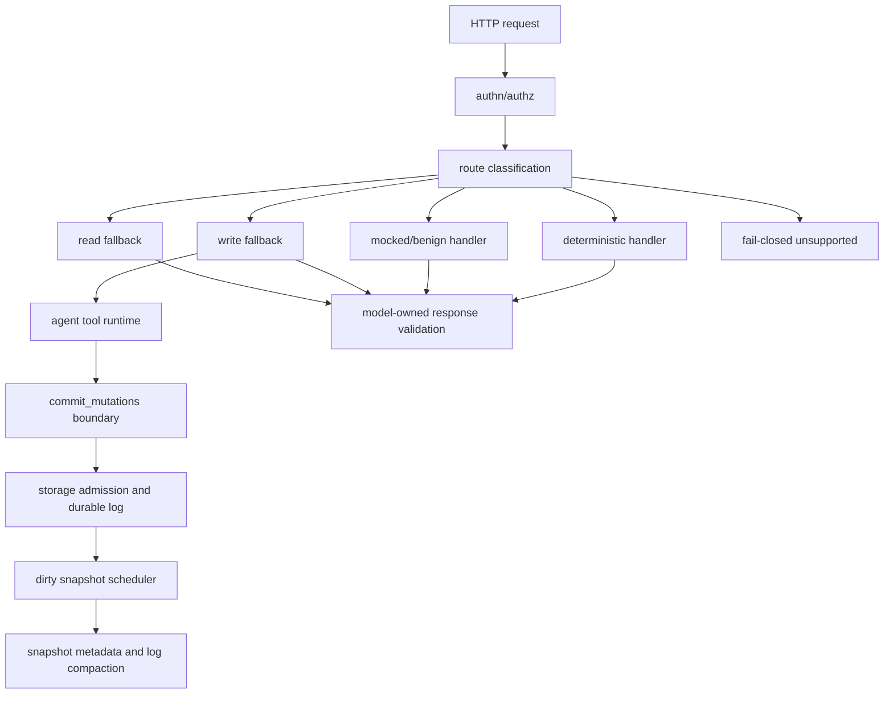
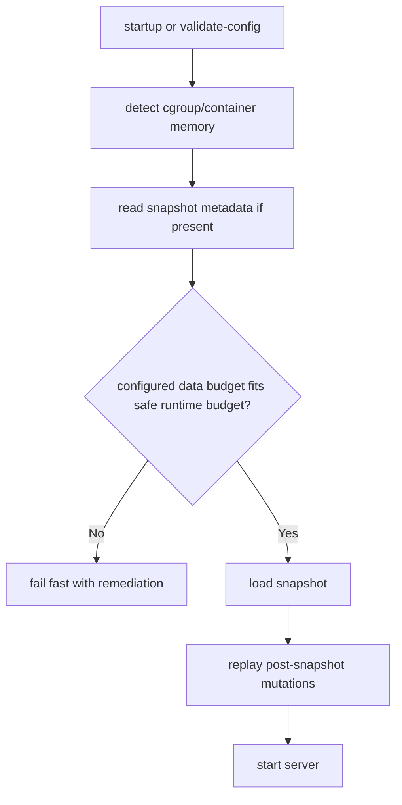

# feat: Add Write-Capable Agent Fallback

## Summary

Implement write-capable agent fallback as a phased compatibility feature: first
make persistence and resource limits robust enough for tool-backed writes, then
add compatibility route tiers, fallback tools, model/prompt benchmarking, and
the first catalog/template/pipeline/script API family. Live model benchmarking
is a first-class implementation stream, but remains opt-in and secret-backed.

---

## Problem Frame

The origin requirements define a broader fallback goal: mainstack-search should
let a configured model bridge more OpenSearch API gaps in development without
turning every unsupported or local-inapplicable API into a client-breaking
error. Planning must preserve the safety constraints from that brainstorm while
choosing a concrete implementation path that fits the current Rust/Tokio server,
in-memory store, readable durable files, route inventory, and authz model.

---

## Requirements

- R1. Preserve read-only fallback behavior unless write-enabled fallback is
  explicitly configured. Origin: R1, R2, R7.
- R2. Route all fallback writes through an explicit server-visible commit
  boundary that uses the same authorization, resource, validation, and durable
  storage paths as deterministic writes. Origin: R2, R4, R5, R6, R32, R33.
- R3. Let the model own eligible OpenSearch-shaped responses while preventing it
  from mutating files directly or claiming uncommitted side effects. Origin:
  R3, R4, R6, R8.
- R4. Introduce route-tier semantics that distinguish implemented,
  best-effort, mocked/benign no-op, read-fallback, write-fallback, unsupported,
  and outside-identity behavior. Origin: R14, R15, R16.
- R5. Return benign positive compatibility responses for safe local-inapplicable
  APIs where hard unsupported errors would break clients unnecessarily. Origin:
  R14, R15, R16, R17.
- R6. Keep security/control namespaces, destructive filesystem-like behavior,
  snapshot restore/delete, dangling-index operations, and wrong-method routes
  fail-closed. Origin: R18.
- R7. Implement the first write-enabled fallback API family around catalog,
  templates, pipelines, and scripts, using local registry-style semantics where
  appropriate. Origin: R9, R11, R12.
- R8. Prepare the second family around search-template, explain,
  query-validation, text-analysis, and term-vector behavior without requiring
  all of it in the first implementation pass. Origin: R10, R11, R12, R13.
- R9. Build a model and prompt benchmark harness that discovers candidates,
  exercises representative agentic operations, grades accuracy, captures
  speed/cost, and keeps live paid calls opt-in. Origin: R19, R20, R21, R22,
  R23, R24.
- R10. Continue appending durable mutations on every committed write while
  replacing snapshot-on-every-write with dirty-threshold snapshot flushing.
  Origin: R25, R26.
- R11. Boot durable state from the latest valid snapshot plus only
  post-snapshot mutations, and compact obsolete mutation-log history only after
  a successful snapshot. Origin: R27, R28, R30, R31.
- R12. Add snapshot metadata that can be read before the full snapshot and
  carries estimated stored bytes, index counts, document counts, generation, and
  related collection-level facts. Origin: R29, R30.
- R13. Detect container memory limits when visible and fail fast with explicit
  remediation guidance before OOM-prone boot or validation work. Origin: R34,
  R35, R36, R37.
- R14. Keep API keys, model credentials, benchmark secrets, and live benchmark
  outputs out of Git by default. Origin: R19.

**Origin actors:** A1 application developer, A2 coding agent caller, A3 runtime
fallback model, A4 maintainer, A5 workgroup operator, A6 benchmark judge model.
**Origin flows:** F1 write-enabled fallback request, F2 benign local-inapplicable
API call, F3 candidate model benchmark, F4 snapshot and mutation-log
maintenance, F5 container memory mismatch diagnosis.
**Origin acceptance examples:** AE1 fallback commit boundary, AE2 fail-closed
security/control routes, AE3 benign cluster-control response, AE4 model
benchmarking, AE5 snapshot compaction, AE6 idle snapshot avoidance, AE7 repair
tooling, AE8 fallback memory admission, AE9 container memory fail-fast.

---

## Scope Boundaries

- Full production OpenSearch behavior for clustering, shard allocation,
  snapshots, restore workflows, security plugin management, distributed fault
  tolerance, and Lucene internals remains out of scope.
- General Painless execution remains out of scope. Script APIs may be
  registry-backed, narrowly simulated, or explicitly rejected.
- Direct model mutation of durable files remains out of scope.
- Silent repair of ambiguous or non-idempotent replay history during normal boot
  remains out of scope.
- Snapshot metadata must not become authoritative when snapshot/log validation
  fails.
- A hard total process RSS cap remains out of scope; container runtimes enforce
  hard limits while mainstack-search coordinates with detected limits and rejects
  unsafe data budgets.
- Live paid model benchmarks must not run in default `cargo test` or normal CI.

### Deferred to Follow-Up Work

- Broader analysis/search-template family completion: plan this after the first
  catalog/template/pipeline/script fallback family and benchmark harness land.
- Full live OpenSearch Dashboards process compatibility: continue to treat it
  as a separate smoke milestone.
- Embedded analytical engines such as DuckDB or Polars: revisit only if
  benchmark fixtures show the in-memory tools are insufficient.
- Snapshot/restore API semantics: defer until local archive/export/import
  behavior is deliberately designed.

---

## Context & Research

### Relevant Code and Patterns

- `src/agent/client.rs`, `src/agent/context.rs`, `src/agent/prompt.rs`, and
  `src/agent/validation.rs` implement the current OpenAI-compatible read-only
  fallback wrapper contract.
- `src/api_spec/mod.rs`, `src/api_spec/tier.rs`, and `build.rs` define route
  classification, access classes, generated API inventory, and strict
  compatibility behavior.
- `src/api/mod.rs` dispatches implemented, best-effort, agent-read, and
  unsupported routes after authorization.
- `src/security/authz.rs` enforces route-inventory-based read/write/admin
  authorization before fallback.
- `src/storage/mod.rs`, `src/storage/mutation_log.rs`, and
  `src/storage/snapshot.rs` implement in-memory state, append-only transaction
  logging, memory admission, and full snapshot writing.
- `src/runtime.rs` already stores process-local runtime state for scrolls and
  synthetic tasks with resource bounds.
- `tests/agent_fallback.rs`, `tests/api_inventory.rs`, `tests/http_surface.rs`,
  `tests/security_surface.rs`, and `tests/durable_agent_read_surface.rs`
  provide the closest existing test patterns.
- `docs/agent-fallback.md`, `docs/compatibility.md`, and
  `docs/supported-apis.md` are the primary docs affected by fallback and tier
  changes.

### Institutional Learnings

- `docs/solutions/security-issues/mainstack-search-p1-code-review-hardening-2026-04-29.md`
  records that route classification, fallback eligibility, write semantics,
  data exposure, and resource limits are security boundaries.
- `docs/solutions/security-issues/mainstack-search-kubernetes-workgroup-security-2026-04-30.md`
  records that fallback runs behind authn/authz and that operator diagnostics
  should be shell/container/Kubernetes friendly without leaking secrets.
- `docs/solutions/integration-issues/mainstack-search-dashboards-migration-api-surface-hardening-2026-04-30.md`
  records the pattern for bounded runtime state and atomic read-then-write
  planning under storage locks.

### External References

- OpenRouter model metadata is the live source for candidate model IDs,
  pricing, context windows, tool support, and structured-output support.
- Artificial Analysis model stats are the live source for quality, speed, and
  blended cost signals used to seed candidate selection.
- Preliminary candidate families observed during planning include GPT-5.5,
  Gemini 3.1 Pro, Claude Opus/Sonnet 4.x, GPT-5.x Codex, Kimi K2.6,
  DeepSeek V4 Pro, Qwen3.6, GLM-5.x, and MiniMax M2.x. The benchmark harness
  must rediscover candidates at run time rather than hard-code this list.

---

## Key Technical Decisions

- Add durability/resource foundations before write-enabled fallback: fallback
  commit tools should not land on a storage layer that rewrites full snapshots
  after every write or boots only from full log replay.
- Add distinct route tiers instead of overloading existing tiers:
  mocked/benign behavior, write-fallback eligibility, and hard unsupported
  behavior have different safety and compatibility meanings.
- Keep the existing authz model authoritative: write-fallback routes require a
  principal that can write, while read-fallback routes remain readable by
  read-only users.
- Use the storage layer as the commit boundary: tool-backed mutations should
  convert into validated storage mutations or write operations, not raw file
  writes.
- Treat model response ownership and mutation ownership separately: the model
  can craft the client-facing response, but the server owns whether side
  effects were actually committed.
- Keep model benchmarking separate from normal tests: live calls need local
  secrets, cost controls, repeatable fixture reports, and a dry-run path for CI.
- Prefer headers and tolerated metadata for compatibility signals: client
  response shapes should remain as close to OpenSearch as practical.
- Keep recovery replay intelligence explicit: normal boot should reject or
  report invalid snapshot/log relationships rather than silently guessing.

---

## Open Questions

### Resolved During Planning

- Should model/prompt benchmarking be a side task or first-class implementation
  stream? It is first-class, with its own implementation unit, fixtures,
  prompt variants, live OpenRouter path, judge grading, and dry-run tests.
- Should write-enabled fallback land before snapshot/log changes? No. Storage
  and resource foundations should land first so fallback commits inherit the
  corrected durability behavior.
- Should benign route behavior reuse `BestEffort`? No. Add explicit
  mocked/benign tier semantics so strict compatibility, docs, and headers can
  communicate the difference.
- Should live benchmarks run during normal tests? No. Normal tests validate
  schemas, fixture loading, scoring logic, and dry-run behavior only.

### Deferred to Implementation

- Exact CLI flag names for write fallback and snapshot thresholds: choose names
  consistent with existing `--agent-*` and resource-limit flags while editing
  `src/config.rs`.
- Exact snapshot metadata wire format: keep it readable and versioned, but let
  implementation settle the smallest maintainable shape.
- Exact model judge prompt wording and rubric scoring scale: define alongside
  benchmark fixtures and refine after the first dry-run outputs.
- Exact set of first mocked APIs: start from cluster routing/cache/open/close
  candidates and adjust where route inventory tests show safer boundaries.

---

## High-Level Technical Design

> *This illustrates the intended approach and is directional guidance for review,
> not implementation specification. The implementing agent should treat it as
> context, not code to reproduce.*

---

## Implementation Units

- U1. **Snapshot Metadata And Dirty Flush Policy**

**Goal:** Replace snapshot-on-every-write with threshold-based snapshot flushing
and readable metadata while keeping append-on-every-write durability.

**Requirements:** R10, R11, R12; origin F4, AE5, AE6.

**Dependencies:** None.

**Files:**
- Modify: `src/config.rs`
- Modify: `src/storage/mod.rs`
- Modify: `src/storage/snapshot.rs`
- Modify: `src/storage/mutation_log.rs`
- Test: `tests/durable_agent_read_surface.rs`
- Test: `tests/http_surface.rs`

**Approach:**
- Add configurable snapshot flush thresholds for committed-write count and
  dirty elapsed time, with defaults matching the origin intent of 1000 writes
  or 10 dirty minutes.
- Track dirty write count and dirty-since time in the store. Append each
  committed transaction to `mutations.jsonl`, but call the full snapshot writer
  only when a threshold is crossed.
- Extend snapshot writing to include a small readable metadata envelope or
  sibling metadata record that can be inspected before loading full state.
- Ensure idle time alone does not rewrite snapshots when no committed writes
  occurred.
- Keep ephemeral mode free of snapshot/log behavior.

**Execution note:** Start with failing durable-storage tests for dirty threshold
behavior before changing snapshot write behavior.

**Patterns to follow:**
- Existing atomic file write pattern in `src/storage/snapshot.rs`.
- Existing memory admission and committed-transaction path in
  `src/storage/mod.rs`.
- Existing durable readability tests in `tests/durable_agent_read_surface.rs`.

**Test scenarios:**
- Happy path: after one durable write below threshold, `mutations.jsonl` is
  appended and no full snapshot rewrite is required.
- Happy path: after the write-count threshold is reached, a snapshot and
  metadata are written and contain current index/document counts.
- Edge case: with no writes since the last snapshot, elapsed dirty time does
  not rewrite the snapshot.
- Edge case: ephemeral mode ignores snapshot thresholds and does not create
  durable files.
- Error path: snapshot write failure logs a warning and does not corrupt the
  committed mutation log.
- Integration: durable files remain directly readable by the existing agent
  readability fixture.

**Verification:**
- Durable writes remain restart-safe.
- Snapshot rewrites are bounded by dirty thresholds, not every write.
- Snapshot metadata is readable and useful without parsing arbitrary document
  bodies.

---

- U2. **Snapshot Boot And Mutation Log Compaction**

**Goal:** Boot from the latest valid snapshot plus post-snapshot mutations and
compact obsolete mutation-log history only after a successful snapshot.

**Requirements:** R10, R11, R12; origin F4, AE5, AE7.

**Dependencies:** U1.

**Files:**
- Modify: `src/storage/mod.rs`
- Modify: `src/storage/snapshot.rs`
- Modify: `src/storage/mutation_log.rs`
- Test: `tests/durable_agent_read_surface.rs`
- Test: `tests/http_surface.rs`

**Approach:**
- Add snapshot loading with validation metadata before mutation-log replay.
- Record enough generation or high-water information to determine which log
  records belong after the snapshot.
- Compact by rotating or replacing only the obsolete log segment after the new
  snapshot is durably written and directory-synced.
- Keep incomplete transactions ignored or rejected according to the existing
  transaction replay semantics; do not silently repair non-idempotent ambiguity
  in normal boot.

**Execution note:** Add characterization coverage around current log replay
before changing boot order.

**Patterns to follow:**
- Existing transaction `begin`/`commit` replay in `src/storage/mutation_log.rs`.
- Atomic write and directory sync pattern in `src/storage/snapshot.rs`.

**Test scenarios:**
- Happy path: a server restarts from a snapshot and replays only mutations
  committed after that snapshot.
- Happy path: after compaction, restart does not require replaying obsolete
  pre-snapshot transactions.
- Edge case: torn final mutation record after a snapshot is handled according
  to current torn-record behavior without corrupting snapshot-loaded state.
- Error path: invalid snapshot metadata causes boot to reject or fall back only
  in an explicitly documented safe mode, not silently treat metadata as
  authoritative.
- Error path: failed compaction leaves a recoverable snapshot/log combination.

**Verification:**
- Normal boot time depends on snapshot plus active log size rather than full
  historical mutation count.
- Compaction cannot make a successfully committed write unrecoverable.

---

- U3. **Container Memory Budget Diagnostics**

**Goal:** Detect container memory limits, compare them with configured data
budgets and snapshot metadata, and fail fast with actionable remediation.

**Requirements:** R13; origin F5, AE9.

**Dependencies:** U1.

**Files:**
- Create: `src/resources.rs`
- Modify: `src/config.rs`
- Modify: `src/server.rs`
- Modify: `src/main.rs`
- Modify: `docs/security.md`
- Modify: `docs/kubernetes-security.md`
- Test: `tests/resource_diagnostics.rs`
- Test: `tests/http_surface.rs`
- Test: `tests/security_surface.rs`

**Approach:**
- Add a small resource-diagnostics module that reads common cgroup v2 and v1
  memory limit files when present and treats unbounded values as unknown.
- Add startup and `--validate-config` diagnostics comparing configured
  `--memory-limit`, reserved overhead, detected container limit, and snapshot
  metadata.
- Fail before opening/loading large durable state when the budget is impossible
  unless an explicit override is later chosen during implementation.
- Emit remediation text that mentions increasing local/container memory,
  reducing local data, lowering mainstack-search limits, using another data
  directory, or moving to full/cloud/server-hosted OpenSearch.

**Patterns to follow:**
- Existing startup validation in `src/server.rs`.
- Existing config and TLS/auth diagnostics style in `src/security/diagnostics.rs`.
- Existing Kubernetes operator docs in `docs/kubernetes-security.md`.

**Test scenarios:**
- Happy path: no cgroup limit present yields a diagnostic summary without
  failing local startup.
- Happy path: a compatible cgroup limit and data budget passes validation.
- Error path: configured data budget exceeds safe detected container budget and
  validation fails before store load.
- Error path: snapshot metadata indicates stored data exceeds safe budget and
  validation fails before loading the full snapshot.
- Integration: `--validate-config` reports configured budget, detected limit,
  reserved overhead, effective safe budget, and remediation text without
  printing secrets or document bodies.

**Verification:**
- Container memory mismatch produces an actionable error instead of an opaque
  restart/OOM loop.
- Local non-container development remains frictionless.

---

- U4. **Compatibility Route Tiers And Benign Responses**

**Goal:** Split hard unsupported behavior from mocked/benign local compatibility
and write-fallback eligibility in route inventory and dispatch.

**Requirements:** R4, R5, R6; origin F2, AE2, AE3.

**Dependencies:** None.

**Files:**
- Modify: `src/api_spec/tier.rs`
- Modify: `src/api_spec/mod.rs`
- Modify: `build.rs`
- Modify: `src/api/mod.rs`
- Modify: `src/responses/best_effort.rs`
- Modify: `docs/compatibility.md`
- Modify: `docs/supported-apis.md`
- Test: `tests/api_inventory.rs`
- Test: `tests/http_surface.rs`
- Test: `tests/security_surface.rs`

**Approach:**
- Add explicit tier variants for mocked/benign local responses and write-agent
  fallback eligibility.
- Reclassify safe local-inapplicable candidates such as cluster routing,
  cache/flush/force-merge/open/close, and rethrottle APIs into mocked/benign
  behavior where response semantics are immaterial locally.
- Keep wrong methods, security/control namespaces, snapshot restore/delete,
  dangling-index operations, and destructive filesystem-like APIs
  unsupported/fail-closed.
- Preserve strict compatibility behavior by making strict mode reject mocked
  and fallback tiers unless allowlisted.
- Add compatibility headers for new tiers while keeping bodies close to
  OpenSearch-shaped expectations.

**Patterns to follow:**
- Current tier enum in `src/api_spec/tier.rs`.
- Current best-effort response and strict guard behavior in `src/api/mod.rs`.
- Route classification regression style in `tests/api_inventory.rs`.

**Test scenarios:**
- Covers AE2. Security/control and wrong-method routes remain fail-closed and
  never reach fallback.
- Covers AE3. A safe cluster-control API returns a positive mocked response with
  compatibility headers in non-strict mode.
- Error path: strict compatibility rejects mocked and fallback tiers unless
  explicitly allowlisted.
- Edge case: generated inventory and manual classifier agree on access class
  for read, write, admin, mocked, and write-fallback routes.
- Integration: docs list new tier meanings and explain when clients should move
  to full OpenSearch.

**Verification:**
- Unsupported now means cannot safely answer, not merely not implemented.
- Clients receive benign success for safe local no-op APIs without weakening
  fail-closed routes.

---

- U5. **Agent Tool Runtime And Commit Boundary**

**Goal:** Add a model-tool abstraction inside the agent module and make
`commit_mutations` the only fallback write side-effect boundary.

**Requirements:** R1, R2, R3, R14; origin F1, AE1, AE2, AE8.

**Dependencies:** U1, U3, U4.

**Files:**
- Create: `src/agent/tools.rs`
- Create: `src/agent/session.rs`
- Modify: `src/agent/client.rs`
- Modify: `src/agent/context.rs`
- Modify: `src/agent/prompt.rs`
- Modify: `src/agent/validation.rs`
- Modify: `src/agent/mod.rs`
- Modify: `src/api/mod.rs`
- Modify: `src/config.rs`
- Test: `tests/agent_fallback.rs`
- Test: `tests/http_surface.rs`
- Test: `tests/security_surface.rs`

**Approach:**
- Extend agent configuration with explicit write-fallback enablement and
  per-family or per-tier allowlisting.
- Represent an agent session as request context plus a constrained tool
  catalogue chosen from route tier, access class, and configuration.
- Add tool-call parsing/validation for read tools and `commit_mutations`, while
  keeping the client-facing wrapper response validation separate.
- Map `commit_mutations` into existing storage mutations/write operations so
  memory admission, document limits, authz, and durability are shared with
  deterministic handlers.
- Reject successful write responses when no matching successful commit occurred
  for a response that claims side effects.
- Keep read-only fallback prompt and validation behavior intact when write mode
  is disabled.

**Technical design:** The tool runtime should expose a narrow set of semantic
operations: inspect catalog, scan bounded documents, evaluate query, run
aggregation, render template, read registry object, commit mutations, record
runtime task, and construct structured OpenSearch errors. The exact Rust types
are implementation details, but every write tool must ultimately cross the
single commit boundary.

**Patterns to follow:**
- Existing `AgentClient::complete` wrapper flow in `src/agent/client.rs`.
- Existing storage mutation validation in `src/storage/mod.rs`.
- Existing route authz checks in `src/security/authz.rs`.

**Test scenarios:**
- Covers AE1. Eligible write fallback succeeds only when the model uses the
  commit boundary and the server validates the mutation.
- Covers AE2. Unauthorized or unsupported write-fallback route does not invoke
  the model.
- Covers AE8. A fallback commit that would exceed stored-data memory budget is
  rejected and leaves durable state unchanged.
- Error path: model returns success with claimed side effects but no successful
  commit; server rejects the response.
- Error path: write-enabled fallback is not configured; the same route fails
  with an actionable unsupported/fallback-disabled response.
- Edge case: read-only fallback behavior and tests continue to pass unchanged.

**Verification:**
- Model-owned responses cannot create hidden durable side effects.
- Write fallback shares the same safety boundaries as deterministic writes.

---

- U6. **Catalog, Template, Pipeline, And Script Registry Fallback**

**Goal:** Implement the first write-enabled fallback API family using local
registry-style tools and deterministic validation where possible.

**Requirements:** R7, R8; origin F1, AE1.

**Dependencies:** U4, U5.

**Files:**
- Create: `src/catalog/registry.rs`
- Modify: `src/storage/mutation_log.rs`
- Modify: `src/storage/mod.rs`
- Modify: `src/api/mod.rs`
- Modify: `build.rs`
- Modify: `docs/supported-apis.md`
- Test: `tests/catalog_surface.rs`
- Test: `tests/agent_fallback.rs`
- Test: `tests/api_inventory.rs`

**Approach:**
- Extend local catalog storage to cover component templates, legacy templates
  as a separate namespace from composable templates, ingest pipelines, search
  pipelines, and stored scripts.
- Route first-priority registry APIs either to deterministic local handlers or
  write-enabled fallback tools depending on complexity and OpenSearch response
  shape.
- Store registry definitions as readable JSON so coding agents can inspect
  them alongside index templates and mappings.
- Keep script execution narrow: stored definitions can be registered and read,
  but arbitrary Painless execution remains unsupported unless a benchmarked
  narrow simulation is added later.

**Patterns to follow:**
- Existing template storage in `src/storage/mod.rs` and `src/catalog/template.rs`.
- Existing legacy-template delete safety behavior.
- Existing API inventory tests for generated and manual route parity.

**Test scenarios:**
- Happy path: component template or pipeline put/get/delete works through the
  selected local registry path and is visible in durable state.
- Happy path: script put/get/delete stores definitions without executing
  arbitrary scripts.
- Error path: legacy templates and composable templates remain separate
  namespaces.
- Error path: unsupported script execution returns a structured error and does
  not mutate state.
- Integration: route inventory marks the first-priority registry APIs with the
  intended tier and access class.

**Verification:**
- A meaningful subset of catalog/template/pipeline/script APIs no longer hard
  fails, and local registry state remains readable and bounded.

---

- U7. **Model Candidate, Prompt, And Benchmark Harness**

**Goal:** Build an opt-in benchmark stream for selecting models and prompt
variants against representative agentic operations.

**Requirements:** R9, R14; origin F3, AE4.

**Dependencies:** U5, U6 for full live write fixtures; dry-run scaffolding may
start earlier.

**Files:**
- Create: `benches/agent_fallback_models.rs`
- Create: `tests/agent_benchmark_harness.rs`
- Create: `fixtures/agent_fallback/catalog_registry.json`
- Create: `fixtures/agent_fallback/benign_noop.json`
- Create: `fixtures/agent_fallback/tool_commit.json`
- Create: `fixtures/agent_fallback/query_analysis.json`
- Create: `docs/agent-fallback-benchmarks.md`
- Modify: `Cargo.toml`
- Modify: `.gitignore`

**Approach:**
- Define fixture cases for registry writes, benign no-op APIs, tool-backed
  commits, query/explain/analysis responses, failure cases, and memory-limit
  rejection.
- Add prompt variants for first-priority API families and keep them readable
  enough for review.
- Discover model candidates from OpenRouter metadata and quality/cost stats
  from Artificial Analysis-style metadata when local credentials are available.
- Use deterministic assertions for exact behaviors and a frontier judge model
  for subjective compatibility grading.
- Capture latency, token usage when available, estimated cost, structured-output
  adherence, tool-call correctness, final response correctness, and restart
  recoverability.
- Keep live calls opt-in behind local env/secret configuration. Normal tests
  validate fixture schemas, prompt registry loading, scoring math, and dry-run
  report generation.
- Write reports to ignored generated paths by default; require a deliberate doc
  update to promote benchmark conclusions.

**Execution note:** Build the dry-run harness and fixture schema tests before
  enabling live OpenRouter calls.

**Patterns to follow:**
- Existing criterion-style benchmark declaration in `Cargo.toml`.
- Existing ignored official-client smoke posture for tests requiring external
  dependencies or services.
- Existing `.env` and `.gitignore` secret-handling posture.

**Test scenarios:**
- Covers AE4. Dry-run loads all benchmark fixtures and prompt variants without
  network calls.
- Happy path: model candidate discovery parses a saved sample metadata response
  and filters for structured-output/tool-capable candidates.
- Happy path: scoring ranks accuracy above speed and speed above cost.
- Error path: missing benchmark credentials skips live calls with a clear
  message and does not fail normal tests.
- Error path: malformed model output is graded as invalid schema/tool failure.
- Integration: a live benchmark run writes an ignored report containing model,
  prompt, accuracy, speed, cost, and failure notes without secret values.

**Verification:**
- Model choice can be justified from repeatable benchmark results rather than
  hard-coded preference.
- Prompt changes can be benchmarked against the same operation fixtures.

---

- U8. **Search Template, Explain, Validation, And Analysis Scaffolding**

**Goal:** Prepare the second API family with shared tools and fixtures without
committing to full general analyzer or Painless behavior.

**Requirements:** R8, R9; origin F3.

**Dependencies:** U5, U7.

**Files:**
- Modify: `src/search/dsl.rs`
- Modify: `src/search/evaluator.rs`
- Modify: `src/agent/tools.rs`
- Modify: `docs/supported-apis.md`
- Modify: `fixtures/agent_fallback/query_analysis.json`
- Test: `tests/search_surface.rs`
- Test: `tests/agent_fallback.rs`

**Approach:**
- Expose existing query parsing/evaluation capabilities as agent tools for
  validation, explanation, and bounded analysis.
- Add deterministic scaffolding for rendering stored search templates and
  validating query shapes before invoking a model.
- Keep `indices.analyze`, term vectors, and explain behavior development-scale:
  enough for clear local feedback and benchmarks, not Lucene parity.
- Use benchmark fixtures to decide which parts should graduate to deterministic
  local handlers in a later tranche.

**Patterns to follow:**
- Existing bounded query guardrails in `src/search/limits.rs`.
- Existing search evaluator error propagation tests.

**Test scenarios:**
- Happy path: a supported query can be validated/explained through the shared
  tool surface without mutating data.
- Error path: unsupported query shapes produce structured errors rather than
  empty or misleading results.
- Edge case: analysis fixtures with empty text, missing fields, or unsupported
  analyzers remain bounded and actionable.
- Integration: benchmark fixtures can exercise the same tool surface used by
  runtime fallback.

**Verification:**
- Second-family APIs have a clear tool and benchmark path, even where full
  deterministic parity is deferred.

---

- U9. **Documentation And Agent-Operable Guidance**

**Goal:** Update user, operator, and agent-facing docs for write fallback,
benign tiers, benchmark workflow, durable metadata, and memory remediation.

**Requirements:** R1 through R14; origin success criteria.

**Dependencies:** U1 through U8.

**Files:**
- Modify: `docs/agent-fallback.md`
- Modify: `docs/compatibility.md`
- Modify: `docs/supported-apis.md`
- Modify: `docs/security.md`
- Modify: `docs/kubernetes-security.md`
- Modify: `docs/agent-fallback-benchmarks.md`

**Approach:**
- Document read-only versus write-enabled fallback configuration, trust
  boundaries, tool commit behavior, and route-family allowlisting.
- Explain new compatibility tiers and which API families are mocked, fallback,
  deterministic, unsupported, or outside identity.
- Document benchmark setup using ignored env/secret files without printing
  secrets.
- Document snapshot metadata and mutation-log compaction at a user-facing level.
- Add Docker/Kubernetes memory diagnostics guidance with remediation language
  that includes moving to full/cloud/server-hosted OpenSearch when local memory
  is insufficient.

**Patterns to follow:**
- Existing concise docs in `docs/agent-fallback.md`, `docs/security.md`, and
  `docs/kubernetes-security.md`.
- Existing compatibility tier explanation in `docs/compatibility.md`.

**Test scenarios:**
- Test expectation: none for prose-only docs, but review docs alongside the
  route inventory and benchmark tests to keep examples accurate.

**Verification:**
- A coding agent can read the docs and determine how to configure fallback,
  run dry-run benchmarks, inspect durable metadata, and diagnose memory
  mismatch without hidden product knowledge.

---

## System-Wide Impact

- **Interaction graph:** `Config` feeds `server::validate_config`,
  `AppState`, route classification, agent client/session setup, storage limits,
  and docs. Changes to fallback flags and tiers affect authz, strict
  compatibility, dispatch, and tests.
- **Error propagation:** Fallback, memory diagnostics, mocked APIs, and storage
  admission must all return OpenSearch-shaped or startup-diagnostic errors with
  actionable hints while avoiding secret/document-body leaks.
- **State lifecycle risks:** Snapshot compaction changes boot recovery paths.
  It must preserve append-first durability and ensure compaction only removes
  history made obsolete by a durable snapshot.
- **API surface parity:** New tiers require generated inventory, manual
  classifier, docs, strict compatibility, and authorization tests to move
  together.
- **Integration coverage:** Unit tests are not sufficient for fallback writes;
  tests must cover request classification, authz, model/tool validation,
  storage commit, durable restart, and response validation.
- **Unchanged invariants:** Security/control namespaces remain fail-closed;
  read-only fallback remains the default; direct file mutation by models remains
  forbidden; normal tests do not make paid model calls.

---

## Risks & Dependencies

| Risk | Mitigation |
|------|------------|
| Write-enabled fallback broadens the blast radius of prompt mistakes | Require explicit enablement, write authz, route-family allowlists, commit-tool boundary, storage validation, and tests that reject claimed but uncommitted side effects |
| Snapshot compaction could lose committed data | Append transactions first, write and sync snapshots atomically, compact only after successful snapshot, and test failure paths |
| New route tiers weaken strict compatibility semantics | Treat mocked and fallback tiers as non-implemented in strict mode unless allowlisted |
| Benign responses hide meaningful unsupported behavior | Keep fail-closed allowlist for security/control/destructive APIs and document local-inapplicable criteria |
| Live benchmarks leak secrets or create surprise cost | Use ignored env/secret files, opt-in execution, dry-run default tests, redacted reports, and no CI live calls |
| Container memory detection is platform-dependent | Treat unknown limits as diagnostic information, not failure; fail fast only when visible limits and configured budgets are clearly incompatible |
| Prompt/model benchmark results drift as hosted models change | Rediscover candidates at benchmark time and report model IDs, metadata timestamps, cost, and prompt variant identifiers |

---

## Documentation / Operational Notes

- Update docs in the same tranche as behavior changes. Route tiers, fallback
  write enablement, memory diagnostics, and benchmark setup are user-visible
  contracts.
- Keep `.env` and generated benchmark reports ignored. Never include API key
  values, bearer tokens, Authorization headers, private keys, or arbitrary
  document bodies in docs, logs, or reports.
- `--validate-config` should become the preferred agent-operable memory and
  mounted-secret diagnostic path for Docker/Kubernetes.
- Startup memory remediation logs should explicitly name local alternatives:
  increase memory, reduce data, lower limits, use a smaller data directory, or
  move to full/cloud/server-hosted OpenSearch.

---

## Alternative Approaches Considered

- **Let the model emit raw state changes without tools:** Rejected because it
  would bypass durable storage validation, memory limits, auditability, and
  restart safety.
- **Add a separate agent sidecar service:** Rejected for this tranche because
  the existing in-process fallback path already has authz, context scoping, and
  OpenAI-compatible client support. A sidecar can be revisited if isolation
  becomes more important than simplicity.
- **Use DuckDB or Polars immediately for analytical tools:** Deferred because
  the current in-memory evaluator and planned benchmark fixtures should first
  prove whether an extra engine is needed.
- **Make all unsupported APIs mocked positive responses:** Rejected because
  security/control, destructive, and filesystem-like APIs need fail-closed
  behavior to avoid misleading clients and agents.

---

## Phased Delivery

### Phase 1: Foundations

- U1. Snapshot metadata and dirty flush policy.
- U2. Snapshot boot and mutation-log compaction.
- U3. Container memory budget diagnostics.
- U4. Compatibility route tiers and benign responses.

### Phase 2: Write-Enabled Fallback

- U5. Agent tool runtime and commit boundary.
- U6. Catalog, template, pipeline, and script registry fallback.

### Phase 3: Evaluation And Expansion

- U7. Model candidate, prompt, and benchmark harness.
- U8. Search template, explain, validation, and analysis scaffolding.
- U9. Documentation and agent-operable guidance.

---

## Sources & References

- **Origin document:** [docs/brainstorms/2026-04-30-mainstack-search-agent-fallback-write-support-requirements.md](docs/brainstorms/2026-04-30-mainstack-search-agent-fallback-write-support-requirements.md)
- Related docs: `docs/agent-fallback.md`
- Related docs: `docs/compatibility.md`
- Related docs: `docs/supported-apis.md`
- Related docs: `docs/security.md`
- Related docs: `docs/kubernetes-security.md`
- Related code: `src/agent/client.rs`
- Related code: `src/api_spec/mod.rs`
- Related code: `src/api/mod.rs`
- Related code: `src/storage/mod.rs`
- Related code: `src/storage/mutation_log.rs`
- Related code: `src/storage/snapshot.rs`
- Related tests: `tests/agent_fallback.rs`
- Related tests: `tests/api_inventory.rs`
- Related tests: `tests/http_surface.rs`
- Related tests: `tests/security_surface.rs`
- Related tests: `tests/durable_agent_read_surface.rs`
