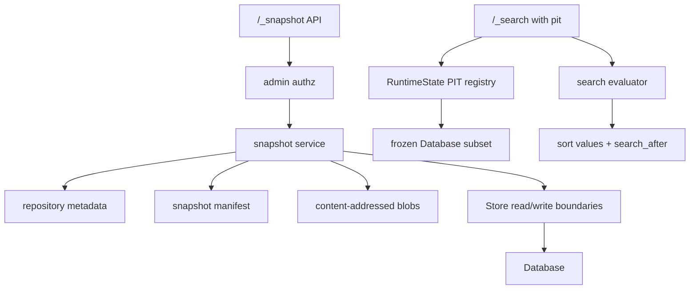
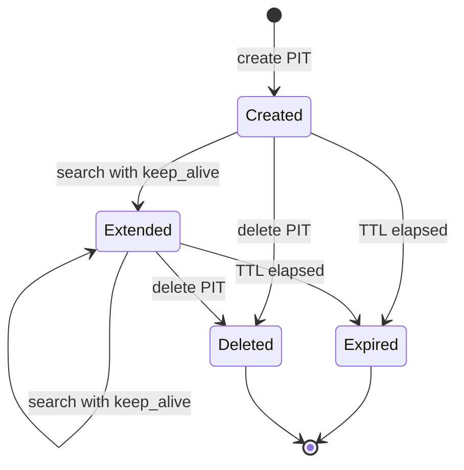

# feat: Add Snapshot Repository, PIT, and Cursor Pagination

## Summary

Add the next compatibility tranche around local snapshot repositories, process-local
PIT contexts, and OpenSearch-compatible chunked result access. The implementation
uses a native manifest/blob catalog rather than Git or Iceberg, then builds PIT on
bounded frozen database views and exposes chunking primarily through PIT plus
`search_after`, with true HTTP response streaming left as a deliberate follow-up.

**Status update, 2026-05-06:** The repository-management, PIT, `search_after`,
streaming-boundary, and reserved-name safety work from this tranche has landed.
Snapshot restore remains intentionally unsupported in code and is split into the
focused follow-up plan at
`docs/plans/2026-05-06-001-feat-snapshot-restore-plan.md`.

---

## Problem Frame

Snapshot APIs, PIT, and large-result access are currently visible API gaps in the
coverage report. mainstack-search already has readable durable recovery snapshots
and bounded scroll state, but it does not yet expose OpenSearch-shaped snapshot
repository APIs, PIT lifecycle APIs, or stable sorted cursors for deep pagination.

---

## Requirements

### Snapshot Repository and Restore

- R1. Implement an OpenSearch-shaped local snapshot repository catalog without
  making Git or Iceberg compatibility part of the runtime contract.
- R2. Keep snapshot APIs behind admin authorization and fail closed for malformed,
  wrong-method, or not-yet-supported snapshot family paths.
- R3. Store snapshot repository metadata, snapshot manifests, and content blobs in
  readable, versioned, atomic files under the configured data directory.
- R4. Snapshot create/get/delete/verify/cleanup must be deterministic local
  behavior and must not route through runtime agent fallback.
- R5. Restore must be explicit, admin-only, resource-admitted, and atomic from the
  caller's perspective; partial restore support may be narrower than OpenSearch
  but must be honestly documented.

### PIT Lifecycle and Frozen Views

- R6. Implement PIT create/list/delete as process-local runtime state with
  bounded count, TTL, retained bytes, and cleanup behavior.
- R7. Searches using a PIT must run against the frozen PIT view and refresh
  keep-alive when the request supplies it.

### Pagination, Streaming Boundary, and Documentation

- R8. Implement `search_after` for deterministic sorted pagination, including
  sort values in returned hits and stable tie-breaking.
- R9. Preserve existing scroll behavior and document when clients should use
  scroll, PIT plus `search_after`, composite aggregation pagination, or a future
  mainstack-search-specific export stream.
- R10. Update API coverage, compatibility, and fallback boundary documentation so
  the new deterministic surfaces and remaining unsupported surfaces are visible.

---

## Scope Boundaries

- Do not implement a Git-backed snapshot repository as the core repository engine.
  Git may become an export/sync option later.
- Do not implement an Iceberg-compatible catalog in this tranche. The repository
  catalog may borrow manifest-generation ideas, but it should stay native to
  mainstack-search.
- Do not implement distributed shard-level snapshot semantics, remote repositories,
  searchable snapshots, repository plugins, or Lucene segment-level restore.
- Do not make PIT durable across server restarts. OpenSearch PIT contexts are
  runtime reader contexts, so process-local PITs are acceptable for
  mainstack-search.
- Do not add general chunked HTTP streaming to `_search`. OpenSearch-compatible
  chunking should use scroll or PIT plus `search_after`.
- Do not expand Index State Management plugin behavior in this tranche.

### Deferred to Follow-Up Work

- mainstack-search-specific NDJSON export endpoint: add only if a real caller
  needs one long streamed response rather than OpenSearch-compatible cursor
  paging.
- Composite aggregation pagination with `after_key`: plan separately after PIT
  plus `search_after`, unless a caller needs bucket paging first.
- Async search partial-result polling: plan separately if large-running queries
  become more important than large-result pagination.
- ISM plugin compatibility: add a separate tranche if Dashboards or Mainstack needs
  `/_plugins/_ism/...` behavior beyond fail-closed route safety.

---

## Context & Research

### Relevant Code and Patterns

- `src/storage/snapshot.rs` already implements readable JSON snapshot writes with
  temp-file, rename, file sync, metadata, and generation tracking for durable
  recovery snapshots.
- `src/storage/mod.rs` owns durable commit admission, mutation log compaction,
  database cloning, resource limits, and `Store::read_database`/write boundaries.
- `src/runtime.rs` owns process-local bounded scroll and task state. PIT should
  follow this pattern rather than entering durable storage.
- `src/api/mod.rs` currently handles search, scroll, clear scroll, reindex, task
  polling, catalog APIs, and unsupported responses after route classification.
- `src/search/evaluator.rs` evaluates local queries, sorting, pagination, source
  filtering, and aggregations against a `Database`.
- `src/search/limits.rs` validates result window, query shape, query depth, and
  aggregation limits before the evaluator scans documents.
- `src/api_spec/mod.rs` treats `_snapshot` as a control namespace today. Snapshot
  exact routes must move ahead of the broad control-family guard when implemented.
- `build.rs` generates route inventory tiers and access classes. Any hand
  classification for snapshot/PIT routes must be reflected in generated
  inventory and inventory/classification tests.
- `tests/dashboards_migration_surface.rs` and `src/runtime.rs` show the expected
  pattern for terminal empty scroll pages and bounded runtime cursor tests.
- `tests/durable_agent_read_surface.rs` captures crash/replay and readable
  snapshot expectations that should influence repository atomicity tests.

### Institutional Learnings

- `docs/solutions/security-issues/mainstack-search-p1-code-review-hardening-2026-04-29.md`
  records that known mutating/control APIs must fail closed before any fallback.
- `docs/solutions/security-issues/mainstack-search-agent-write-fallback-durable-replay-hardening-2026-04-30.md`
  records that snapshot/log metadata must not become authoritative when recovery
  validation fails, and crash-window tests are required for snapshot work.
- `docs/solutions/integration-issues/mainstack-search-dashboards-migration-api-surface-hardening-2026-04-30.md`
  records that runtime cursors need explicit count, TTL, and byte budgets.
- `docs/solutions/security-issues/mainstack-search-kubernetes-workgroup-security-2026-04-30.md`
  records that route inventory access classes and authz checks must remain the
  guard before deterministic handlers and fallback.

### External References

- OpenSearch blob repositories use generated repository metadata and snapshot
  blobs, with repository data updated through generation-like writes:
  `../OpenSearch/server/src/main/java/org/opensearch/repositories/blobstore/package-info.java`.
- OpenSearch PIT creates expiring reader contexts and encodes shard context IDs:
  `../OpenSearch/server/src/main/java/org/opensearch/action/search/CreatePitController.java`,
  `../OpenSearch/server/src/main/java/org/opensearch/search/SearchService.java`,
  and `../OpenSearch/server/src/main/java/org/opensearch/action/search/SearchContextId.java`.
- OpenSearch docs describe PIT plus `search_after` as the preferred deep
  pagination method: https://docs.opensearch.org/3.2/search-plugins/searching-data/paginate/
- OpenSearch docs describe scroll as batch access with retained search context
  and terminal empty hits: https://docs.opensearch.org/latest/api-reference/search-apis/scroll/
- OpenSearch docs describe streaming bulk as experimental ingestion streaming,
  not general search-hit streaming:
  https://docs.opensearch.org/docs/2.18/api-reference/document-apis/bulk-streaming/

---

## Key Technical Decisions

- Use a native manifest/blob snapshot repository: this keeps files inspectable,
  avoids Git GC/lock semantics, avoids Iceberg table-contract complexity, and
  matches OpenSearch's repository-generation shape closely enough for local
  compatibility.
- Keep durable recovery snapshots separate from API snapshots: existing
  `snapshot.json` remains a recovery accelerator, while `_snapshot` repositories
  create user-addressable archives under a dedicated repository directory.
- Implement snapshot restore only after create/get/delete repository behavior is
  covered: restore is the riskiest state transition and needs resource admission
  plus candidate-database validation before commit.
- Model PIT as runtime state, not persisted data: PITs are expiring views and
  should disappear on restart like scroll contexts.
- Store PIT views as bounded database subsets rather than query-bound hit lists:
  OpenSearch PIT is not query-bound, and clients should be able to run different
  queries against the same frozen view.
- Implement `search_after` before claiming useful PIT support: PIT without
  stable sorted cursors is mostly a lifecycle stub.
- Treat streaming as a product boundary: OpenSearch-compatible "chunks" are
  paged responses; true chunked responses should be an explicit
  mainstack-search extension with a separate endpoint and response abstraction.
- Treat snapshot restore as a later state-transition tranche, not a prerequisite
  for PIT pagination: the first user-visible large-read outcome is PIT search
  plus `search_after`.

---

## Open Questions

### Resolved During Planning

- Should Git back snapshot repositories? No. Git is useful as export/sync, but
  not as the runtime repository implementation.
- Should the repository catalog be Iceberg-compatible? No. Borrow manifest ideas
  but keep the contract native to mainstack-search.
- Should `_search` stream hits over HTTP? No. Use PIT plus `search_after` and
  scroll for OpenSearch compatibility; defer custom streaming.
- Should PIT be durable? No. Runtime-only PIT matches OpenSearch reader-context
  behavior closely enough for local development.

### Deferred to Implementation

- Exact snapshot manifest schema: choose the smallest readable versioned shape
  that supports create/get/delete/restore without duplicating the recovery
  snapshot metadata type.
- Exact repository path flag or default: use existing `--data-dir` unless
  implementation reveals a strong need for a separate `--snapshot-repository-dir`.
- Exact PIT ID encoding: choose an opaque URL-safe ID that can carry enough
  validation context without exposing full snapshot contents.
- Exact sort support breadth: start with scalar field sorts, `_id`, `_score`,
  `_shard_doc`, multi-clause ordering, and documented unsupported errors for
  missing advanced sort modes.

---

## Output Structure

    src/
      snapshots/
        mod.rs
        manifest.rs
        repository.rs
        service.rs
    tests/
      snapshot_surface.rs
      pit_surface.rs

The exact module split is directional. If implementation shows a smaller module
set is clearer, keep the public boundaries the same: snapshot repository logic
should not be folded into `src/storage/snapshot.rs`, which already means durable
recovery snapshot.

---

## High-Level Technical Design

> *This illustrates the intended approach and is directional guidance for review,
> not implementation specification. The implementing agent should treat it as
> context, not code to reproduce.*

---

## Implementation Units

- U1. **Snapshot Route Classification and Inventory**

**Goal:** Move selected `_snapshot` and PIT routes from broad unsupported/control
classification into exact deterministic classifications while preserving
fail-closed behavior for malformed family paths.

**Requirements:** R2, R4, R6, R10

**Dependencies:** None

**Files:**
- Modify: `build.rs`
- Modify: `src/api_spec/mod.rs`
- Modify: `src/api_spec/tier.rs`
- Test: `tests/api_inventory.rs`
- Test: `tests/security_surface.rs`

**Approach:**
- Add exact route classification for snapshot repository create/get/delete,
  snapshot create/get/delete, verify, cleanup, restore, PIT create/list/delete,
  and PIT family wrong-method behavior.
- Keep broad `_snapshot`, `_search/point_in_time`, `/_cat/pit_segments`, and
  malformed related paths fail-closed unless exact support exists.
- Ensure generated inventory agrees with `classify()` for every implemented
  snapshot and PIT route.
- Keep snapshot access class as `admin`; keep PIT create/delete as `read` only
  if that matches OpenSearch search-context behavior and local authz policy,
  otherwise explicitly choose `write` and document the choice.

**Execution note:** Start with route inventory tests so unsafe fallback cannot
creep in while implementation is incomplete.

**Patterns to follow:**
- Datasource exact route plus family guard in `src/api_spec/mod.rs`.
- Inventory/classification consistency tests in `tests/api_inventory.rs`.
- Control namespace guard patterns in `src/security/authz.rs`.

**Test scenarios:**
- Happy path: `PUT /_snapshot/local` classifies as implemented/admin and does
  not return `security_or_control`.
- Happy path: `GET /_snapshot/local/snap-1` classifies as implemented/admin
  once snapshot get is in scope.
- Happy path: `POST /orders/_search/point_in_time?keep_alive=1m` classifies as
  implemented with the chosen PIT access class.
- Error path: `GET /_snapshot/local/snap-1/extra` returns unsupported, not
  `AgentRead`.
- Error path: wrong methods on exact snapshot/PIT routes return unsupported with
  the correct access class.
- Integration: authz blocks snapshot admin routes for read-only users before any
  handler or fallback runs.

**Verification:**
- Route inventory, generated API coverage, and runtime classification agree for
  every newly supported and still-unsupported snapshot/PIT path.

---

- U2. **Native Snapshot Repository Catalog**

**Goal:** Add a readable, atomic, local repository catalog that stores repository
metadata, snapshot manifests, and content-addressed blobs under the data
directory.

**Requirements:** R1, R2, R3, R4

**Dependencies:** U1

**Files:**
- Create: `src/snapshots/mod.rs`
- Create: `src/snapshots/manifest.rs`
- Create: `src/snapshots/repository.rs`
- Create: `src/snapshots/service.rs`
- Modify: `src/lib.rs`
- Modify: `src/config.rs`
- Modify: `src/storage/mod.rs`
- Test: `tests/snapshot_surface.rs`
- Test: `tests/durable_agent_read_surface.rs`

**Approach:**
- Store repository definitions under a dedicated subdirectory such as
  `<data-dir>/repositories/<repository>/`.
- Store repository data with a generation pointer (`index.latest` plus
  `index-000001.json`-style files) so catalog reads can recover the latest
  complete version.
- Serialize repository catalog generation updates behind a repository mutex that
  covers reading `index.latest`, writing the next generation, and advancing
  `index.latest`.
- Store snapshot manifests separately from blob payloads. Use content-addressed
  blobs for serialized `Database` or index subsets so repeated snapshots can
  share identical payloads when practical.
- Reuse the existing atomic write/sync discipline from `src/storage/snapshot.rs`
  rather than writing raw files directly.
- Keep repository metadata versioned and readable JSON; reject path traversal,
  empty names, absolute paths, and unsafe repository settings.

**Patterns to follow:**
- Atomic file writes in `src/storage/snapshot.rs`.
- Durable data lock and data-directory ownership in `src/storage/mod.rs`.
- Resource diagnostics reading snapshot metadata in `src/resources.rs`.

**Test scenarios:**
- Happy path: creating a repository writes readable repository metadata and a
  latest-generation pointer under the expected data-dir repository path.
- Happy path: repository metadata survives server restart and `GET /_snapshot`
  returns the stored definition.
- Edge case: creating an existing repository updates metadata without corrupting
  the previous generation if the write fails mid-way.
- Error path: repository names with slashes, parent components, empty names, or
  unsupported repository types return OpenSearch-shaped errors and write no
  files outside the repository root.
- Error path: corrupt `index.latest` or missing latest generation produces an
  explicit repository corruption error rather than silently selecting arbitrary
  files.
- Integration: concurrent repository create/delete/snapshot updates cannot race
  two writers into publishing the same next generation or losing catalog data.
- Integration: repository files remain directly inspectable JSON and do not
  modify `snapshot.json`, which remains durable recovery state.

**Verification:**
- Repository create/get/delete behavior is deterministic, restart-safe, and
  visibly separate from durable recovery snapshots.

---

- U3. **Snapshot Create, Get, Delete, Cleanup, and Verify APIs**

**Goal:** Implement the safe snapshot management subset before restore:
repository verify/cleanup, snapshot create, snapshot get/list, and snapshot
delete.

**Requirements:** R2, R3, R4, R10

**Dependencies:** U1, U2

**Files:**
- Modify: `src/api/mod.rs`
- Modify: `src/snapshots/manifest.rs`
- Modify: `src/snapshots/repository.rs`
- Modify: `src/snapshots/service.rs`
- Test: `tests/snapshot_surface.rs`
- Test: `tests/api_inventory.rs`

**Approach:**
- Implement snapshot create synchronously. Respect `wait_for_completion` only as
  an immediate response-shape compatibility hint; do not create, return, or
  advertise pollable task state until asynchronous snapshot execution is
  intentionally designed.
- Capture a consistent `Database` clone through `Store::read_database`, then
  write manifest/blobs outside the store read lock when possible.
- Return OpenSearch-shaped `accepted`, `snapshot`, `state`, `indices`, shard
  count, start/end time, duration, failures, and repository fields at the level
  clients usually inspect.
- Implement snapshot delete by advancing repository generation and removing the
  snapshot from repository data. Cleanup removes unreferenced blobs only after
  verifying no live repository generation references them.
- Document deletion as logical removal plus best-effort local blob cleanup, not
  secure erase of filesystem media.
- Implement verify and cleanup as deterministic local repository checks.

**Patterns to follow:**
- `handle_reindex` response/error shaping only; snapshot create must not create
  or return pollable task state in this tranche.
- `store_error` and `open_search_error` response shaping in `src/api/mod.rs`.
- Repository generation write pattern from U2.

**Test scenarios:**
- Happy path: create repository, create snapshot, list snapshots, get named
  snapshot, and observe the expected index/document counts.
- Happy path: deleting a snapshot removes it from subsequent get/list responses
  and leaves other snapshots in the same repository intact.
- Happy path: cleanup reports no-op or reclaimed counts without deleting live
  snapshot blobs.
- Happy path: cleanup removes only blobs unreachable from all live repository
  generations and reports reclaimed counts.
- Edge case: snapshot names with comma lists, `_all`, or missing snapshot names
  follow documented supported behavior or return explicit unsupported errors.
- Error path: creating a snapshot in a missing repository returns
  `repository_missing_exception`.
- Error path: creating an existing snapshot returns a conflict-shaped error
  unless OpenSearch-compatible overwrite semantics are explicitly supported.
- Integration: snapshot create during concurrent writes captures one consistent
  database view and never a partially applied mutation.
- Integration: snapshot delete plus cleanup does not remove blobs referenced by
  another snapshot or generation.

**Verification:**
- The snapshot family no longer appears as closed in API coverage for the
  implemented routes, and unsupported snapshot subpaths remain fail-closed.

---

- U4. **Snapshot Restore with Resource Admission**

**Goal:** Restore a snapshot into the local store through a candidate database
that is validated before commit.

**Requirements:** R2, R3, R5

**Dependencies:** U2, U3

**Files:**
- Modify: `src/storage/mod.rs`
- Modify: `src/storage/mutation_log.rs`
- Modify: `src/snapshots/service.rs`
- Modify: `src/api/mod.rs`
- Test: `tests/snapshot_surface.rs`
- Test: `tests/durable_agent_read_surface.rs`
- Test: `tests/resource_diagnostics.rs`

**Approach:**
- Start with full local restore and a narrow index selection/rename subset only
  if it can be validated cleanly. Explicitly reject unsupported restore options.
- Load the snapshot into a candidate `Database`, apply requested include/rename
  rules, then run the same memory/index/document admission checks used by normal
  storage writes.
- Commit restore as a durable mutation transaction or a dedicated restore record
  that can be replayed without ambiguity.
- Preserve atomicity: if validation or durable append fails, the live store is
  unchanged.
- Treat restore as admin-only and visible in docs as destructive local state
  replacement unless a narrower merge mode is implemented.

**Execution note:** Add characterization tests for durable replay and memory
failure before changing storage commit behavior.

**Patterns to follow:**
- `Store::apply_dynamic_write_operations_atomic` for validating a planned
  mutation set against one candidate database.
- Durable replay high-water and compaction tests in
  `tests/durable_agent_read_surface.rs`.
- Resource validation in `src/resources.rs`.

**Test scenarios:**
- Happy path: restore a snapshot into an empty server and read restored indices,
  aliases, mappings, and documents.
- Happy path: restore replaces or recreates the documented target state and the
  result survives restart.
- Edge case: restoring a snapshot above memory/index/document limits fails
  before mutating live state.
- Error path: restore from a deleted snapshot or corrupt manifest returns a
  structured error and leaves live data unchanged.
- Error path: unsupported restore options return a parse/unsupported error
  rather than being ignored.
- Integration: a restore committed to durable state replays correctly after a
  crash between restore commit and later snapshot compaction.

**Verification:**
- Restore behavior is deterministic, restart-safe, and honest about unsupported
  OpenSearch restore options.

---

- U5. **PIT Runtime Registry**

**Goal:** Add process-local PIT create/list/delete lifecycle behavior with
bounded frozen database views.

**Requirements:** R6, R7, R10

**Dependencies:** U1

**Files:**
- Modify: `src/runtime.rs`
- Modify: `src/api/mod.rs`
- Modify: `src/search/evaluator.rs`
- Test: `tests/pit_surface.rs`
- Test: `tests/api_inventory.rs`
- Test: `tests/search_surface.rs`

**Approach:**
- Add a PIT map to `RuntimeState` alongside scrolls/tasks.
- On PIT create, resolve target indices and clone only the needed `Database`
  subset, including mappings/settings/aliases required for search response and
  field behavior. Use `_resolve/index` hidden/system-index expansion semantics as
  the source of truth; do not copy field caps wildcard expansion behavior.
- Parse and enforce `keep_alive`; reject missing or invalid keep-alive in the
  same OpenSearch-shaped way as practical.
- Track created time, expiry, last access, byte estimate, and target index list.
- Add max PIT contexts and retained-byte budgets. Reuse the scroll eviction/TTL
  style, but keep PIT constants separate so future tuning is explicit.
- Implement list all PITs and delete PIT/all PITs with OpenSearch-shaped bodies.

**Patterns to follow:**
- Scroll cursor runtime state and byte-budget tests in `src/runtime.rs`.
- `handle_scroll` and `handle_clear_scroll` response shaping in `src/api/mod.rs`.
- Index expansion and hidden-index behavior in `_resolve/index`; extract or
  share that resolver for PIT create if needed.

**Test scenarios:**
- Happy path: create PIT on an index, list PITs, delete it by ID, and observe it
  disappear.
- Happy path: deleting all PITs frees every retained PIT and reports success.
- Edge case: PIT expires after keep-alive and subsequent search/delete behavior
  matches documented missing-context behavior.
- Edge case: multiple PITs retain independent frozen views and IDs are opaque.
- Error path: missing `keep_alive`, invalid duration, missing index, or too many
  retained PIT bytes returns structured errors.
- Integration: PIT create after authz does not expose hidden/system indices
  unless the request's expansion semantics allow them.

**Verification:**
- PIT lifecycle APIs are deterministic, bounded, and process-local by design.

---

- U6. **Search Against PIT Views**

**Goal:** Make `_search` with a `pit` object execute against the frozen PIT view
and refresh keep-alive when requested.

**Requirements:** R6, R7, R8

**Dependencies:** U5

**Files:**
- Modify: `src/api/mod.rs`
- Modify: `src/runtime.rs`
- Modify: `src/search/evaluator.rs`
- Modify: `src/search/limits.rs`
- Test: `tests/pit_surface.rs`
- Test: `tests/search_surface.rs`

**Approach:**
- Detect `body.pit.id` in `handle_search`. When present, require `_search`
  without a conflicting path index unless OpenSearch-compatible behavior is
  intentionally supported.
- Retrieve the PIT's frozen database subset from `RuntimeState` and run the
  existing evaluator against that view.
- Refresh PIT expiry when the request supplies `pit.keep_alive`.
- Return `pit_id` in search responses where OpenSearch-compatible clients expect
  it.
- Ensure search limits still apply to query body size, result window, query
  depth, clause count, and aggregation limits.

**Patterns to follow:**
- Search handler validation and error conversion in `handle_search`.
- Store read snapshots passed to `search_engine::search`.
- Runtime missing-context behavior from scroll.

**Test scenarios:**
- Happy path: create PIT, mutate live index, search with PIT, and observe the
  PIT search sees the original frozen view while normal search sees live data.
- Happy path: two different queries against the same PIT both run against the
  same frozen dataset.
- Happy path: `pit.keep_alive` on search extends expiry.
- Edge case: search with PIT and no explicit index works; search with PIT and
  conflicting path index returns the chosen OpenSearch-shaped error.
- Error path: invalid or expired PIT ID returns a missing-context error.
- Integration: field/source filtering and aggregations still run against the
  PIT database view.

**Verification:**
- PIT search semantics are query-independent and frozen in time, not just scroll
  aliases.

---

- U7. **search_after and Stable Sort Values**

**Goal:** Add deterministic `search_after` support and sort values so PIT can
serve deep pagination clients.

**Requirements:** R7, R8, R9

**Dependencies:** U6

**Files:**
- Modify: `src/search/evaluator.rs`
- Modify: `src/search/limits.rs`
- Modify: `src/search/sort.rs`
- Test: `tests/search_surface.rs`
- Test: `tests/pit_surface.rs`
- Test: `tests/dashboards_workflow_surface.rs`

**Approach:**
- Extend sort handling beyond the first clause. Support scalar field sorts,
  `_id`, `_score`, and `_shard_doc` as the first useful local subset.
- Include each hit's full effective `sort` array in responses when sort is
  requested.
- Apply `search_after` after sorting and before result `size` truncation.
- For PIT searches, append a deterministic mainstack-search `_shard_doc`
  tie-breaker to the effective sort tuple when the caller has not supplied a
  unique resumable tie-breaker; include that value in each hit's returned `sort`
  array.
- Validate `search_after` array length/type against the full effective sort
  tuple and return parse errors for unsupported modes.

**Execution note:** Add tests that fail on duplicate or skipped hits before
changing the evaluator sorting pipeline.

**Patterns to follow:**
- Current scalar `apply_sort` in `src/search/evaluator.rs`.
- Search result window validation in `src/search/limits.rs`.
- Dashboards search surface tests in `tests/search_surface.rs`.

**Test scenarios:**
- Happy path: sort by timestamp and `_id`, request page 1, then use the last
  hit's `sort` values as `search_after` to get page 2 with no duplicates.
- Happy path: PIT plus `search_after` remains stable after live writes/deletes.
- Edge case: equal primary sort values use the returned `_shard_doc` or caller
  `_id` tie-breaker deterministically.
- Edge case: descending sort reverses comparison and still paginates correctly.
- Error path: `search_after` without sort returns a parse error.
- Error path: malformed `search_after`, unsupported sort mode, or mismatched
  value count returns a parse error and does not silently page incorrectly.

**Verification:**
- PIT plus `search_after` is the recommended large-read path and behaves
  predictably across repeated pages.

---

- U8. **Streaming Boundary and Optional Response Abstraction Prep**

**Goal:** Document and enforce the streaming boundary, while preparing only the
minimal response abstraction needed if a future mainstack-search-specific stream
endpoint is approved.

**Requirements:** R9, R10

**Dependencies:** U7

**Files:**
- Modify: `src/responses/mod.rs`
- Modify: `src/server.rs`
- Modify: `src/http/request.rs`
- Modify: `src/api_spec/mod.rs`
- Test: `tests/http_surface.rs`
- Test: `tests/api_inventory.rs`

**Approach:**
- Keep `_search` returning complete JSON responses.
- Keep current request body buffering for normal OpenSearch APIs.
- Add no public streaming endpoint in this tranche unless implementation needs
  an internal abstraction for future work.
- If adding an abstraction, make it mechanical: response bodies can be complete
  JSON, empty, or stream-capable, but all existing handlers continue to return
  complete JSON.
- Add route guards for likely near-miss streaming paths, such as `/_search/stream`
  and `/_bulk/stream`, so they fail closed rather than becoming unknown GET
  fallback or accidental bulk behavior.

**Patterns to follow:**
- Current `Response::into_axum` serialization in `src/responses/mod.rs`.
- Bulk path family guard in `src/api_spec/mod.rs`.
- Strict route tests for unsupported extra path segments.

**Test scenarios:**
- Happy path: normal search, scroll, and PIT/search_after responses remain
  complete JSON responses.
- Error path: `GET /_search/stream`, `POST /_search/stream`, and
  `POST /_bulk/stream` return explicit unsupported responses.
- Edge case: existing `_bulk` and scroll path behavior is unchanged after route
  guards are added.
- Integration: API coverage/docs distinguish OpenSearch-compatible paging from
  unsupported HTTP response streaming.

**Verification:**
- The product has a clear and tested boundary: OpenSearch-compatible chunks are
  cursored pages, not streamed `_search` responses.

---

- U9a. **Snapshot Docs and Coverage**

**Goal:** Update public docs and generated coverage for the snapshot repository
management subset that lands with Phase 1.

**Requirements:** R1, R2, R10

**Dependencies:** U1, U3

**Files:**
- Modify: `docs/supported-apis.md`
- Modify: `docs/compatibility.md`
- Modify: `docs/agent-fallback.md`
- Modify: `docs/api-coverage.md`
- Modify: `examples/api_coverage.rs`
- Test: `tests/api_inventory.rs`

**Approach:**
- Document native snapshot repository semantics separately from durable recovery
  `snapshot.json`.
- Regenerate API coverage and ensure the family table reflects implemented
  snapshot repository routes and still-closed snapshot restore paths.
- Document that snapshot create/get/delete/verify/cleanup are deterministic
  local behavior and do not route to runtime agent fallback.

**Patterns to follow:**
- API coverage generator in `examples/api_coverage.rs`.
- Compatibility boundary language in `docs/compatibility.md`.
- Fallback privacy boundary language in `docs/agent-fallback.md`.

**Test scenarios:**
- Happy path: generated coverage includes snapshot repository implemented counts
  that match inventory/classification.
- Error path: docs list unsupported snapshot restore paths rather than implying
  silent support.
- Integration: strict/fallback docs continue to state that control surfaces do
  not route to runtime agent fallback.

**Verification:**
- A reader can understand the implemented local snapshot repository subset
  without reverse engineering current behavior from tests.

---

- U9b. **Final Restore, PIT, Pagination, and Streaming Docs**

**Goal:** Update public docs and generated coverage for restore, PIT,
`search_after`, and streaming-boundary behavior after those units land.

**Requirements:** R5, R7, R8, R9, R10

**Dependencies:** U4, U5, U7, U8

**Files:**
- Modify: `docs/supported-apis.md`
- Modify: `docs/compatibility.md`
- Modify: `docs/agent-fallback.md`
- Modify: `docs/api-coverage.md`
- Modify: `examples/api_coverage.rs`
- Test: `tests/api_inventory.rs`

**Approach:**
- Document PIT as process-local and non-durable across restart.
- Document recommended result access: scroll for migration-style forward-only
  batch reads, PIT plus `search_after` for deep pagination, and no generic
  `_search` streaming.
- Document any intentionally unsupported snapshot restore options and remaining
  unsupported snapshot APIs before restore is considered complete.
- Regenerate API coverage and ensure the family table reflects implemented
  restore, PIT, pagination, and closed streaming routes.

**Patterns to follow:**
- API coverage generator in `examples/api_coverage.rs`.
- Compatibility boundary language in `docs/compatibility.md`.
- Fallback privacy boundary language in `docs/agent-fallback.md`.

**Test scenarios:**
- Happy path: generated coverage includes PIT/search_after/restore counts that
  match inventory/classification.
- Error path: docs list unsupported streaming paths and snapshot restore options
  rather than implying silent support.
- Integration: strict/fallback docs continue to state that control surfaces do
  not route to runtime agent fallback.

**Verification:**
- A reader can choose snapshot, PIT, scroll, or full OpenSearch without reverse
  engineering current behavior from tests.

---

## System-Wide Impact

- **Interaction graph:** Snapshot APIs cross API classification, admin authz,
  storage snapshots, repository files, and docs. PIT crosses API classification,
  runtime state, search evaluator, and resource limits.
- **Error propagation:** Repository corruption, invalid manifests, unsupported
  restore options, expired PIT IDs, and invalid `search_after` inputs must return
  OpenSearch-shaped errors with actionable mainstack-search hints.
- **State lifecycle risks:** Snapshot restore can replace or merge durable state;
  it needs candidate validation and durable replay coverage. PIT can retain large
  frozen views; it needs TTL, count, and byte budgets.
- **API surface parity:** Generated inventory, runtime classification, authz,
  docs, and API coverage must agree. Hand-classified routes need inventory
  overlays or build-time tier changes.
- **Integration coverage:** Unit tests alone are insufficient for restore,
  restart, PIT after mutation, and multi-page `search_after`. These need
  API-level tests against `AppState`.
- **Unchanged invariants:** Runtime agent fallback must not handle snapshot,
  PIT lifecycle, streaming, or malformed control routes. Durable recovery
  snapshots remain recovery internals, not user-addressable repositories.

---

## Alternative Approaches Considered

- Git-backed repository: rejected as the runtime implementation because Git
  introduces ref locking, packfile/GC behavior, poor delete semantics for local
  privacy, and a dependency that does not match OpenSearch repository APIs.
- Iceberg-compatible catalog: rejected for this tranche because Iceberg table
  manifests, partition specs, delete files, and catalog APIs are broader than
  snapshot/PIT needs and would pull the server away from OpenSearch-shaped local
  compatibility.
- Full HTTP streaming `_search`: rejected because OpenSearch's mainstream read
  model is cursor paging, while documented streaming support is currently
  experimental and focused on bulk ingestion or non-REST/transport internals.
- Reusing scroll state for PIT: rejected because scroll is query-bound and
  forward-only, while PIT must allow different queries against one frozen view.

---

## Risks & Dependencies

| Risk | Mitigation |
|------|------------|
| Snapshot restore corrupts or partially mutates durable state. | Validate into a candidate database, commit through one durable boundary, and cover restart/crash windows. |
| Snapshot repository files escape the data directory. | Validate repository and snapshot names, canonicalize paths under the repository root, and test traversal rejection. |
| PIT retains too much memory. | Estimate retained bytes, cap PIT count and bytes separately from scroll, and expire contexts aggressively. |
| `search_after` silently drops or duplicates hits. | Require sort validation, emit sort values in hits, add duplicate/tie-breaker tests, and use deterministic tie-breaking. |
| Inventory and runtime classification drift. | Add inventory/classify consistency tests for every hand-classified route. |
| Users confuse recovery snapshots with API snapshots. | Keep module/file naming distinct and document the difference in compatibility docs. |

---

## Phased Delivery

### Phase 1: Safe Surface and Snapshot Repository

- U1. Snapshot route classification and inventory
- U2. Native snapshot repository catalog
- U3. Snapshot create/get/delete/cleanup/verify APIs
- U9a. Snapshot docs and coverage

### Phase 2: PIT Cursor Pagination and Streaming Boundary

- U5. PIT runtime registry
- U6. Search against PIT views
- U7. `search_after` and stable sort values
- U8. Streaming boundary and optional response abstraction prep

### Phase 3: Restore and Final Documentation

- U4. Snapshot restore with resource admission
- U9b. Final restore, PIT, pagination, and streaming docs

---

## Documentation / Operational Notes

- `docs/supported-apis.md` should distinguish implemented snapshot repository
  APIs from still-unsupported remote/searchable/distributed snapshot behavior.
- `docs/compatibility.md` should state that PITs are process-local and lost on
  restart, like scroll contexts.
- `docs/agent-fallback.md` should continue to list snapshot/control surfaces as
  deterministic or unsupported, never fallback-driven.
- `docs/api-coverage.md` should be regenerated after each phase that changes
  route tier counts.
- Client examples should prefer PIT plus `search_after` for deep pagination once
  U5-U7 land, before restore work begins.

---

## Deferred / Open Questions

### From 2026-05-03 review

- **PIT authz policy unresolved** — U1. Snapshot Route Classification and
  Inventory / U5. PIT Runtime Registry (P1, security-lens and feasibility,
  confidence 100)

  Implementers will have to choose PIT access behavior while adding route
  inventory, and different choices create different security outcomes. Decide
  whether PIT lifecycle is read-class like scroll, principal-scoped with
  creator-or-admin ownership for single-PIT use/delete, or admin-only for
  list/delete-all before these routes move out of the fail-closed control
  family.

  <!-- dedup-key: section="u1 snapshot route classification and inventory u5 pit runtime registry" title="pit authz policy unresolved" evidence="Add exact route classification for snapshot repository create/get/delete, snapshot create/get/delete, verify, cleanup, restore, PIT create/list/delete," -->

- **Coverage gaps drive risky restore scope** — Problem Frame / Phased Delivery
  (P1, product-lens, confidence 75)

  Implementers can spend a tranche on destructive snapshot restore because it is
  a coverage gap, while the document uses real-caller gates for other deferred
  surfaces. Before treating U4 as committed scope, name the caller or workflow
  that needs restore; if no named adopter exists, keep restore deferred and ship
  repository create/get/delete plus PIT/search_after first.

  <!-- dedup-key: section="problem frame phased delivery" title="coverage gaps drive risky restore scope" evidence="Snapshot APIs, PIT, and large-result access are currently visible API gaps in the coverage report." -->

- **PIT storage may defeat large-result goal** — Key Technical Decisions / U5.
  PIT Runtime Registry (P1, adversarial-document, confidence 75)

  The plan positions PIT plus search_after as the main large-read path, but the
  chosen PIT representation retains cloned database subsets. Add explicit PIT
  scale targets and an acceptance test for the intended large-read workload,
  then decide whether PIT should clone subsets, use shared immutable store
  snapshots, or reject oversized PIT creation with documented fallback guidance.

  <!-- dedup-key: section="key technical decisions u5 pit runtime registry" title="pit storage may defeat largeresult goal" evidence="Snapshot APIs, PIT, and large-result access are currently visible API gaps in the coverage report." -->

- **Restore replay format is punted** — U4. Snapshot Restore with Resource
  Admission (P1, feasibility, confidence 75)

  Restore cannot be implemented safely until the durable replay representation
  is chosen. A transaction of existing mutations and a dedicated restore record
  have different replay ordering, compaction, metadata, and version/seq_no
  semantics, so choose the replay format before U4 implementation begins.

  <!-- dedup-key: section="u4 snapshot restore with resource admission" title="restore replay format is punted" evidence="Commit restore as a durable mutation transaction or a dedicated restore record that can be replayed without ambiguity." -->

- **Restore atomicity excludes runtime contexts** — U4. Snapshot Restore with
  Resource Admission / System-Wide Impact (P2, adversarial-document, confidence
  75)

  The restore plan defines atomicity around the live store, but the same tranche
  adds runtime PIT views that intentionally preserve old database state. Decide
  whether restore completion invalidates all PIT and scroll contexts, or whether
  pre-restore runtime contexts may continue reading their frozen views until
  expiration and are documented that way.

  <!-- dedup-key: section="u4 snapshot restore with resource admission systemwide impact" title="restore atomicity excludes runtime contexts" evidence="Restore must be explicit, admin-only, resource-admitted, and atomic from the caller's perspective; partial restore support may be narrower than OpenSearch" -->

---

## Sources & References

- Related requirements: `docs/brainstorms/2026-04-30-mainstack-search-agent-fallback-write-support-requirements.md`
- Related plan: `docs/plans/2026-04-30-003-feat-agent-fallback-write-support-plan.md`
- Related learning: `docs/solutions/security-issues/mainstack-search-agent-write-fallback-durable-replay-hardening-2026-04-30.md`
- Related learning: `docs/solutions/integration-issues/mainstack-search-dashboards-migration-api-surface-hardening-2026-04-30.md`
- Related code: `src/storage/snapshot.rs`
- Related code: `src/runtime.rs`
- Related code: `src/search/evaluator.rs`
- Related code: `src/api_spec/mod.rs`
- OpenSearch blob repository source note: `../OpenSearch/server/src/main/java/org/opensearch/repositories/blobstore/package-info.java`
- OpenSearch PIT source note: `../OpenSearch/server/src/main/java/org/opensearch/action/search/CreatePitController.java`
- External docs: https://docs.opensearch.org/3.2/search-plugins/searching-data/paginate/
- External docs: https://docs.opensearch.org/latest/api-reference/search-apis/scroll/
- External docs: https://docs.opensearch.org/docs/2.18/api-reference/document-apis/bulk-streaming/
